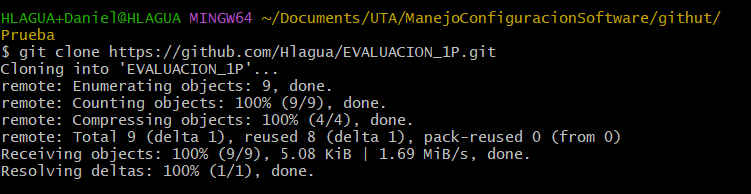
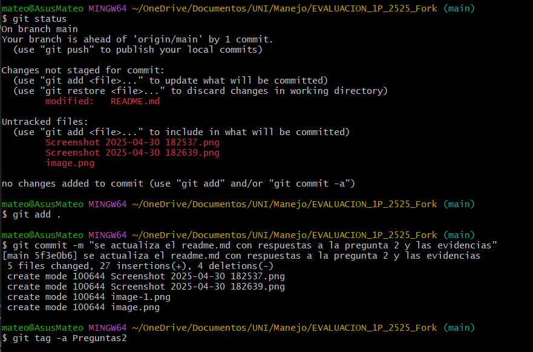
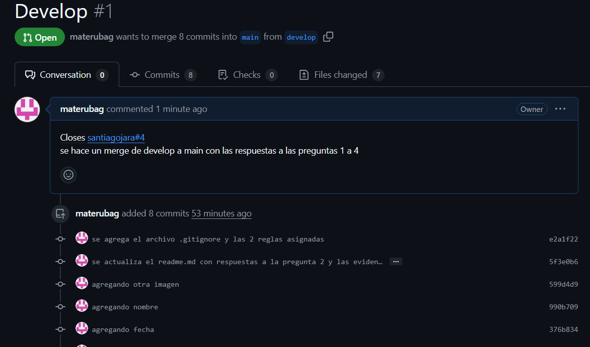
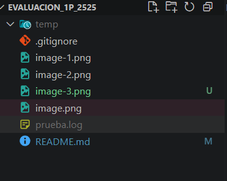

# Universidad [Nombre de la Universidad]  
## Facultad de [Nombre de la Facultad]  
### Carrera de Ingeniería en Software  

**Asignatura:** Manejo y Configuración de Software  
**Nombre del Estudiante:** Edison Alejandro Andrade Ocaña  
**Fecha:** 30/04/2025  

---

# Evaluación Práctica de Git y GitHub

## Instrucciones Generales

- Cada pregunta debe ser respondida directamente en este archivo **(README.md)** debajo del enunciado correspondiente.
- Cada respuesta debe ir acompañada de uno o más **commits**, según se indique en cada pregunta.
- Cuando se indique, deberán realizarse acciones prácticas dentro del repositorio (como creación de archivos, ramas, resolución de conflictos, etc.).
- Cada pregunta debe estar **etiquetada con un tag**, únicamente en el commit final correspondiente, con el formato: `"Pregunta 1"`, `"Pregunta 2"`, etc.

---

## Pregunta 1 (1 punto)

**Explicar la diferencia entre los siguientes conceptos/comandos en Git y GitHub:**

- `git clone`  
- `fork`  
- `git pull`

### Parte práctica:

- Realizar un **fork** de este repositorio en la cuenta personal de GitHub del estudiante.
- Luego, realizar un **clone** del fork en el equipo local.
- En este README, describir el proceso seguido:
  - ¿Cómo se realizó el fork?
  - ¿Cómo se realizó el clone del fork?
  - ¿Cómo se verificó que se estaba trabajando sobre el fork y no sobre el repositorio original?

**📝 Respuesta:**
- `git clone:` Este comando nos sirve para realizar una clonacion de un repositorio remoto hacia nuestra maquina de forma local. 
- `fork:` Un fork nos sirve para hacer una copia de un repositorio hacia nuestra cuenta de GitHub.
- `git pull:` Este comando nos sirve para traes los cambios que se han realizado en un repositorio remota hacia nuestra maquina local.

- ¿Cómo se realizó el fork?
- Para esto se tiene que estar en el repositorio remoto EVALUACION_1P_2525 del ingeniero Santiago Jara, donde en la parte derecha se visualizara una sección con el nombre de fork, se debe dar click ahí y seleccionar un nombre con el cual se guardara en nuestra cuenta de GitHub, luego hay que desmacar la opcion de solo traer la rama main y dar en continuar y con eso ya tendriamos el una copia de ese repositorio en nuestra cuenta de GitHub.
  - ¿Cómo se realizó el clone del fork?
  - Para esto se debe seleccionar el apartado de Code en nuestra cuenta de GitHub, donde esta el repositorio copiado mediante fork y copiar la URL y luego donde se va clonar el repositorio se debe digitar el comando `git clone <url>`.

  
  - ¿Cómo se verificó que se estaba trabajando sobre el fork y no sobre el repositorio original?
  - Hay que tomar en cuneta que se debe estar en nuestra  cuenta de GitHub y que debajo del repositorio diga que es un fork de usuario de GitHub que se haya realizado el fork.

  
<!-- Escribe aquí tu respuesta a la Pregunta 1 -->

---

## Pregunta 2 (1 punto)

**Configurar un archivo `.gitignore` para que ignore:**

- Todos los archivos con extensión `.log`.
- Una carpeta llamada `temp/`.

### Requisitos:

1. Realizar un **primer commit** que incluya únicamente el archivo `.gitignore` con las reglas de exclusión definidas.
2. Realizar un **segundo commit** donde se explique en este README la función del archivo `.gitignore` y se muestre evidencia de que los archivos y carpetas indicadas no están siendo rastreadas por Git.

**Importante:**  
- Solo el **segundo commit** debe llevar el **tag `"Pregunta 2"`**.

**📝 Respuesta:**
**Configuración del .GITIGNORE**

**primer commit**

**segundo commit**
GITIGNORE:Se utiliza para evitar que ciertos archivos, modulos y carpetas sean rastreados por Git, de esta manera manteniendo el repositorio limpio.
En la siguiente imagen se muestra mediante el comando `git status` que los archivos .log y la carpeta temp/ no esta siendo rastreada.

<!-- Escribe aquí tu explicación y evidencia para la Pregunta 2 -->

---

## Pregunta 3 (2 puntos)

**Utilizar Git Flow para desarrollar una nueva funcionalidad llamada `ingresar-encabezado`.**

### Requisitos:

- Inicializar el repositorio con Git Flow, utilizando las ramas por defecto: `main` y `develop`.
- Crear una rama de tipo `feature` con el nombre `ingresar-encabezado`.
- En dicha rama, **completar con los datos personales del estudiante** el encabezado que ya se encuentra al inicio de este archivo `README.md`.
- Realizar al menos un commit durante el desarrollo.
- Finalizar la feature siguiendo el flujo de trabajo establecido por Git Flow.

### En este README, se debe incluir:

- Los **comandos exactos** utilizados desde la inicialización de Git Flow hasta el cierre de la feature.
- Una descripción del **proceso seguido**, indicando el propósito de cada paso.
- Una reflexión sobre las **ventajas de aplicar Git Flow**, especialmente en contextos colaborativos o proyectos de larga duración.

**Importante:**

- Deben realizarse varios commits durante esta pregunta.
- **Solo el commit final** debe llevar el **tag `"Pregunta 3"`**.
- El flujo debe respetar la estructura de Git Flow con las ramas `develop` y `main`.

**📝 Respuesta:**
- Los **comandos exactos** utilizados desde la inicialización de Git Flow hasta el cierre de la feature.
 git flow init
 git flow feature start ingresar-encabezado

 - Descripción del proceso seguido
 Primero se debe iniciar con el comando git flow init luego se selecciona las ramas main y develop, para luego crear el la rama feature/ingresar-encabezado desde la rama develop
<!-- Escribe aquí tu respuesta completa a la Pregunta 3 -->

---

## Pregunta 4 (2 puntos)

**Trabajo con Issues y Pull Requests**

### Parte teórica:

- Explicar qué es un **issue** en GitHub.
- Explicar qué es un **pull request** y cuál es su finalidad.
- Indicar la diferencia entre ambos y cómo se relacionan en un entorno de trabajo colaborativo.

### Parte práctica:

- Trabajar en la rama `develop`, ya existente desde la configuración de Git Flow.
- Crear un **issue** titulado `"Respuesta a la Pregunta 4"`, en el que se indique que su objetivo es documentar esta pregunta.
- Realizar los cambios necesarios en este archivo `README.md` para responder esta pregunta.
- Realizar un **commit** con los cambios y subirlo a la rama `develop` del repositorio remoto.
- Crear un **pull request** desde `develop` hacia `develop` en GitHub.
- **Vincular el pull request con el issue creado**, de manera que al ser aprobado y fusionado, el issue se cierre automáticamente.
- El repositorio debe estar **configurado para requerir una revisión previa al merge**, la cual **debe ser aprobada por el docente**.

### En este README, se debe incluir:

- Un resumen del procedimiento realizado.
- El número del issue creado.
- El enlace al pull request.
- Una explicación de cómo se comprobó que el repositorio requería revisión antes de aceptar el pull request (por ejemplo, a través del mensaje mostrado por GitHub).

**📝 Respuesta:**

<!-- Escribe aquí tu respuesta completa a la Pregunta 4 -->

---

## Pregunta 5 (2 puntos)

**Resolver conflictos entre ramas y realizar un Pull Request controlado**

### Requisitos:

- Crear dos ramas llamadas `ramaA` y `ramaB`, ambas a partir de la rama `main`.
- En `ramaA`, crear un archivo llamado `archivoA.txt` con el contenido:  
  `Contenido A`
- En `ramaB`, crear un archivo con el mismo nombre (`archivoA.txt`), pero con el contenido:  
  `Contenido B`
- Intentar fusionar `ramaB` sobre `ramaA`, lo cual debe generar un conflicto.
- Resolver el conflicto combinando ambos contenidos (por ejemplo: `Contenido combinado A+B`).
- Realizar el merge de `ramaA` hacia `develop`.
- Crear un **pull request** desde `ramaA` hacia `develop`.
- El pull request debe estar **configurado para requerir revisión y ser aprobado por el docente**.
- Una vez completado el merge, eliminar las ramas `ramaA` y `ramaB` tanto local como remotamente.

### En este README, se debe incluir:

- El procedimiento completo:
  - Cómo se crearon las ramas.
  - Cómo se generó y resolvió el conflicto.
  - Cómo se realizó el merge hacia `develop`.
  - Cómo se creó y vinculó el pull request.
  - Cómo se verificó que la revisión fue requerida y aprobada.
  - Cómo se eliminaron las ramas al finalizar.
- El enlace al pull request.
- Una breve explicación de qué es un conflicto en Git y por qué ocurrió en este caso.

**📝 Respuesta:**

<!-- Escribe aquí tu respuesta completa a la Pregunta 5 -->

---

## Pregunta 6 (2 puntos)

**Realizar limpieza, explicar versionamiento semántico y enviar cambios al repositorio original**

### Requisitos:

- Trabajar en la rama `develop` del fork del repositorio.
- Eliminar los archivos `archivoA.txt` y `archivoB.txt` creados en preguntas anteriores.
- Realizar un merge desde `develop` hacia `main` en el repositorio local.
- Enviar los cambios de la rama `main` local a la rama `develop` del repositorio remoto (fork).
- Finalmente, crear un **pull request** desde la rama `develop` del fork hacia la rama `main` del repositorio original (del cual se realizó el fork en la Pregunta 1), en la descripción colocar el link de su repositorio de GitHub.

### En este README, se debe incluir:

- Una explicación del proceso realizado paso a paso.
- Una explicación del **versionamiento semántico**, indicando:
  - En qué consiste.
  - Sus tres componentes (MAJOR, MINOR, PATCH).
  - Ejemplos de aplicación en un proyecto real.
- El enlace al pull request creado hacia el repositorio original.
- Una reflexión sobre la importancia del versionamiento semántico y del uso de forks y pull requests en equipos de trabajo.

**📝 Respuesta:**

<!-- Escribe aquí tu respuesta completa a la Pregunta 6 -->
