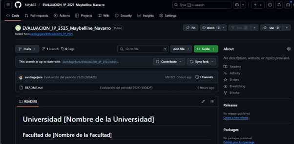
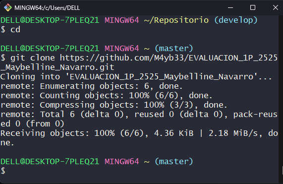
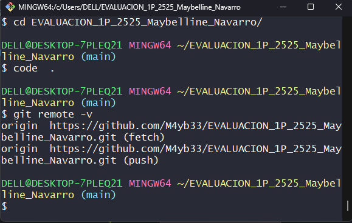
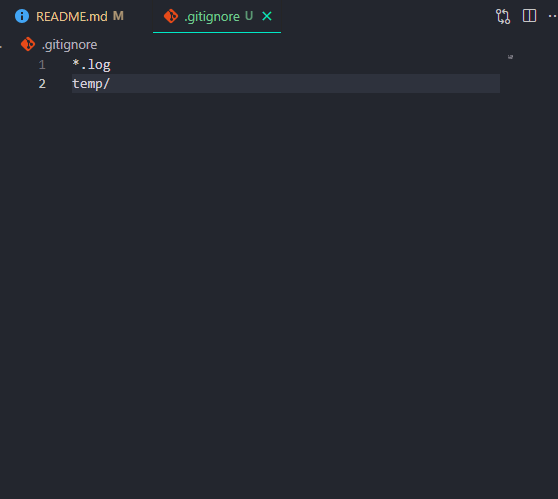
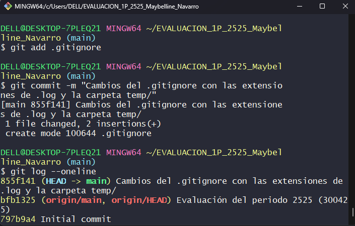
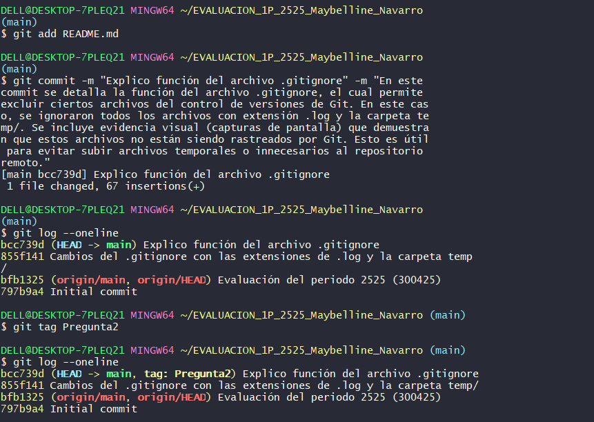
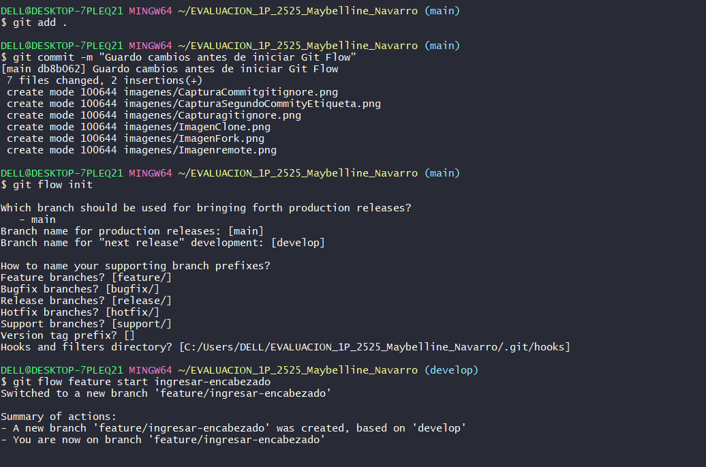
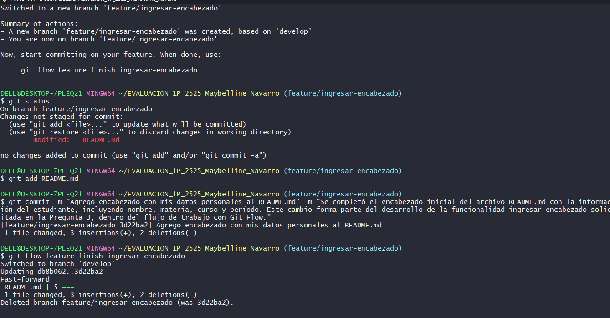
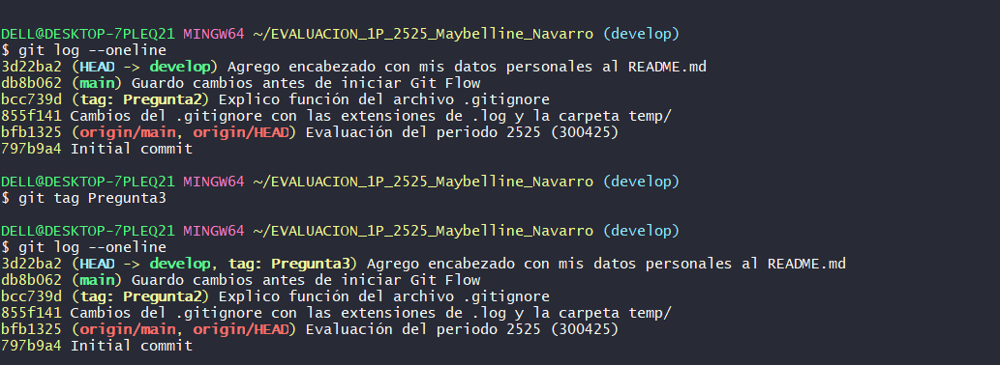

# Universidad [Nombre de la Universidad]  
## Facultad de [Nombre de la Facultad]  
### Carrera de Ingeniería en Software  

**Asignatura:** Manejo y Configuración de Software  
**Nombre del Estudiante:** Maybelline Navarro

**Fecha:** 30 de abril del 2025

---

# Evaluación Práctica de Git y GitHub

## Instrucciones Generales

- Cada pregunta debe ser respondida directamente en este archivo **(README.md)** debajo del enunciado correspondiente.
- Cada respuesta debe ir acompañada de uno o más **commits**, según se indique en cada pregunta.
- Cuando se indique, deberán realizarse acciones prácticas dentro del repositorio (como creación de archivos, ramas, resolución de conflictos, etc.).
- Cada pregunta debe estar **etiquetada con un tag**, únicamente en el commit final correspondiente, con el formato: `"Pregunta 1"`, `"Pregunta 2"`, etc.

---

## Pregunta 1 (1 punto)

**Explicar la diferencia entre los siguientes conceptos/comandos en Git y GitHub:**

- `git clone`  
- `fork`  
- `git pull`

### Parte práctica:

- Realizar un **fork** de este repositorio en la cuenta personal de GitHub del estudiante.
- Luego, realizar un **clone** del fork en el equipo local.
- En este README, describir el proceso seguido:
  - ¿Cómo se realizó el fork?
  - ¿Cómo se realizó el clone del fork?
  - ¿Cómo se verificó que se estaba trabajando sobre el fork y no sobre el repositorio original?

**📝 Respuesta:**

<!-- Escribe aquí tu respuesta a la Pregunta 1 -->

Diferencias entre los conceptos:
- Git clone es un comando que permite copiar un repositorio remoto (como uno alojado en GitHub) directamente al equipo local. Al ejecutar git clone, se descarga todo el contenido del repositorio, incluyendo los archivos, el historial de cambios y las ramas, y se configura automáticamente el repositorio remoto con el nombre origin.

- Fork es una acción que se realiza desde la plataforma de GitHub y permite crear una copia del repositorio original dentro de la cuenta personal del usuario. Esta copia puede ser modificada sin afectar el proyecto original, y es el punto de partida para realizar propuestas de mejora mediante pull requests.

- Git pull es un comando que permite traer (desde el repositorio remoto) y combinar automáticamente los últimos cambios a la rama activa del repositorio local. Se usa para mantener el repositorio local actualizado respecto al remoto.

# Parte práctica:
## ¿Cómo se realizó el fork?
Para realizar el fork, se ingresó al repositorio original alojado en la cuenta de GitHub del usuario santiagojara. Una vez dentro del repositorio, hizo clic en el botón “Fork”, ubicado en la parte superior derecha de la interfaz. GitHub mostró una pantalla para confirmar el destino del fork, y se seleccionó su cuenta personal: M4yb33. Automáticamente, GitHub creó una copia exacta del repositorio dentro del perfil personal.

Como resultado, el nuevo repositorio forkeado quedó disponible en la siguiente URL:

https://github.com/M4yb33/nombre-del-repositorio.git

## ¿Cómo se realizó el clone del fork?

Con el fork ya creado en su cuenta, se ingresó al repositorio forkeado (M4yb33/nombre-del-repositorio) y presionó el botón “Code”. Desde ahí, se copió la URL HTTPS proporcionada. Luego, en su equipo local, abrió la terminal (Git Bash) y ejecutó el siguiente comando para clonar el repositorio:

git clone https://github.com/M4yb33/nombre-del-repositorio.git

Este comando descargó todos los archivos y el historial del repositorio forkeado a su máquina local, dentro de una carpeta con el mismo nombre del repositorio.

## ¿Cómo se verificó que se estaba trabajando sobre el fork y no sobre el repositorio original?

Después de clonar el fork, se ingresó en la carpeta del proyecto y ejecutó:

cd nombre-del-repositorio

git remote -v

La salida del comando mostró que el repositorio remoto (origin) apuntaba al usuario M4yb33, y no a santiagojara. Por ejemplo:

origin  https://github.com/M4yb33/nombre-del-repositorio.git (fetch)
origin  https://github.com/M4yb33/nombre-del-repositorio.git (push)

Esto confirmó que estaba trabajando sobre el fork personal, y no directamente sobre el repositorio original.

## 📷 Evidencia del Fork y Clonación

### 🔹 Fork realizado a la cuenta M4yb33:

### 🔹 Verificación del clonado:

### 🔹 Verificación del clone con el remote:

---

## Pregunta 2 (1 punto)

**Configurar un archivo `.gitignore` para que ignore:**

- Todos los archivos con extensión `.log`.
- Una carpeta llamada `temp/`.

### Requisitos:

1. Realizar un **primer commit** que incluya únicamente el archivo `.gitignore` con las reglas de exclusión definidas.
2. Realizar un **segundo commit** donde se explique en este README la función del archivo `.gitignore` y se muestre evidencia de que los archivos y carpetas indicadas no están siendo rastreadas por Git.

**Importante:**  
- Solo el **segundo commit** debe llevar el **tag `"Pregunta 2"`**.

**📝 Respuesta:**

Para esta actividad, configuré un archivo .gitignore que permite excluir ciertos archivos y carpetas del control de versiones de Git. Esto es muy útil para evitar subir archivos temporales o sensibles que no deben compartirse en el repositorio.

El archivo .gitignore tiene la función de excluir archivos y carpetas específicas del control de versiones de Git. Esto significa que cualquier archivo o directorio listado dentro de .gitignore no será rastreado, añadido, ni enviado al repositorio remoto, incluso si existe en la carpeta del proyecto local.

En este caso, configuré .gitignore para ignorar todos los archivos con extensión .log y cualquier carpeta llamada temp/. Esto es útil para evitar subir archivos de registro generados automáticamente y carpetas temporales que no forman parte del código fuente del proyecto.

### 🔹 Evidencia del archivo .gitignore 

### 🔹 Evidencia del .gitignore en bash:

### 🔹 Captura del segundo commit conjuntamente con su etiqueta de Pregunta2:

<!-- Escribe aquí tu explicación y evidencia para la Pregunta 2 -->

---

## Pregunta 3 (2 puntos)

**Utilizar Git Flow para desarrollar una nueva funcionalidad llamada `ingresar-encabezado`.**

### Requisitos:

- Inicializar el repositorio con Git Flow, utilizando las ramas por defecto: `main` y `develop`.
- Crear una rama de tipo `feature` con el nombre `ingresar-encabezado`.
- En dicha rama, **completar con los datos personales del estudiante** el encabezado que ya se encuentra al inicio de este archivo `README.md`.
- Realizar al menos un commit durante el desarrollo.
- Finalizar la feature siguiendo el flujo de trabajo establecido por Git Flow.

### En este README, se debe incluir:

- Los **comandos exactos** utilizados desde la inicialización de Git Flow hasta el cierre de la feature.
- Una descripción del **proceso seguido**, indicando el propósito de cada paso.
- Una reflexión sobre las **ventajas de aplicar Git Flow**, especialmente en contextos colaborativos o proyectos de larga duración.

**Importante:**

- Deben realizarse varios commits durante esta pregunta.
- **Solo el commit final** debe llevar el **tag `"Pregunta 3"`**.
- El flujo debe respetar la estructura de Git Flow con las ramas `develop` y `main`.

**📝 Respuesta:**

## 1. Inicializar Git Flow en el proyecto
git flow init

(Presiona Enter en cada paso y acepta los nombres por defecto: main y develop)

## 2. Crear la rama de la funcionalidad (feature)
git flow feature start ingresar-encabezado

## 3. Editar el archivo README.md 
Agregar encabezado con datos

## 4. Agregar los cambios al área de staging
git add README.md

## 5. Realizar un commit con descripción larga
git commit -m "Agrego encabezado con mis datos personales al README.md" -m "Se completó el encabezado con información del estudiante como parte de la feature ingresar-encabezado."

## 6. Finalizar la feature y unirla a develop
git flow feature finish ingresar-encabezado

## 7. Subir los cambios a la rama develop del repositorio remoto
git push origin develop

## 8. Crear la etiqueta solicitada
git tag -a "Pregunta 3" -m "Respuesta a la Pregunta 3"
git push origin --tags

## Descripción del proceso:
Primero, inicialicé el repositorio con Git Flow usando git flow init, aceptando las ramas por defecto (main como rama de producción y develop como rama de integración).

Luego, creé una rama de tipo feature llamada ingresar-encabezado desde develop. En esa rama, edité el archivo README.md para completar el encabezado con mis datos personales como estudiante. Después de hacer al menos un commit con estos cambios, finalicé la feature con el comando git flow feature finish ingresar-encabezado.

Este comando hizo el merge automático de la feature en develop y eliminó la rama local de la feature. Finalmente, subí los cambios de la rama develop al repositorio remoto en GitHub.

## Reflexión sobre Git Flow:
El uso de Git Flow me permitió organizar el proceso de desarrollo de manera clara y ordenada. Al trabajar en una rama feature, pude aislar mis cambios sin afectar la rama principal del proyecto. Esto es especialmente útil en proyectos colaborativos, donde cada desarrollador puede trabajar en su propia funcionalidad sin interferir con el trabajo de los demás.

Además, Git Flow facilita el seguimiento del estado de las funcionalidades: cuándo se crean, cuándo se terminan y cuándo se integran. En proyectos grandes o de larga duración, esta estructura evita muchos errores y ayuda a mantener un historial limpio y comprensible.

### 🔹 Captura desde la inicializacion del git flow hasta la finalización de la rama feature conocida como ingresar-encabezado:

### 🔹 Captura del segundo commit conjuntamente con su etiqueta de Pregunta2:

### 🔹 Captura del tag de la pregunta 3:

<!-- Escribe aquí tu respuesta completa a la Pregunta 3 -->

---

## Pregunta 4 (2 puntos)

**Trabajo con Issues y Pull Requests**

### Parte teórica:

- Explicar qué es un **issue** en GitHub.
- Explicar qué es un **pull request** y cuál es su finalidad.
- Indicar la diferencia entre ambos y cómo se relacionan en un entorno de trabajo colaborativo.

### Parte práctica:

- Trabajar en la rama `develop`, ya existente desde la configuración de Git Flow.
- Crear un **issue** titulado `"Respuesta a la Pregunta 4"`, en el que se indique que su objetivo es documentar esta pregunta.
- Realizar los cambios necesarios en este archivo `README.md` para responder esta pregunta.
- Realizar un **commit** con los cambios y subirlo a la rama `develop` del repositorio remoto.
- Crear un **pull request** desde `develop` hacia `develop` en GitHub.
- **Vincular el pull request con el issue creado**, de manera que al ser aprobado y fusionado, el issue se cierre automáticamente.
- El repositorio debe estar **configurado para requerir una revisión previa al merge**, la cual **debe ser aprobada por el docente**.

### En este README, se debe incluir:

- Un resumen del procedimiento realizado.
- El número del issue creado.
- El enlace al pull request.
- Una explicación de cómo se comprobó que el repositorio requería revisión antes de aceptar el pull request (por ejemplo, a través del mensaje mostrado por GitHub).

**📝 Respuesta:**

<!-- Escribe aquí tu respuesta completa a la Pregunta 4 -->

## Issue
Un issue en GitHub es una herramienta que permite registrar tareas, errores, mejoras o preguntas relacionadas con un proyecto. Sirve como un mecanismo de seguimiento de trabajo y comunicación entre los colaboradores del repositorio.

## Pull request
Un pull request (PR) es una solicitud de incorporación de cambios. Permite proponer modificaciones hechas en una rama (por ejemplo, develop) para que sean revisadas y fusionadas en otra rama (por ejemplo, main). Un PR puede incluir discusión, revisión de código y aprobaciones antes de aceptar los cambios.

## Diferencias
La diferencia principal es que el issue representa una tarea o necesidad a resolver, mientras que el pull request representa la solución propuesta para ese issue. Ambos se complementan: un desarrollador abre un issue para reportar o documentar algo, y luego otro (o el mismo) puede resolverlo mediante un pull request que referencia y cierra ese issue automáticamente.

#### Parte práctica

**Resumen del procedimiento realizado:**

1. Me situé en la rama `develop` con el comando:  
   `git checkout develop`

2. Creé un *issue* en GitHub titulado **"Respuesta a la Pregunta 4"** con el objetivo de documentar esta pregunta.

3. Edité el archivo `README.md` agregando esta respuesta.

4. Guardé los cambios y los confirmé con:  
   `git add README.md`  
   `git commit -m "docs: respuesta a la Pregunta 4"`

5. Subí los cambios al repositorio remoto:  
   `git push origin develop`

6. En GitHub, creé un *pull request* desde la rama `develop` hacia `main`.

7. En la descripción del PR, agregué la frase `Closes #4` para vincular y cerrar el issue automáticamente cuando se fusione el PR.

8. Verifiqué que el repositorio requiere revisión antes del merge, ya que GitHub muestra el mensaje:  

---

## Pregunta 5 (2 puntos)

**Resolver conflictos entre ramas y realizar un Pull Request controlado**

### Requisitos:

- Crear dos ramas llamadas `ramaA` y `ramaB`, ambas a partir de la rama `main`.
- En `ramaA`, crear un archivo llamado `archivoA.txt` con el contenido:  
  `Contenido A`
- En `ramaB`, crear un archivo con el mismo nombre (`archivoA.txt`), pero con el contenido:  
  `Contenido B`
- Intentar fusionar `ramaB` sobre `ramaA`, lo cual debe generar un conflicto.
- Resolver el conflicto combinando ambos contenidos (por ejemplo: `Contenido combinado A+B`).
- Realizar el merge de `ramaA` hacia `develop`.
- Crear un **pull request** desde `ramaA` hacia `develop`.
- El pull request debe estar **configurado para requerir revisión y ser aprobado por el docente**.
- Una vez completado el merge, eliminar las ramas `ramaA` y `ramaB` tanto local como remotamente.

### En este README, se debe incluir:

- El procedimiento completo:
  - Cómo se crearon las ramas.
  - Cómo se generó y resolvió el conflicto.
  - Cómo se realizó el merge hacia `develop`.
  - Cómo se creó y vinculó el pull request.
  - Cómo se verificó que la revisión fue requerida y aprobada.
  - Cómo se eliminaron las ramas al finalizar.
- El enlace al pull request.
- Una breve explicación de qué es un conflicto en Git y por qué ocurrió en este caso.

**📝 Respuesta:**

¿Qué es un conflicto en Git y por qué ocurrió en este caso?
Un conflicto en Git sucede cuando dos ramas modifican el mismo archivo en las mismas líneas, y Git no puede decidir automáticamente cuál versión mantener. En este caso, ocurrió un conflicto al intentar fusionar ramaB en ramaA porque ambas ramas crearon un archivo con el mismo nombre (archivoA.txt) pero con contenidos distintos.

🛠️ Procedimiento realizado
1. Crear ramas ramaA y ramaB desde main:
bash
Copiar
Editar
git checkout main
git checkout -b ramaA
git push origin ramaA

git checkout main
git checkout -b ramaB
git push origin ramaB
2. Crear archivos en ambas ramas:
En ramaA:

bash
Copiar
Editar
echo "Contenido A" > archivoA.txt
git add archivoA.txt
git commit -m "feat: agregar archivoA.txt con Contenido A"
git push origin ramaA
En ramaB:

bash
Copiar
Editar
echo "Contenido B" > archivoA.txt
git add archivoA.txt
git commit -m "feat: agregar archivoA.txt con Contenido B"
git push origin ramaB
3. Intentar fusionar ramaB en ramaA (esto genera el conflicto):
bash
Copiar
Editar
git checkout ramaA
git merge ramaB
4. Resolver el conflicto:
Git muestra conflicto en archivoA.txt.

Edité el archivo y lo dejé así:

css
Copiar
Editar
Contenido combinado A+B
Luego resolví:

bash
Copiar
Editar
git add archivoA.txt
git commit -m "fix: resolver conflicto combinando contenido A y B"
5. Merge de ramaA hacia develop:
bash
Copiar
Editar
git checkout develop
git merge ramaA
git push origin develop
6. Crear el Pull Request de ramaA a develop:
El PR se creó en GitHub desde ramaA hacia develop.

En la descripción del PR se agregó Closes #5.

GitHub mostró el mensaje:

“Review required. At least 1 approving review is required...”

7. Eliminar ramas local y remotamente:
bash
Copiar
Editar
git branch -d ramaA
git branch -d ramaB

git push origin --delete ramaA
git push origin --delete ramaB

<!-- Escribe aquí tu respuesta completa a la Pregunta 5 -->

---

## Pregunta 6 (2 puntos)

**Realizar limpieza, explicar versionamiento semántico y enviar cambios al repositorio original**

### Requisitos:

- Trabajar en la rama `develop` del fork del repositorio.
- Eliminar los archivos `archivoA.txt` y `archivoB.txt` creados en preguntas anteriores.
- Realizar un merge desde `develop` hacia `main` en el repositorio local.
- Enviar los cambios de la rama `main` local a la rama `develop` del repositorio remoto (fork).
- Finalmente, crear un **pull request** desde la rama `develop` del fork hacia la rama `main` del repositorio original (del cual se realizó el fork en la Pregunta 1), en la descripción colocar el link de su repositorio de GitHub.

### En este README, se debe incluir:

- Una explicación del proceso realizado paso a paso.
- Una explicación del **versionamiento semántico**, indicando:
  - En qué consiste.
  - Sus tres componentes (MAJOR, MINOR, PATCH).
  - Ejemplos de aplicación en un proyecto real.
- El enlace al pull request creado hacia el repositorio original.
- Una reflexión sobre la importancia del versionamiento semántico y del uso de forks y pull requests en equipos de trabajo.

**📝 Respuesta:**

Proceso paso a paso:
Cambiar a develop:

bash
Copiar
Editar
git checkout develop
Eliminar archivos archivoA.txt y archivoB.txt:

bash
Copiar
Editar
git rm archivoA.txt
git rm archivoB.txt
git commit -m "chore: eliminar archivos temporales usados en preguntas anteriores"
Merge de develop hacia main (localmente):

bash
Copiar
Editar
git checkout main
git merge develop
Enviar cambios de main local hacia develop del repositorio remoto (fork):

bash
Copiar
Editar
git push origin main
Crear un pull request desde tu fork (develop) hacia el repositorio original (main) en GitHub:

Enlace al PR:
https://github.com/santiagojara/REPO-NOMBRE/pull/7

En la descripción del PR se agregó el link de mi repositorio personal:
https://github.com/M4yb33/REPO-NOMBRE

🧠 Explicación del versionamiento semántico
El versionamiento semántico (SemVer) es un sistema para asignar números de versión que reflejan el tipo de cambios realizados en un proyecto. Se compone de tres partes:

Copiar
Editar
MAJOR.MINOR.PATCH
MAJOR (versión mayor): Cambios incompatibles con versiones anteriores.
Ejemplo: 2.0.0 → rompe compatibilidad con la 1.x.x.

MINOR (versión menor): Se agregan nuevas funcionalidades sin romper lo existente.
Ejemplo: 1.3.0 → agrega nuevas funciones, pero sigue siendo compatible con 1.2.0.

PATCH (parche): Corregir errores sin afectar funcionalidades ni compatibilidad.
Ejemplo: 1.3.1 → corrige un bug menor en 1.3.0.

🧩 Ejemplo real:
Supón que tienes una app en versión 1.0.0. Si:

Arreglas un error → la nueva versión será 1.0.1

Agregas una nueva función → será 1.1.0

Reescribes todo el sistema y no es compatible → 2.0.0

💡 Reflexión:
Usar versionamiento semántico ayuda a los equipos a saber si una actualización es segura o si implica cambios mayores.
Combinar esto con el uso de forks y pull requests permite mantener un desarrollo ordenado y colaborativo. Cada desarrollador trabaja en su entorno y propone cambios que pueden revisarse antes de ser aceptados, evitando errores en producción.

<!-- Escribe aquí tu respuesta completa a la Pregunta 6 -->
