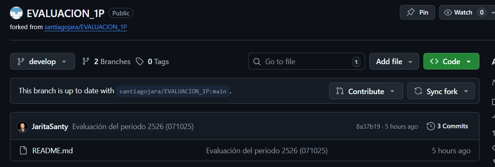
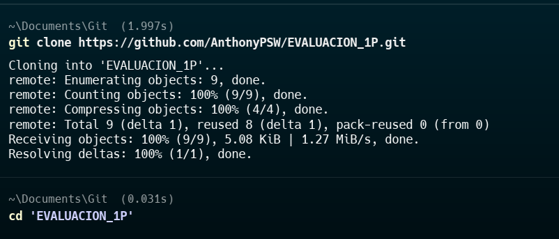
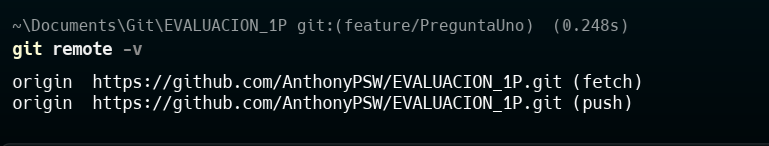
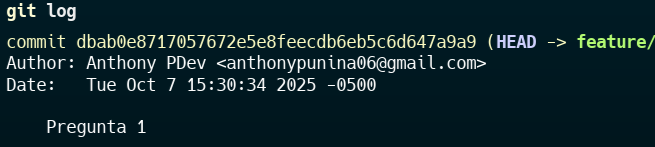
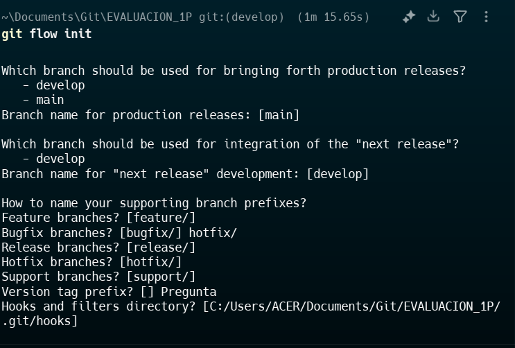
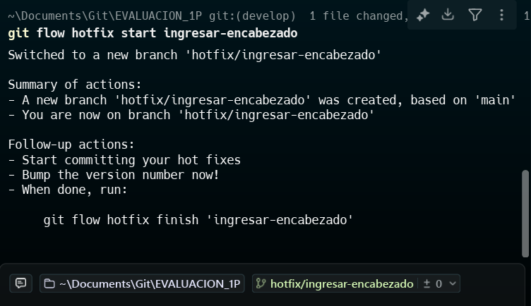
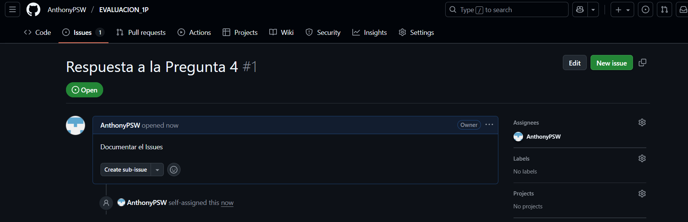
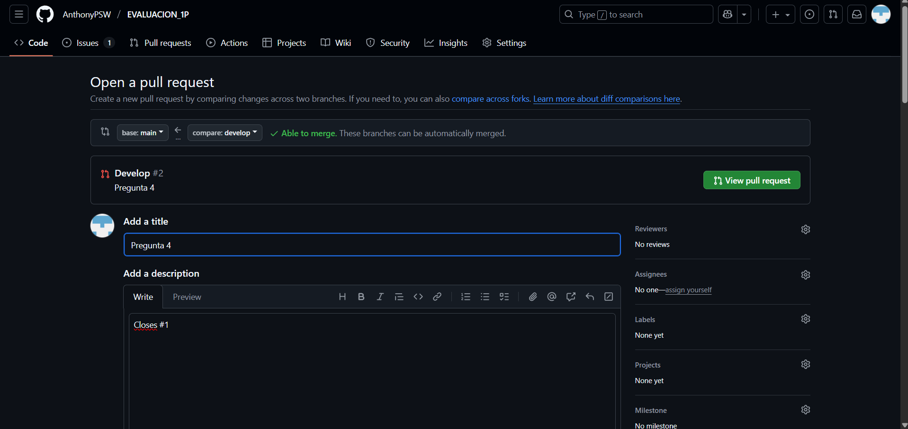
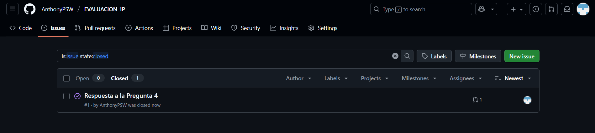
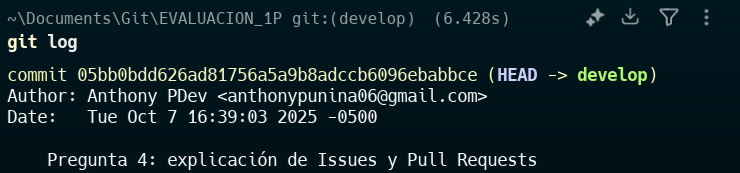

# Universidad [Nombre de la Universidad]  
## Facultad de [Nombre de la Facultad]  
### Carrera de Ingeniería en Software  

**Asignatura:** Manejo y Configuración de Software  
**Nombre del Estudiante:** Anthony Israel Punina Chisag 
**Fecha:** 07/10/2025

---

# Evaluación Práctica de Git y GitHub

## Instrucciones Generales

- Cada pregunta debe ser respondida directamente en este archivo **(README.md)** debajo del enunciado correspondiente.
- Cada respuesta debe ir acompañada de uno o más **commits**, según se indique en cada pregunta.
- Cuando se indique, deberán realizarse acciones prácticas dentro del repositorio (como creación de archivos, ramas, resolución de conflictos, etc.).
- Cada pregunta debe estar **etiquetada con un tag**, únicamente en el commit final correspondiente, con el formato: `"Pregunta 1"`, `"Pregunta 2"`, etc.

---

## Pregunta 1 (1 punto)

**Explicar la diferencia entre los siguientes conceptos/comandos en Git y GitHub:**

- `git clone`  
- `fork`  
- `git pull`

### Parte práctica:

- Realizar un **fork** de este repositorio en la cuenta personal de GitHub del estudiante.
- Luego, realizar un **clone** del fork en el equipo local.
- En este README, describir el proceso seguido:
  - ¿Cómo se realizó el fork?
  - ¿Cómo se realizó el clone del fork?
  - ¿Cómo se verificó que se estaba trabajando sobre el fork y no sobre el repositorio original?

**📝 Respuesta:**

**Diferencia entre los siguientes conceptos/comandos en Git y GitHub**

**git clone**
Es un comando que permite copiar un repositorio remoto a tu nuestra computadora local, clona todo el historial, ramas y archivos del proyecto, permitiendo trabajar de manera independiente en tu entorno local.

**fork**
Es una copia completa de un repositorio remoto que se crea directamente en tu cuenta de GitHub. Su propósito es permitirte modificar el código sin afectar el repositorio original, ideal para colaborar en proyectos de otros usuarios.

**git pull**
Se utiliza para actualizar tu repositorio local con los últimos cambios realizados en el repositorio remoto. Internamente combina los comandos git fetch (descargar cambios) y git merge (fusionar cambios).
### Parte práctica:

**¿Cómo se realizó el fork?**

Ingresé al repositorio original del docente con esta url: https://github.com/santiagojara/EVALUACION_1P en GitHub y presioné el botón Fork ubicado en la esquina superior derecha. Luego seleccioné mi cuenta personal para crear una copia del repositorio dentro de mi perfil. GitHub generó automáticamente una versión idéntica del repositorio original, pero ahora en mi usuario.




**¿Cómo se realizó el clone del fork?**
Copié la URL de mi fork:

https://github.com/AnthonyPSW/EVALUACION_1P.git


Luego, abrí la terminal en mi computadora y ejecuté los siguientes comandos:

git clone https://github.com/AnthonyPSW/EVALUACION_1P.git
cd EVALUACION_1P




Con esto descargué todo el contenido del repositorio en mi equipo local, incluyendo el historial de commits y las ramas.

**¿Cómo se verificó que se estaba trabajando sobre el fork y no sobre el repositorio original?**
Ejecuté el comando:

**git remote -v**


Esto mostró la siguiente información:

origin	https://github.com/AnthonyPSW/EVALUACION_1P.git (fetch)
origin	https://github.com/AnthonyPSW/EVALUACION_1P.git (push)

Al ver que la direccion corresponde a mi cuenta de GitHub, confirme que estaba trabajando sobre mi fork personal y no sobre el repositorio original.




**Evidencia Commit**




## Pregunta 2 (1 punto)

**Configurar un archivo `.gitignore` para que ignore:**

- Todos los archivos con extensión `.log`.
- Una carpeta llamada `temp/`.
- Todos los archivos `.md` y `.txt`de la carpeta `doc/`. (Probar agregando un archivo `prueba.md` y un archivo `prueba.txt` dentro de la carpeta y fuera de la carpeta.)

### Requisitos:

1. Realizar un **primer commit** que incluya únicamente el archivo `.gitignore` con las reglas de exclusión definidas.
2. Realizar un **segundo commit** donde se explique en este README la función del archivo `.gitignore` y se muestre evidencia de que los archivos y carpetas indicadas no están siendo rastreadas por Git.

**Importante:**  
- Solo el **segundo commit** debe llevar el **tag `"Pregunta 2"`**.

**📝 Respuesta:**
La funcion del `.gitignore` es que excluye los archivos de ese tipo en los que hemos configurado por ejemplo los archivos que son .txt


Como se puede ver los archivos dentro de la carpeta .doc y la carpeta doc no estan siendo rastreadas pero el archivo que tengo fuera de esa carpeta si lo esta siendo 


<!-- Escribe aquí tu explicación y evidencia para la Pregunta 2 -->

---

## Pregunta 3 (2 puntos)

**Utilizar Git Flow para desarrollar una nueva funcionalidad llamada `ingresar-encabezado`.**

### Requisitos:

- Inicializar el repositorio con Git Flow, utilizando las ramas por defecto: `main` y `develop`.
- Crear una rama de tipo `hotfix` con el nombre `ingresar-encabezado`.
- En dicha rama, **completar con los datos personales del estudiante** el encabezado que ya se encuentra al inicio de este archivo `README.md`.
- Realizar al menos un commit durante el desarrollo.
- Finalizar el hotfix siguiendo el flujo de trabajo establecido por Git Flow.

### En este README, se debe incluir:

- Los **comandos exactos** utilizados desde la inicialización de Git Flow hasta el cierre del hotfix.
- Una descripción del **proceso seguido**, indicando el propósito de cada paso.
- Una reflexión sobre las **ventajas de aplicar Git Flow**, especialmente en contextos colaborativos o proyectos de larga duración.

**Importante:**

- Deben realizarse varios commits durante esta pregunta.
- **Solo el commit final** debe llevar el **tag `"Pregunta 3"`**.
- El flujo debe respetar la estructura de Git Flow con las ramas `develop` y `main`.

**📝 Respuesta:**


## **1. Inicialización de Git Flow**

**Requisitos:** Inicializar el repositorio con Git Flow, utilizando las ramas por defecto: `main` y `develop`.

**Comando:**

git flow init


Durante la inicialización, Git Flow pedirá algunas ramas base:

```
Which branch should be used for bringing forth production releases? [main]: main
Which branch should be used for integration of the next release? [develop]: develop
Feature branches? [feature/]: feature/
Release branches? [release/]: release/
Hotfix branches? [hotfix/]: hotfix/
Support branches? [support/]: support/
Version tag prefix? []: 
```

**Propósito:**

* Define la estructura de ramas del proyecto (`main`, `develop`, `feature/*`, `release/*`, `hotfix/*`).

* Establece un estándar para el flujo de trabajo colaborativo.

---

## **2. Crear hotfix `ingresar-encabezado`**

**Comando:**

git flow hotfix start ingresar-encabezado


**Propósito:**

* Crea la rama `hotfix/ingresar-encabezado` a partir de `main`.
* Permite modificar el encabezado del README sin afectar `develop` ni otras ramas.

---

## **3. Desarrollo del hotfix**

Completar con los datos personales del estudiante el encabezado que ya se encuentra al inicio de este archivo `README.md`.
Realizar al menos un commit durante el desarrollo:

```bash
git add .
git commit -m "Pregunta 3 Parte 1"
```

**Propósito:**

* Guardar los cambios de manera controlada en la rama del hotfix.

Si se realizan otros cambios menores antes del commit final, se pueden hacer commits adicionales


---

## **4. Finalizar el hotfix y etiquetar**

**Comando:**

git flow hotfix finish ingresar-encabezado
git tag -a "Pregunta 3" -m "Hotfix ingresar-encabezado completado"
git push origin main
git push origin develop
git push --tags


**Qué hace Git Flow automáticamente:**

1. Hace merge de `hotfix/ingresar-encabezado` en `main`.
2. Hace merge de `hotfix/ingresar-encabezado` en `develop`.
3. Crea un tag en `main` (en este caso, `Pregunta 3`).
4. Elimina la rama de hotfix local y, opcionalmente, remota.

**Propósito:**

* Garantizar que los cambios estén tanto en producción (`main`) como en desarrollo (`develop`).
* Mantener la historia del proyecto clara y etiquetar el commit final como referencia.

---

## **5. Reflexión sobre Git Flow**

**Ventajas principales:**

1. Mantiene el proyecto organizado con ramas claras (`develop`, `main`, `feature`, `hotfix`).
2. Facilita la colaboración: varios desarrolladores pueden trabajar simultáneamente sin interferencias.
3. Permite un control de versiones claro y trazable mediante tags y merges controlados.
4. Ideal para proyectos de larga duración o con múltiples releases, ya que permite aplicar hotfixes sin interrumpir el desarrollo activo.

---


  Evidencia del Git Flow Init 
  

  Evidencia de la creacion del Hotfix
  


<!-- Escribe aquí tu respuesta completa a la Pregunta 3 -->

---

## Pregunta 4 (2 puntos)

**Trabajo con Issues y Pull Requests**

### Parte teórica:

- Explicar qué es un **issue** en GitHub.
- Explicar qué es un **pull request** y cuál es su finalidad.
- Indicar la diferencia entre ambos y cómo se relacionan en un entorno de trabajo colaborativo.

### Parte práctica:

- Trabajar en la rama `develop`, ya existente desde la configuración de Git Flow.
- Crear un **issue** titulado `"Respuesta a la Pregunta 4"`, en el que se indique que su objetivo es documentar esta pregunta.
- Realizar los cambios necesarios en este archivo `README.md` para responder esta pregunta.
- Realizar un **commit** con los cambios y subirlo a la rama `develop` del repositorio remoto.
- Crear un **pull request** desde `develop` hacia `main` en GitHub.
- **Vincular el pull request con el issue creado**, de manera que al ser aprobado y fusionado, el issue se cierre automáticamente.
- **Aprobar** el pull request para que se haga el merge respectivo hacia `main`.

### En este README, se debe incluir:

- Un resumen del procedimiento realizado.
- El número y enlace del issue creado.
- El número y enlace al pull request.

**📝 Respuesta:**

<!-- Escribe aquí tu respuesta completa a la Pregunta 4 -->

**Trabajo con Issues y Pull Requests**

**Parte teórica**

1. **¿Qué es un issue en GitHub?**
   Un **issue** es una herramienta de GitHub que permite registrar tareas, errores, solicitudes de mejora o preguntas relacionadas con un proyecto. Funciona como un ticket de seguimiento donde los colaboradores pueden discutir, asignar responsables, agregar etiquetas y documentar el progreso de cada tema.

2. **¿Qué es un pull request y cuál es su finalidad?**
   Un **pull request (PR)** es una solicitud para fusionar cambios de una rama hacia otra (por ejemplo, de `develop` a `main`). Su finalidad es revisar, discutir y validar los cambios antes de integrarlos al proyecto principal, asegurando calidad y control de versiones en entornos colaborativos.

3. **Diferencia entre issue y pull request y su relación en colaboración**

   * **Diferencia:**

     * El **issue** es un registro o tarea por realizar.
     * El **pull request** es la propuesta de cambio concreta que resuelve un issue o agrega funcionalidad al proyecto.
   * **Relación:**

     * Normalmente, un pull request se vincula a un issue, de modo que al fusionarse los cambios, el issue se cierra automáticamente. Esto permite un seguimiento claro de qué tareas están completadas y quién las ha trabajado, facilitando la colaboración en equipo.

---

**Parte práctica**

**Pasos realizados:**

1. Trabajé en la rama `develop` que ya existía desde la configuración de Git Flow:

   ```bash
   git checkout develop
   ```

2. Creé un **issue** titulado `"Respuesta a la Pregunta 4"` en GitHub, indicando que su objetivo es documentar esta pregunta.

   * **Número del issue:** #4
   * **Enlace:** [Issue #4](https://github.com/AnthonyPSW/EVALUACION_1P/issues/1)

 


3. Edité el archivo `README.md` para incluir la explicación teórica sobre issues y pull requests.

4. Realicé un **commit** con los cambios:

   ```bash
   git add .
   git commit -m "Respuesta a la Pregunta 4: explicación de Issues y Pull Requests"
   git push origin develop
   ```

5. Creé un **pull request** desde `develop` hacia `main` en GitHub y lo vinculé con el issue #4 usando la referencia:

   > "Closes #4"
   > Esto asegura que al fusionarse el pull request, el issue se cierre automáticamente.

 


6. El pull request fue **aprobado** y fusionado a `main`, cerrando el issue automáticamente.

 

 Commits
  

---

## Pregunta 5 (2 puntos)

**Resolver conflictos entre ramas y realizar un Pull Request**

### Requisitos:

- Crear dos ramas llamadas `ramaA` y `ramaB`, ambas a partir de la rama `develop`.
- En `ramaA`, crear un archivo llamado `archivoA.txt` con el contenido:  
  `Contenido A`
- En `ramaB`, crear un archivo con el mismo nombre (`archivoA.txt`), pero con el contenido:  
  `Contenido B`
- Intentar fusionar `ramaB` sobre `ramaA`, lo cual debe generar un conflicto.
- Resolver el conflicto combinando ambos contenidos.
- Realizar el merge de `ramaA` hacia `develop`.
- Crear un **pull request** desde `develop` hacia `main`.
- Una vez completado lo anterior, eliminar las ramas `ramaA` y `ramaB` tanto local como remotamente.

### En este README, se debe incluir:

- El procedimiento completo:
  - Cómo se crearon las ramas.
  - Cómo se generó y resolvió el conflicto.
  - Cómo se realizó el merge hacia `develop`.
  - Cómo se eliminaron las ramas al finalizar.
- El enlace al pull request.
- Una breve explicación de qué es un conflicto en Git y por qué ocurrió en este caso.

**📝 Respuesta:**

<!-- Escribe aquí tu respuesta completa a la Pregunta 5 -->

---

## Pregunta 6 (2 puntos)

**Realizar limpieza, explicar versionamiento semántico y enviar cambios al repositorio original**

### Requisitos:

- Trabajar en la rama `develop` del fork del repositorio.
- Eliminar los archivos `archivoA.txt` y `archivoB.txt` creados en preguntas anteriores.
- Realizar un merge desde `develop` hacia `main` en el repositorio local.
- Enviar los cambios de la rama `main` local a la rama `develop` del repositorio remoto (fork). Recuerde incluir todos los tags creados (6 tags).
- Finalmente, crear un **pull request** desde la rama `develop` del fork hacia la rama `main` del repositorio original (del cual se realizó el fork en la Pregunta 1). El titulo del pull request debe ser "NOMBRE APELLIDOS", en la descripción colocar el link de su repositorio de GitHub.

### En este README, se debe incluir:

- Una explicación del proceso realizado paso a paso.
- Una explicación del **versionamiento semántico**, indicando:
  - En qué consiste.
  - Sus tres componentes (MAJOR, MINOR, PATCH).
- El enlace al pull request creado hacia el repositorio original.
- Si hace falta agregar alguna evidencia adicional, agregue un tag adicional que sea `Version Final`.

**📝 Respuesta:**

 1. Proceso realizado paso a paso

1. **Trabajo en la rama `develop` del fork**
   Se hizo checkout a la rama `develop` en el repositorio local:

   ```bash
   git checkout develop
   ```

2. **Realizar cambios y commit**
   Se hicieron los cambios necesarios y se realizó un commit:

   ```bash
   git commit -m "Cambios aplicados en develop"
   ```

3. **Merge de `develop` a `main` en el repositorio local**
   Se cambió a la rama `main` y se hizo el merge de `develop`:

   ```bash
   git checkout main
   git merge develop
   ```

4. **Enviar los cambios de `main` local a `develop` del fork remoto**
   Se enviaron los cambios a la rama `develop` del repositorio remoto, incluyendo todos los tags (6 en total):

   ```bash
   git push origin main:develop --tags
   ```

5. **Creación del Pull Request hacia el repositorio original**

   * Se creó un PR desde la rama `develop` del fork hacia la rama `main` del repositorio original.
   * Título del PR: `"NOMBRE APELLIDOS"`
   * Descripción del PR: Se colocó el link del repositorio del fork en GitHub.

---

2. Versionamiento semántico (SemVer)

El **versionamiento semántico** es un estándar para asignar números de versión a los releases de software de forma que reflejen la naturaleza de los cambios realizados.

Componentes

1. **MAJOR (Mayor)**
   Incrementa cuando se realizan cambios incompatibles con versiones anteriores (breaking changes).
   Ejemplo: `v2.0.0` → cambio que rompe compatibilidad con `v1.x.x`.

2. **MINOR (Menor)**
   Incrementa cuando se añaden nuevas funcionalidades de manera compatible con versiones anteriores.
   Ejemplo: `v1.2.0` → se agregan nuevas funciones sin romper lo existente.

3. **PATCH (Parche)**
   Incrementa cuando se realizan correcciones de errores sin agregar nuevas funcionalidades ni romper compatibilidad.
   Ejemplo: `v1.2.1` → se corrigen bugs menores.


3. Tag adicional

Se agregó un tag adicional para evidenciar la versión final:

```bash
git tag -a "Version Final" -m "Entrega final del proyecto con todos los cambios"
git push origin "Version Final"
```

---

<!-- Escribe aquí tu respuesta completa a la Pregunta 6 -->
