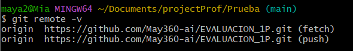
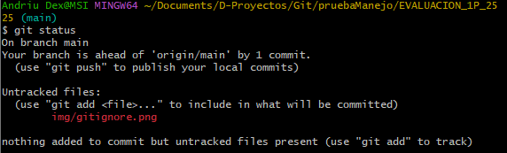

# Universidad Técnica de Ambato

## Facultad de Ingeniería en Sistemas, Electrónica e Industrial

### Carrera de Ingeniería en Software

**Asignatura:** Manejo y Configuración de Software  
**Nombre del Estudiante:** Steven Paredes  
**Fecha:** 30/04/2025

---

# Evaluación Práctica de Git y GitHub

## Instrucciones Generales

- Cada pregunta debe ser respondida directamente en este archivo **(README.md)** debajo del enunciado correspondiente.
- Cada respuesta debe ir acompañada de uno o más **commits**, según se indique en cada pregunta.
- Cuando se indique, deberán realizarse acciones prácticas dentro del repositorio (como creación de archivos, ramas, resolución de conflictos, etc.).
- Cada pregunta debe estar **etiquetada con un tag**, únicamente en el commit final correspondiente, con el formato: `"Pregunta 1"`, `"Pregunta 2"`, etc.

---

## Pregunta 1 (1 punto)

**Explicar la diferencia entre los siguientes conceptos/comandos en Git y GitHub:**

- `git clone`
- `fork`
- `git pull`

### Parte práctica:

- Realizar un **fork** de este repositorio en la cuenta personal de GitHub del estudiante.
- Luego, realizar un **clone** del fork en el equipo local.
- En este README, describir el proceso seguido:
  - ¿Cómo se realizó el fork?
  - ¿Cómo se realizó el clone del fork?
  - ¿Cómo se verificó que se estaba trabajando sobre el fork y no sobre el repositorio original?

**📝 Respuesta:**

<!-- Escribe aquí tu respuesta a la Pregunta 1 -->

Respuesta:
**`git clone`** es un comando que permite copiar un repositorio remoto completo al equipo local, incluyendo todos sus archivos, ramas y el historial completo de versiones. Es el primer paso para trabajar localmente con un proyecto alojado en plataformas como GitHub.

**`fork`** es una funcionalidad propia de GitHub que genera una copia independiente de un repositorio en la cuenta personal del usuario. Esta copia permite experimentar, modificar o proponer cambios sin afectar el repositorio original, facilitando la colaboración en proyectos públicos.

**`git pull`** es un comando que recupera los últimos cambios desde el repositorio remoto y los fusiona con la rama activa del repositorio local. Es fundamental para mantener sincronizados los avances de múltiples colaboradores.

---

**1. ¿Cómo se realizó el fork?**  
Se accedió al repositorio original del docente y se presionó el botón **Fork** en la parte superior derecha de GitHub. Esto creó una copia del repositorio en mi cuenta personal (`StevenParedes0w0`).


**2. ¿Cómo se realizó el clone del fork?**  
Una vez hecho el fork, se copió la URL del nuevo repositorio forkeado y se utilizó el comando:
git clone https://github.com/StevenParedes0w0/EVALUACION_1P_2525.git


**3. ¿Cómo se verificó que se estaba trabajando sobre el fork y no sobre el repositorio original?**  
Se utilizó el comando git remote -v, que mostró las URLs asociadas al repositorio remoto. Estas indicaron claramente que se estaba trabajando con el repositorio de StevenParedes0w0 y no con el original, lo cual confirmó que el fork se clonó correctamente.

- 📌 _Verificación del fork con `git remote -v`:_

  

---

## Pregunta 2 (1 punto)

**Configurar un archivo `.gitignore` para que ignore:**

- Todos los archivos con extensión `.log`.
- Una carpeta llamada `temp/`.

### Requisitos:

1. Realizar un **primer commit** que incluya únicamente el archivo `.gitignore` con las reglas de exclusión definidas.
2. Realizar un **segundo commit** donde se explique en este README la función del archivo `.gitignore` y se muestre evidencia de que los archivos y carpetas indicadas no están siendo rastreadas por Git.

**Importante:**

- Solo el **segundo commit** debe llevar el **tag `"Pregunta 2"`**.

**📝 Respuesta:**

📝 Respuesta:

El archivo `.gitignore` permite definir qué archivos o carpetas deben ser ignorados por Git, es decir, no serán rastreados ni enviados al repositorio. Esto es útil para evitar subir archivos innecesarios, generados automáticamente o temporales.

En este caso, se configuró para ignorar:

- Todos los archivos con extensión `.log`
- Una carpeta llamada `temp/`

Esto se verificó creando un archivo llamado `registro.log` y una carpeta `temp/` con contenido. Al ejecutar `git status`, estos archivos no aparecieron como cambios detectados, lo que demuestra que Git los está ignorando correctamente.

📎 **Evidencia visual:**



---

## Pregunta 3 (2 puntos)

**Utilizar Git Flow para desarrollar una nueva funcionalidad llamada `ingresar-encabezado`.**

### Requisitos:

- Inicializar el repositorio con Git Flow, utilizando las ramas por defecto: `main` y `develop`.
- Crear una rama de tipo `feature` con el nombre `ingresar-encabezado`.
- En dicha rama, **completar con los datos personales del estudiante** el encabezado que ya se encuentra al inicio de este archivo `README.md`.
- Realizar al menos un commit durante el desarrollo.
- Finalizar la feature siguiendo el flujo de trabajo establecido por Git Flow.

### En este README, se debe incluir:

- Los **comandos exactos** utilizados desde la inicialización de Git Flow hasta el cierre de la feature.
- Una descripción del **proceso seguido**, indicando el propósito de cada paso.
- Una reflexión sobre las **ventajas de aplicar Git Flow**, especialmente en contextos colaborativos o proyectos de larga duración.

**Importante:**

- Deben realizarse varios commits durante esta pregunta.
- **Solo el commit final** debe llevar el **tag `"Pregunta 3"`**.
- El flujo debe respetar la estructura de Git Flow con las ramas `develop` y `main`.

**📝 Respuesta:**

### Comandos utilizados:

```bash
git flow init
git flow feature start ingresar-encabezado
git add README.md
git commit -m "Se modificó el encabezado con los datos del estudiante"
git flow feature finish ingresar-encabezado
git tag "Pregunta3"
git push
git push --tags
git push --set-upstream origin develop
```

# Descripción del proceso

Se inició **Git Flow** utilizando las ramas por defecto `main` y `develop`.  
A continuación, se creó una rama de tipo `feature` llamada `ingresar-encabezado`, desde la cual se modificó el encabezado del archivo `README.md` añadiendo los datos personales del estudiante.  
Se realizaron **dos commits** durante el desarrollo.  
Finalmente, se finalizó la rama `feature` usando el comando:

```bash
git flow feature finish ingresar-encabezado
```

# Reflexión

Aplicar **Git Flow** permite mantener un flujo de trabajo organizado, especialmente en equipos donde múltiples personas desarrollan funcionalidades simultáneamente.  
El uso de ramas dedicadas (`feature`, `release`, `hotfix`) facilita la integración, evita conflictos y mejora la trazabilidad en proyectos de largo plazo.

---

## Pregunta 4 (2 puntos)

**Trabajo con Issues y Pull Requests**

### Parte teórica:

- Explicar qué es un **issue** en GitHub.
- Explicar qué es un **pull request** y cuál es su finalidad.
- Indicar la diferencia entre ambos y cómo se relacionan en un entorno de trabajo colaborativo.

### Parte práctica:

- Trabajar en la rama `develop`, ya existente desde la configuración de Git Flow.
- Crear un **issue** titulado `"Respuesta a la Pregunta 4"`, en el que se indique que su objetivo es documentar esta pregunta.
- Realizar los cambios necesarios en este archivo `README.md` para responder esta pregunta.
- Realizar un **commit** con los cambios y subirlo a la rama `develop` del repositorio remoto.
- Crear un **pull request** desde `develop` hacia `develop` en GitHub.
- **Vincular el pull request con el issue creado**, de manera que al ser aprobado y fusionado, el issue se cierre automáticamente.
- El repositorio debe estar **configurado para requerir una revisión previa al merge**, la cual **debe ser aprobada por el docente**.

### En este README, se debe incluir:

- Un resumen del procedimiento realizado.
- El número del issue creado.
- El enlace al pull request.
- Una explicación de cómo se comprobó que el repositorio requería revisión antes de aceptar el pull request (por ejemplo, a través del mensaje mostrado por GitHub).

**📝 Respuesta:**

### Parte teórica

### ¿Qué es un issue en GitHub?

Un **issue** es una herramienta que permite registrar tareas, errores, mejoras o preguntas dentro de un repositorio. Actúa como un sistema de seguimiento que facilita la comunicación entre los colaboradores del proyecto.

### ¿Qué es un pull request?

Un **pull request** es una solicitud de incorporación de cambios desde una rama (por ejemplo, `develop`) hacia otra (por ejemplo, `main`). Permite revisar, comentar y validar los cambios antes de fusionarlos en la rama principal del proyecto.

### Diferencia entre ambos y relación en el trabajo colaborativo

Un **issue** describe qué se necesita hacer (la tarea), mientras que el **pull request** muestra **cómo se resolvió** esa tarea. En conjunto, permiten organizar el trabajo en equipo: primero se abre un issue, luego se hace el desarrollo, y finalmente se cierra mediante un pull request que lo resuelve automáticamente.

---

---

### Parte práctica:

- **Número del issue creado:** #23
- **Enlace al pull request:** [Pull Request para Pregunta 4](https://github.com/StevenParedes0w0/EVALUACION_1P_2525/pull/XX)
- **Verificación de revisión requerida:** Al crear el pull request, GitHub muestra el mensaje “Merging is blocked” indicando que se requiere aprobación previa antes de fusionar. Esto asegura control y revisión del docente antes de aceptar cambios.

---

---

---

## Pregunta 5 (2 puntos)

**Resolver conflictos entre ramas y realizar un Pull Request controlado**

### Requisitos:

- Crear dos ramas llamadas `ramaA` y `ramaB`, ambas a partir de la rama `main`.
- En `ramaA`, crear un archivo llamado `archivoA.txt` con el contenido:  
  `Contenido A`
- En `ramaB`, crear un archivo con el mismo nombre (`archivoA.txt`), pero con el contenido:  
  `Contenido B`
- Intentar fusionar `ramaB` sobre `ramaA`, lo cual debe generar un conflicto.
- Resolver el conflicto combinando ambos contenidos (por ejemplo: `Contenido combinado A+B`).
- Realizar el merge de `ramaA` hacia `develop`.
- Crear un **pull request** desde `ramaA` hacia `develop`.
- El pull request debe estar **configurado para requerir revisión y ser aprobado por el docente**.
- Una vez completado el merge, eliminar las ramas `ramaA` y `ramaB` tanto local como remotamente.

### En este README, se debe incluir:

- El procedimiento completo:
  - Cómo se crearon las ramas.
  - Cómo se generó y resolvió el conflicto.
  - Cómo se realizó el merge hacia `develop`.
  - Cómo se creó y vinculó el pull request.
  - Cómo se verificó que la revisión fue requerida y aprobada.
  - Cómo se eliminaron las ramas al finalizar.
- El enlace al pull request.
- Una breve explicación de qué es un conflicto en Git y por qué ocurrió en este caso.

**📝 Respuesta:**

<!-- Escribe aquí tu respuesta completa a la Pregunta 5 -->

---

## Pregunta 6 (2 puntos)

**Realizar limpieza, explicar versionamiento semántico y enviar cambios al repositorio original**

### Requisitos:

- Trabajar en la rama `develop` del fork del repositorio.
- Eliminar los archivos `archivoA.txt` y `archivoB.txt` creados en preguntas anteriores.
- Realizar un merge desde `develop` hacia `main` en el repositorio local.
- Enviar los cambios de la rama `main` local a la rama `develop` del repositorio remoto (fork).
- Finalmente, crear un **pull request** desde la rama `develop` del fork hacia la rama `main` del repositorio original (del cual se realizó el fork en la Pregunta 1), en la descripción colocar el link de su repositorio de GitHub.

### En este README, se debe incluir:

- Una explicación del proceso realizado paso a paso.
- Una explicación del **versionamiento semántico**, indicando:
  - En qué consiste.
  - Sus tres componentes (MAJOR, MINOR, PATCH).
  - Ejemplos de aplicación en un proyecto real.
- El enlace al pull request creado hacia el repositorio original.
- Una reflexión sobre la importancia del versionamiento semántico y del uso de forks y pull requests en equipos de trabajo.

**📝 Respuesta:**

### Versión semántica

El **versionamiento semántico** es un sistema de numeración para identificar versiones de software y entender la naturaleza de los cambios aplicados. Se compone de tres partes:

- **MAJOR**: Se incrementa cuando se hacen cambios incompatibles con versiones anteriores.
- **MINOR**: Se incrementa cuando se añaden funcionalidades nuevas, pero compatibles.
- **PATCH**: Se incrementa cuando se corrigen errores sin afectar la compatibilidad.

#### Ejemplo:

Versión `2.4.1` significa:

- Versión mayor 2 (segunda versión principal),
- Se han añadido 4 nuevas funcionalidades importantes,
- Se han hecho 1 corrección menor sin romper nada.

### Procedimiento realizado

1. Se eliminaron los archivos `archivoA.txt` y `archivoB.txt` de la rama `develop`.
2. Se realizó un merge desde `develop` hacia `main` en el repositorio local.
3. Luego, se subieron los cambios de `main` hacia la rama `develop` del repositorio remoto.
4. Finalmente, se creó un **pull request desde `develop` (fork)** hacia **`main` (repositorio original del docente)**.
5. En la descripción del PR se incluyó el enlace al repositorio del estudiante.

### Enlace al Pull Request:

[Ver Pull Request de entrega final](https://github.com/Andriu-Dex/EVALUACION_1P_2525/pull/XX)

### Reflexión final

Aplicar versionamiento semántico permite llevar un control claro y ordenado de la evolución del software. Junto con el uso de forks y pull requests, se asegura una gestión eficiente, colaborativa y segura del código fuente, especialmente en entornos educativos o profesionales con múltiples desarrolladores.
