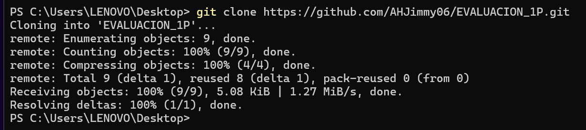
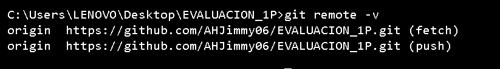
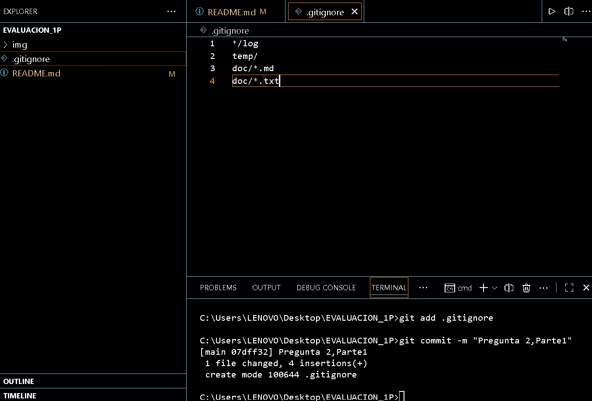
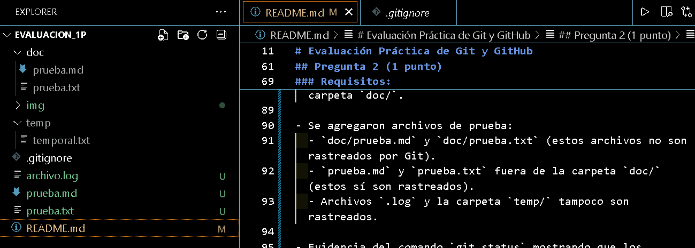
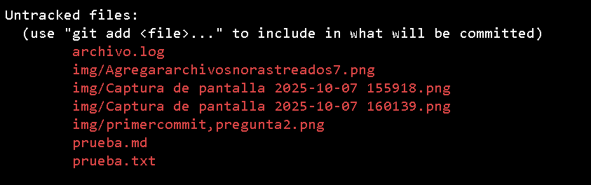

# Universidad [Nombre de la Universidad]  
## Facultad de [Nombre de la Facultad]  
### Carrera de Ingeniería en Software  

**Asignatura:** Manejo y Configuración de Software  
**Nombre del Estudiante:** Jimmy Añilema  
**Fecha:** 7/10/2025

---

# Evaluación Práctica de Git y GitHub

## Instrucciones Generales

- Cada pregunta debe ser respondida directamente en este archivo **(README.md)** debajo del enunciado correspondiente.
- Cada respuesta debe ir acompañada de uno o más **commits**, según se indique en cada pregunta.
- Cuando se indique, deberán realizarse acciones prácticas dentro del repositorio (como creación de archivos, ramas, resolución de conflictos, etc.).
- Cada pregunta debe estar **etiquetada con un tag**, únicamente en el commit final correspondiente, con el formato: `"Pregunta 1"`, `"Pregunta 2"`, etc.

---

## Pregunta 1 (1 punto)

**Explicar la diferencia entre los siguientes conceptos/comandos en Git y GitHub:**

- `git clone`  
- `fork`  
- `git pull`

### Parte práctica:

- Realizar un **fork** de este repositorio en la cuenta personal de GitHub del estudiante.
- Luego, realizar un **clone** del fork en el equipo local.
- En este README, describir el proceso seguido:
  - ¿Cómo se realizó el fork?
  - ¿Cómo se realizó el clone del fork?
  - ¿Cómo se verificó que se estaba trabajando sobre el fork y no sobre el repositorio original?

**📝 Respuesta:**

**Diferencias:**

- **`git clone`:** Comando de Git que descarga una copia completa de un repositorio remoto (incluyendo historial y ramas) a tu equipo local.
- **`fork`:** Acción en GitHub que crea una copia del repositorio en tu propia cuenta, permitiendo trabajar de forma independiente del original.
- **`git pull`:** Comando de Git que actualiza tu repositorio local trayendo y fusionando los últimos cambios del repositorio remoto.

**Proceso seguido:**

- **Fork:** Ingresé al repositorio original en GitHub y presioné el botón "Fork" para crear una copia en mi cuenta personal.  
  

- **Clone:** En mi cuenta, copié la URL del fork y ejecuté en la terminal:  
  `git clone https://github.com/miusuario/nombre-del-repositorio.git`  
  
  
- **Verificación:** Usé el comando `git remote -v` y comprobé que la URL remota corresponde a mi fork (mi usuario), no al repositorio original.  
  

---

## Pregunta 2 (1 punto)

**Configurar un archivo `.gitignore` para que ignore:**

- Todos los archivos con extensión `.log`.
- Una carpeta llamada `temp/`.
- Todos los archivos `.md` y `.txt`de la carpeta `doc/`. (Probar agregando un archivo `prueba.md` y un archivo `prueba.txt` dentro de la carpeta y fuera de la carpeta.)

### Requisitos:

1. Realizar un **primer commit** que incluya únicamente el archivo `.gitignore` con las reglas de exclusión definidas.
2. Realizar un **segundo commit** donde se explique en este README la función del archivo `.gitignore` y se muestre evidencia de que los archivos y carpetas indicadas no están siendo rastreadas por Git.

**Importante:**  
- Solo el **segundo commit** debe llevar el **tag `"Pregunta 2"`**.

**📝 Respuesta:**

**Función del archivo `.gitignore`:**

El archivo `.gitignore` sirve para indicarle a Git qué archivos o carpetas no deben ser rastreados ni incluidos en el control de versiones. Esto es útil para evitar subir archivos temporales, de configuración local, o archivos generados automáticamente que no son relevantes para el repositorio.

**Evidencia de exclusión:**

- Se creó un archivo `.gitignore` con las siguientes reglas:
  - Ignorar todos los archivos `.log`.
  - Ignorar la carpeta `temp/`.
  - Ignorar todos los archivos `.md` y `.txt` dentro de la carpeta `doc/`.

  

- Se agregaron archivos de prueba:
  - `doc/prueba.md` y `doc/prueba.txt` (estos archivos no son rastreados por Git).
  - `prueba.md` y `prueba.txt` fuera de la carpeta `doc/` (estos sí son rastreados).
  - Archivos `.log` y la carpeta `temp/` tampoco son rastreados.

  

- Evidencia del comando `git status` mostrando que los archivos y carpetas indicados no aparecen como cambios a ser rastreados:

  

---

## Pregunta 3 (2 puntos)

**Utilizar Git Flow para desarrollar una nueva funcionalidad llamada `ingresar-encabezado`.**

### Requisitos:

- Inicializar el repositorio con Git Flow, utilizando las ramas por defecto: `main` y `develop`.
- Crear una rama de tipo `hotfix` con el nombre `ingresar-encabezado`.
- En dicha rama, **completar con los datos personales del estudiante** el encabezado que ya se encuentra al inicio de este archivo `README.md`.
- Realizar al menos un commit durante el desarrollo.
- Finalizar el hotfix siguiendo el flujo de trabajo establecido por Git Flow.

### En este README, se debe incluir:

- Los **comandos exactos** utilizados desde la inicialización de Git Flow hasta el cierre del hotfix.
- Una descripción del **proceso seguido**, indicando el propósito de cada paso.
- Una reflexión sobre las **ventajas de aplicar Git Flow**, especialmente en contextos colaborativos o proyectos de larga duración.

**Importante:**

- Deben realizarse varios commits durante esta pregunta.
- **Solo el commit final** debe llevar el **tag `"Pregunta 3"`**.
- El flujo debe respetar la estructura de Git Flow con las ramas `develop` y `main`.

**📝 Respuesta:**

### Comandos exactos utilizados

```bash
# Inicializar Git Flow en el repositorio
git flow init

# Crear y empezar un hotfix llamado ingresar-encabezado
git flow hotfix start ingresar-encabezado

# (Editar el README.md para completar los datos personales en el encabezado)

# Agregar y commitear los cambios realizados
git add README.md
git commit -m "Completar encabezado con datos personales"

# Finalizar el hotfix (esto fusiona los cambios en main y develop, y crea un tag)
git flow hotfix finish ingresar-encabezado

# Subir los cambios y los tags al repositorio remoto
git push origin main
git push origin develop
git push origin --tags
```

### Descripción del proceso seguido

1. **Inicialización de Git Flow:**  
   Se ejecutó `git flow init` para configurar el flujo de trabajo con las ramas principales `main` y `develop`.

2. **Creación del hotfix:**  
   Se creó una rama de tipo hotfix llamada `ingresar-encabezado` con `git flow hotfix start ingresar-encabezado`. Esto permite corregir o agregar cambios urgentes directamente sobre la rama principal.

3. **Desarrollo en la rama hotfix:**  
   Se completó el encabezado del archivo `README.md` con los datos personales del estudiante y se realizó un commit.

4. **Finalización del hotfix:**  
   Se ejecutó `git flow hotfix finish ingresar-encabezado`, lo que fusionó los cambios tanto en `main` como en `develop`, eliminó la rama hotfix y creó un tag correspondiente.

5. **Subida de cambios:**  
   Se subieron las ramas y los tags al repositorio remoto con los comandos `git push`.

### Ventajas de aplicar Git Flow

- **Organización:** Permite separar claramente el desarrollo de nuevas funcionalidades, correcciones urgentes y lanzamientos.
- **Colaboración:** Facilita el trabajo en equipo, ya que cada tipo de tarea tiene su propio flujo y ramas específicas.
- **Control de versiones:** Ayuda a mantener un historial limpio y estructurado, ideal para proyectos de larga duración y equipos grandes.
- **Reducción de errores:** Minimiza los conflictos y errores al tener procesos definidos para cada tipo de cambio.

---

## Pregunta 4 (2 puntos)

**Trabajo con Issues y Pull Requests**

### Parte teórica:

- Explicar qué es un **issue** en GitHub.
- Explicar qué es un **pull request** y cuál es su finalidad.
- Indicar la diferencia entre ambos y cómo se relacionan en un entorno de trabajo colaborativo.

### Parte práctica:

- Trabajar en la rama `develop`, ya existente desde la configuración de Git Flow.
- Crear un **issue** titulado `"Respuesta a la Pregunta 4"`, en el que se indique que su objetivo es documentar esta pregunta.
- Realizar los cambios necesarios en este archivo `README.md` para responder esta pregunta.
- Realizar un **commit** con los cambios y subirlo a la rama `develop` del repositorio remoto.
- Crear un **pull request** desde `develop` hacia `main` en GitHub.
- **Vincular el pull request con el issue creado**, de manera que al ser aprobado y fusionado, el issue se cierre automáticamente.
- **Aprobar** el pull request para que se haga el merge respectivo hacia `main`.

### En este README, se debe incluir:

- Un resumen del procedimiento realizado.
- El número y enlace del issue creado.
- El número y enlace al pull request.

**📝 Respuesta:**

<!-- Escribe aquí tu respuesta completa a la Pregunta 4 -->

---

## Pregunta 5 (2 puntos)

**Resolver conflictos entre ramas y realizar un Pull Request**

### Requisitos:

- Crear dos ramas llamadas `ramaA` y `ramaB`, ambas a partir de la rama `develop`.
- En `ramaA`, crear un archivo llamado `archivoA.txt` con el contenido:  
  `Contenido A`
- En `ramaB`, crear un archivo con el mismo nombre (`archivoA.txt`), pero con el contenido:  
  `Contenido B`
- Intentar fusionar `ramaB` sobre `ramaA`, lo cual debe generar un conflicto.
- Resolver el conflicto combinando ambos contenidos.
- Realizar el merge de `ramaA` hacia `develop`.
- Crear un **pull request** desde `develop` hacia `main`.
- Una vez completado lo anterior, eliminar las ramas `ramaA` y `ramaB` tanto local como remotamente.

### En este README, se debe incluir:

- El procedimiento completo:
  - Cómo se crearon las ramas.
  - Cómo se generó y resolvió el conflicto.
  - Cómo se realizó el merge hacia `develop`.
  - Cómo se eliminaron las ramas al finalizar.
- El enlace al pull request.
- Una breve explicación de qué es un conflicto en Git y por qué ocurrió en este caso.

**📝 Respuesta:**

<!-- Escribe aquí tu respuesta completa a la Pregunta 5 -->

---

## Pregunta 6 (2 puntos)

**Realizar limpieza, explicar versionamiento semántico y enviar cambios al repositorio original**

### Requisitos:

- Trabajar en la rama `develop` del fork del repositorio.
- Eliminar los archivos `archivoA.txt` y `archivoB.txt` creados en preguntas anteriores.
- Realizar un merge desde `develop` hacia `main` en el repositorio local.
- Enviar los cambios de la rama `main` local a la rama `develop` del repositorio remoto (fork). Recuerde incluir todos los tags creados (6 tags).
- Finalmente, crear un **pull request** desde la rama `develop` del fork hacia la rama `main` del repositorio original (del cual se realizó el fork en la Pregunta 1). El titulo del pull request debe ser "NOMBRE APELLIDOS", en la descripción colocar el link de su repositorio de GitHub.

### En este README, se debe incluir:

- Una explicación del proceso realizado paso a paso.
- Una explicación del **versionamiento semántico**, indicando:
  - En qué consiste.
  - Sus tres componentes (MAJOR, MINOR, PATCH).
- El enlace al pull request creado hacia el repositorio original.
- Si hace falta agregar alguna evidencia adicional, agregue un tag adicional que sea `Version Final`.

**📝 Respuesta:**

<!-- Escribe aquí tu respuesta completa a la Pregunta 6 -->
