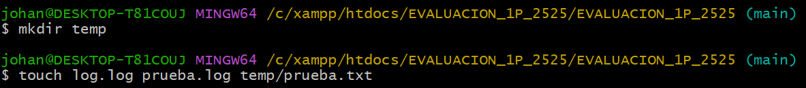

# Universidad [Nombre de la Universidad]  
## Facultad de [Nombre de la Facultad]  
### Carrera de Ingeniería en Software  

**Asignatura:** Manejo y Configuración de Software  
**Nombre del Estudiante:** Ojeda Castillo Jonathan Fabrico  
**Fecha:** 30/04/2025  

---

# Evaluación Práctica de Git y GitHub

## Instrucciones Generales

- Cada pregunta debe ser respondida directamente en este archivo **(README.md)** debajo del enunciado correspondiente.
- Cada respuesta debe ir acompañada de uno o más **commits**, según se indique en cada pregunta.
- Cuando se indique, deberán realizarse acciones prácticas dentro del repositorio (como creación de archivos, ramas, resolución de conflictos, etc.).
- Cada pregunta debe estar **etiquetada con un tag**, únicamente en el commit final correspondiente, con el formato: `"Pregunta 1"`, `"Pregunta 2"`, etc.

---

## Pregunta 1 (1 punto)

**Explicar la diferencia entre los siguientes conceptos/comandos en Git y GitHub:**

- `git clone`  
- `fork`  
- `git pull`

### Parte práctica:

- Realizar un **fork** de este repositorio en la cuenta personal de GitHub del estudiante.
- Luego, realizar un **clone** del fork en el equipo local.
- En este README, describir el proceso seguido:
  - ¿Cómo se realizó el fork?
  Ingrese a github y presione click en fork desde el directorio inicial de santiagojara/EVALUACION_1P_2525 
  - ¿Cómo se realizó el clone del fork?
  
    Se desplego el terminal de git 
    Se ingreso el comando git clone seguido del la url del repositorio de mi cuenta 'ajkarots':
    git clone https://github.com/ajkarots/EVALUACION_1P_2525.git

  - ¿Cómo se verificó que se estaba trabajando sobre el fork y no sobre el repositorio original?
  
    En el terminal git se debe ingresar el comando $ git remote -v lo cual nos muestra:
    origin  https://github.com/ajkarots/EVALUACION_1P_2525.git (fetch)
    origin  https://github.com/ajkarots/EVALUACION_1P_2525.git (push)
    Mediente esa direccion se puede observar claramente que el repositorio pertenece a la cuenta ajkarots

**📝 Respuesta:**

git clone
Qué es: Es un comando de Git que se utiliza para copiar un repositorio existente a tu máquina local.

Qué hace: Descarga todo el historial de commits, ramas, y archivos del repositorio remoto.

Uso típico: git clone https://github.com/usuario/repositorio.git

Ejemplo: Si ves un proyecto en GitHub y quieres trabajar en él localmente, lo clonas.

fork
Qué es: Es una acción en GitHub (no un comando Git) que te permite crear una copia de un repositorio en tu propia cuenta de GitHub.

Qué hace: Copia el repositorio original (con todo su historial) a tu cuenta personal, permitiéndote modificarlo libremente.

Uso típico: Se usa cuando quieres contribuir a un proyecto pero no tienes acceso directo para escribir en el repositorio original.

Ejemplo: Haces fork del repositorio de otro usuario y luego puedes clonarlo con git clone.

git pull

Qué es: Es un comando de Git que se utiliza para actualizar tu repositorio local con los últimos cambios del repositorio remoto.

Qué hace: Combina dos acciones: git fetch (descargar cambios) y git merge (integrarlos en tu rama actual).

Uso típico: git pull origin main

Ejemplo: Si otros colaboradores han hecho cambios en GitHub, tú haces git pull para traer esos cambios a tu copia local.

Git clone es un comando para copiar el repositorio localmente, mientras que fork lo copia desde un repositorio a otro manteniendo el origen de la ruta del repositorio,
haciendo alusion a quien fue el creador; git pull "trae" desde el repositorio los datos que se encuentran en la nube.

---

## Pregunta 2 (1 punto)

**Configurar un archivo `.gitignore` para que ignore:**

- Todos los archivos con extensión `.log`.
- Una carpeta llamada `temp/`.

### Requisitos:

1. Realizar un **primer commit** que incluya únicamente el archivo `.gitignore` con las reglas de exclusión definidas.
2. Realizar un **segundo commit** donde se explique en este README la función del archivo `.gitignore` y se muestre evidencia de que los archivos y carpetas indicadas no están siendo rastreadas por Git.

**Importante:**  
- Solo el **segundo commit** debe llevar el **tag `"Pregunta 2"`**.

**📝 Respuesta:**

Commit con gitignore y las reglas

-Archivo git ignore creado

Funcion del archivo .gitignore

El archivo gitignore no detectara para commits los archivos con extension
.log ni las carpetas temp/

Tag Pregunta 2

---

## Pregunta 3 (2 puntos)

**Utilizar Git Flow para desarrollar una nueva funcionalidad llamada `ingresar-encabezado`.**

### Requisitos:

- Inicializar el repositorio con Git Flow, utilizando las ramas por defecto: `main` y `develop`.
- Crear una rama de tipo `feature` con el nombre `ingresar-encabezado`.
- En dicha rama, **completar con los datos personales del estudiante** el encabezado que ya se encuentra al inicio de este archivo `README.md`.
- Realizar al menos un commit durante el desarrollo.
- Finalizar la feature siguiendo el flujo de trabajo establecido por Git Flow.

### En este README, se debe incluir:

- Los **comandos exactos** utilizados desde la inicialización de Git Flow hasta el cierre de la feature.
- Una descripción del **proceso seguido**, indicando el propósito de cada paso.
- Una reflexión sobre las **ventajas de aplicar Git Flow**, especialmente en contextos colaborativos o proyectos de larga duración.

**Importante:**

- Deben realizarse varios commits durante esta pregunta.
- **Solo el commit final** debe llevar el **tag `"Pregunta 3"`**.
- El flujo debe respetar la estructura de Git Flow con las ramas `develop` y `main`.

**📝 Respuesta:**

- Inicializar el repositorio con Git Flow, utilizando las ramas por defecto: `main` y `develop`.

- Crear una rama de tipo `feature` con el nombre `ingresar-encabezado`.

- En dicha rama, **completar con los datos personales del estudiante** el encabezado que ya se encuentra al inicio de este archivo `README.md`.

- Realizar al menos un commit durante el desarrollo.

- Finalizar la feature siguiendo el flujo de trabajo establecido por Git Flow.

- Los **comandos exactos** utilizados desde la inicialización de Git Flow hasta el cierre de la feature.

Para inicar 
git flow feature start ingresar-encabezado
Para finalizar
git flow finish start ingresar-encabezado

- Una descripción del **proceso seguido**, indicando el propósito de cada paso.

El usar git flow con feature ayuda a no tener que crear las ramas individualmente y luego 
cambiarnos entre ellas con checkout, se modifico el archivo readme.md y se cumplieron con los requisitos

- Una reflexión sobre las **ventajas de aplicar Git Flow**, especialmente en contextos colaborativos o proyectos de larga duración.

Usar git flow es una gran ventaja de tiempo frente a hacerlo "manualmente" ya que ganamos mucho tiempo
y sobre todo dentro de un examen cada segundo cuenta.

---

## Pregunta 4 (2 puntos)

**Trabajo con Issues y Pull Requests**

### Parte teórica:

- Explicar qué es un **issue** en GitHub.
- Explicar qué es un **pull request** y cuál es su finalidad.
- Indicar la diferencia entre ambos y cómo se relacionan en un entorno de trabajo colaborativo.

### Parte práctica:

- Trabajar en la rama `develop`, ya existente desde la configuración de Git Flow.
- Crear un **issue** titulado `"Respuesta a la Pregunta 4"`, en el que se indique que su objetivo es documentar esta pregunta.
- Realizar los cambios necesarios en este archivo `README.md` para responder esta pregunta.
- Realizar un **commit** con los cambios y subirlo a la rama `develop` del repositorio remoto.
- Crear un **pull request** desde `develop` hacia `develop` en GitHub.
- **Vincular el pull request con el issue creado**, de manera que al ser aprobado y fusionado, el issue se cierre automáticamente.
- El repositorio debe estar **configurado para requerir una revisión previa al merge**, la cual **debe ser aprobada por el docente**.

### En este README, se debe incluir:

- Un resumen del procedimiento realizado.
- El número del issue creado.
- El enlace al pull request.
- Una explicación de cómo se comprobó que el repositorio requería revisión antes de aceptar el pull request (por ejemplo, a través del mensaje mostrado por GitHub).

**📝 Respuesta:**

- Explicar qué es un **issue** en GitHub.
Es un requisito solicitado desde la paltaforma donde indicamos nuevas funcionalidades posibles.
- Explicar qué es un **pull request** y cuál es su finalidad.

Un pull request (también abreviado como PR) es una solicitud que haces en plataformas como GitHub,para proponer cambios en el código de un repositorio.

Finalidad:
  Permitir que otros revisen, comenten y aprueben tus cambios antes de integrarlos al proyecto principal.
  Facilitar la colaboración, la revisión de código y el control de calidad.

- Indicar la diferencia entre ambos y cómo se relacionan en un entorno de trabajo colaborativo.

un issue Un reporte de problema, mejora o tareamientras que un Pull Request es 	Una propuesta de cambio de código
Se relacionan  por que se puede cerrar automaticamente  al ser aceptado

- Trabajar en la rama `develop`, ya existente desde la configuración de Git Flow.

- Crear un **issue** titulado `"Respuesta a la Pregunta 4"`, en el que se indique que su objetivo es documentar esta pregunta.

- Realizar un **commit** con los cambios y subirlo a la rama `develop` del repositorio remoto.

- Crear un **pull request** desde `develop` hacia `develop` en GitHub.

- **Vincular el pull request con el issue creado**, de manera que al ser aprobado y fusionado, el issue se cierre automáticamente.

- El repositorio debe estar **configurado para requerir una revisión previa al merge**, la cual **debe ser aprobada por el docente**.

---

## Pregunta 5 (2 puntos)

**Resolver conflictos entre ramas y realizar un Pull Request controlado**

### Requisitos:

- Crear dos ramas llamadas `ramaA` y `ramaB`, ambas a partir de la rama `main`.
- En `ramaA`, crear un archivo llamado `archivoA.txt` con el contenido:  
  `Contenido A`
- En `ramaB`, crear un archivo con el mismo nombre (`archivoA.txt`), pero con el contenido:  
  `Contenido B`
- Intentar fusionar `ramaB` sobre `ramaA`, lo cual debe generar un conflicto.
- Resolver el conflicto combinando ambos contenidos (por ejemplo: `Contenido combinado A+B`).
- Realizar el merge de `ramaA` hacia `develop`.
- Crear un **pull request** desde `ramaA` hacia `develop`.
- El pull request debe estar **configurado para requerir revisión y ser aprobado por el docente**.
- Una vez completado el merge, eliminar las ramas `ramaA` y `ramaB` tanto local como remotamente.

### En este README, se debe incluir:

- El procedimiento completo:
  - Cómo se crearon las ramas.
  - Cómo se generó y resolvió el conflicto.
  - Cómo se realizó el merge hacia `develop`.
  - Cómo se creó y vinculó el pull request.
  - Cómo se verificó que la revisión fue requerida y aprobada.
  - Cómo se eliminaron las ramas al finalizar.
- El enlace al pull request.
- Una breve explicación de qué es un conflicto en Git y por qué ocurrió en este caso.

**📝 Respuesta:**

- Crear dos ramas llamadas `ramaA` y `ramaB`, ambas a partir de la rama `main`.
- En `ramaA`, crear un archivo llamado `archivoA.txt` con el contenido:  
  `Contenido A`
- En `ramaB`, crear un archivo con el mismo nombre (`archivoA.txt`), pero con el contenido:  
  `Contenido B`
- Intentar fusionar `ramaB` sobre `ramaA`, lo cual debe generar un conflicto.
- Resolver el conflicto combinando ambos contenidos (por ejemplo: `Contenido combinado A+B`).
- Realizar el merge de `ramaA` hacia `develop`.
- Crear un **pull request** desde `ramaA` hacia `develop`.
- El pull request debe estar **configurado para requerir revisión y ser aprobado por el docente**.
- Una vez completado el merge, eliminar las ramas `ramaA` y `ramaB` tanto local como remotamente.

---

## Pregunta 6 (2 puntos)

**Realizar limpieza, explicar versionamiento semántico y enviar cambios al repositorio original**

### Requisitos:

- Trabajar en la rama `develop` del fork del repositorio.
- Eliminar los archivos `archivoA.txt` y `archivoB.txt` creados en preguntas anteriores.
- Realizar un merge desde `develop` hacia `main` en el repositorio local.
- Enviar los cambios de la rama `main` local a la rama `develop` del repositorio remoto (fork).
- Finalmente, crear un **pull request** desde la rama `develop` del fork hacia la rama `main` del repositorio original (del cual se realizó el fork en la Pregunta 1), en la descripción colocar el link de su repositorio de GitHub.

### En este README, se debe incluir:

- Una explicación del proceso realizado paso a paso.
- Una explicación del **versionamiento semántico**, indicando:
  - En qué consiste.
  - Sus tres componentes (MAJOR, MINOR, PATCH).
  - Ejemplos de aplicación en un proyecto real.
- El enlace al pull request creado hacia el repositorio original.
- Una reflexión sobre la importancia del versionamiento semántico y del uso de forks y pull requests en equipos de trabajo.

**📝 Respuesta:**

<!-- Escribe aquí tu respuesta completa a la Pregunta 6 -->
