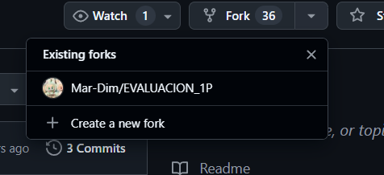
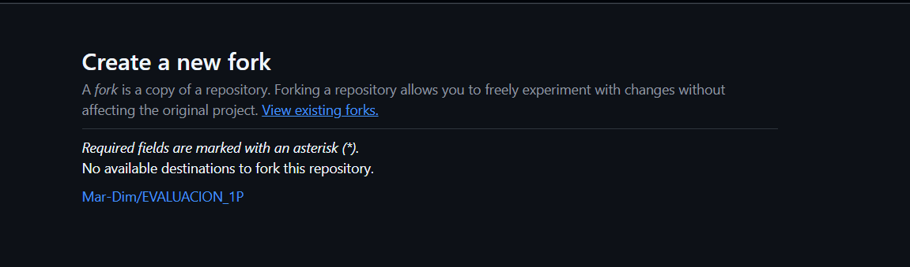
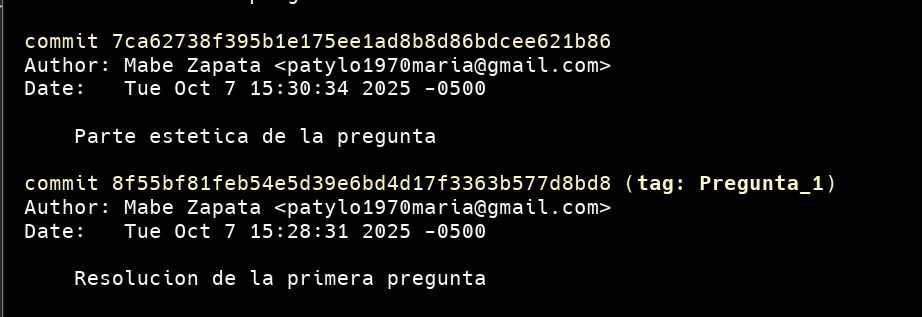
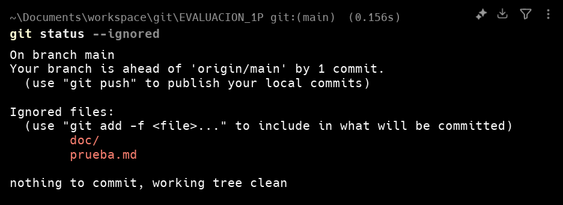
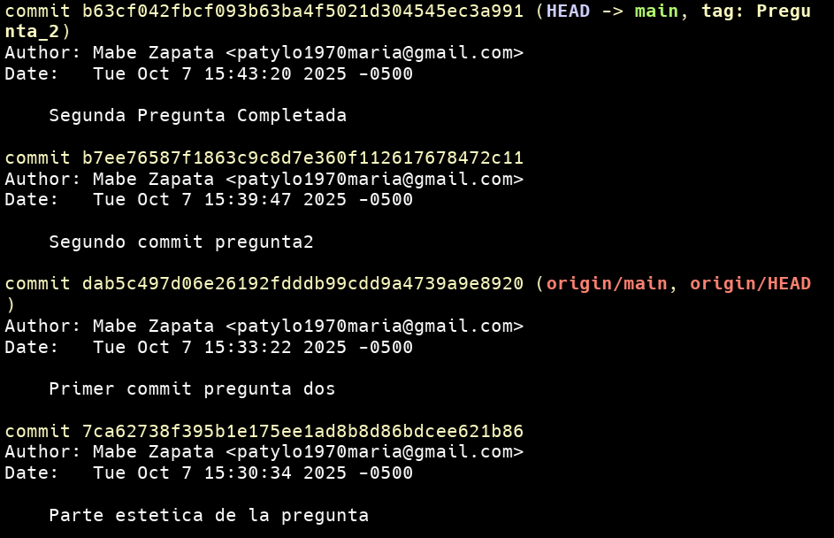
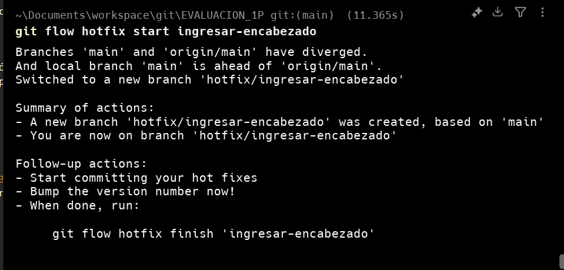
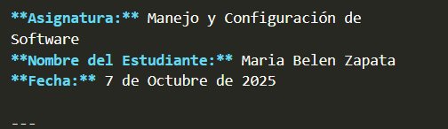
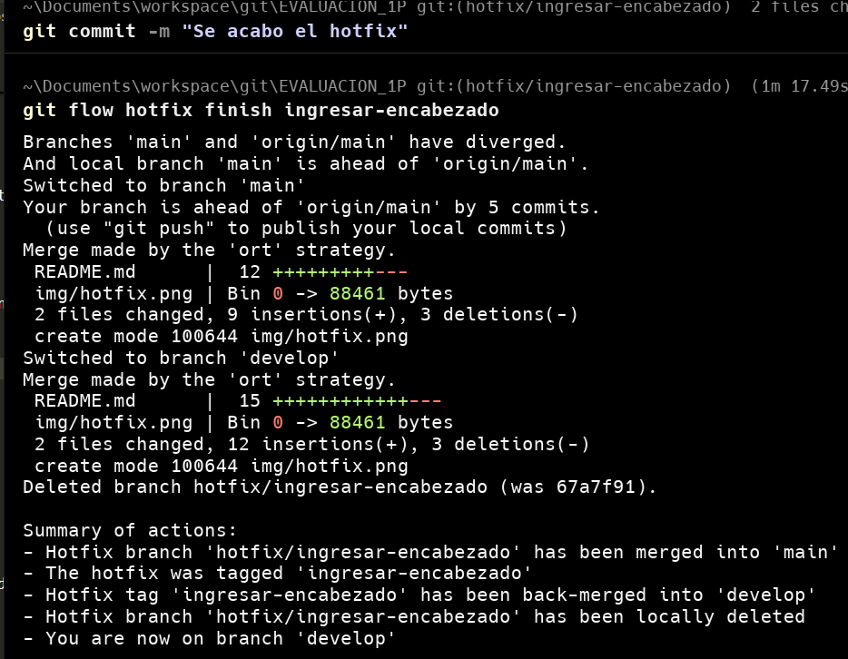
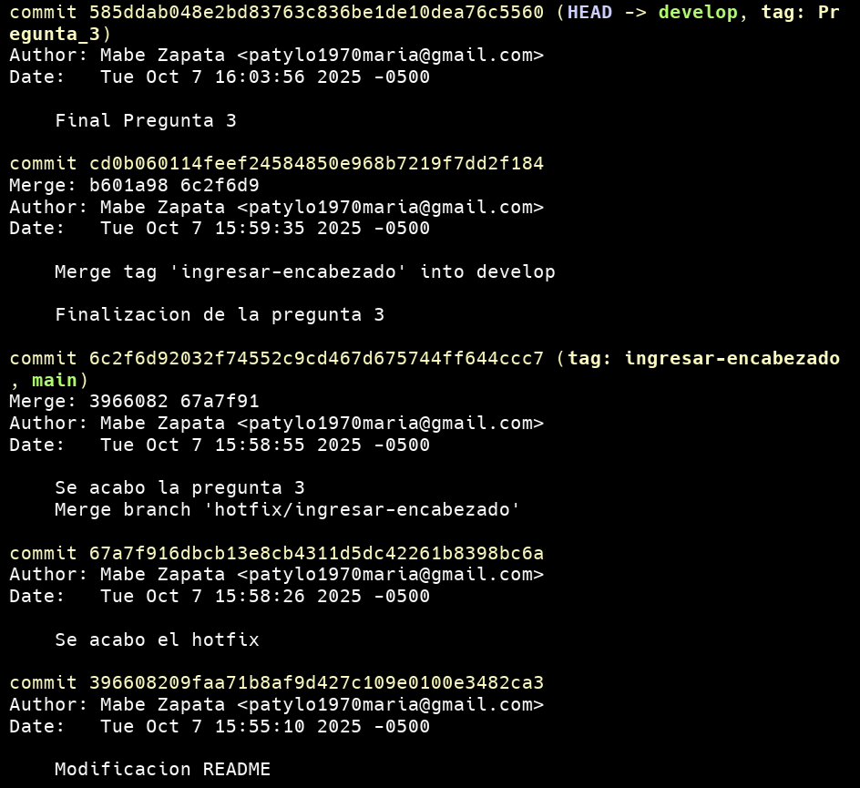
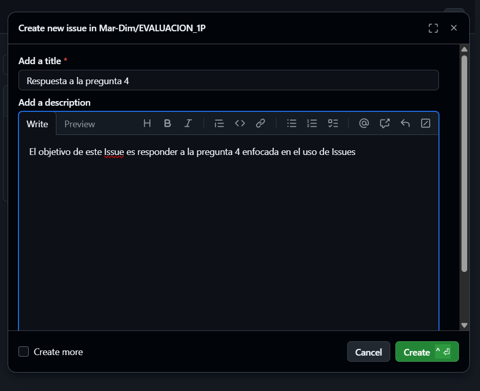

# Universidad [Nombre de la Universidad]  
## Facultad de [Nombre de la Facultad]  
### Carrera de Ingeniería en Software  

**Asignatura:** Manejo y Configuración de Software  
**Nombre del Estudiante:** Maria Belen Zapata 
**Fecha:** 7 de Octubre de 2025 

---

# Evaluación Práctica de Git y GitHub

## Instrucciones Generales

- Cada pregunta debe ser respondida directamente en este archivo **(README.md)** debajo del enunciado correspondiente.
- Cada respuesta debe ir acompañada de uno o más **commits**, según se indique en cada pregunta.
- Cuando se indique, deberán realizarse acciones prácticas dentro del repositorio (como creación de archivos, ramas, resolución de conflictos, etc.).
- Cada pregunta debe estar **etiquetada con un tag**, únicamente en el commit final correspondiente, con el formato: `"Pregunta 1"`, `"Pregunta 2"`, etc.

---

## Pregunta 1 (1 punto)

**Explicar la diferencia entre los siguientes conceptos/comandos en Git y GitHub:**

- `git clone`  
- `fork`  
- `git pull`

### Parte práctica:

- Realizar un **fork** de este repositorio en la cuenta personal de GitHub del estudiante.
- Luego, realizar un **clone** del fork en el equipo local.
- En este README, describir el proceso seguido:
  - ¿Cómo se realizó el fork?
  - ¿Cómo se realizó el clone del fork?
  - ¿Cómo se verificó que se estaba trabajando sobre el fork y no sobre el repositorio original?

**📝 Respuesta:**

- Explicacion de git clone

Git clone es un comando que permite clonar un repositorio remoto para un git local, este comando despues de ejecutarse crea una carpeta que dentro contiene lo que se encontraba en el repositorio remoto.
- Explicacion de fork

El fork en github permite traer un repositorio de otro usuario a los repositorios propios, es como realizar una copia del repositorio pero este mantiene coneccion con el original de modo que los cambios en la rama main seran controlados por la persona que creo el repositorio, si se desea hacer un cambio en main se debe hacer un pull request del contenido del fork hacia la main del repositorio original.
- Explicacion de git pull

Git pull es el comando que se utiliza cuando se desea traer los datos del repositorio remoto, al usarse este comando el contenido del repositorio local con lo que es traido del repositorio remoto.

### Parte práctica:
- Para realizar el fork debemos acceder al repositorio que se quiere utilizar, dentro de este tendremos la opcion de crear un nuevo fork.

- Al dar click sobre este tendremos la interfaz que se visualiza en la imagen. En este apartado se puede cambiar el nombre si se desea hacerlo.
- Despues de aceptar la creacion del fork, el repositorio resultante se visualizara de la siguiente forma, donde se notifica que es un fork del repositorio original.

- Para clonar el repositorio remoto que resulto del fork, se utiliza el comando git clone con el url del fork realizado como se puede ver en la captura

 
- Como se puede ver dentro de la imagen del fork creado se verifica que se esta trabajando en un repositorio propio que es una bifurcacion del repositorio original, al hacer un clon del repositorio resultante se sigue trabajando en el repositorio de la bifurcacion y no en el original.

## Commits Pregunta 1 

---

## Pregunta 2 (1 punto)

**Configurar un archivo `.gitignore` para que ignore:**

- Todos los archivos con extensión `.log`.
- Una carpeta llamada `temp/`.
- Todos los archivos `.md` y `.txt`de la carpeta `doc/`. (Probar agregando un archivo `prueba.md` y un archivo `prueba.txt` dentro de la carpeta y fuera de la carpeta.)

### Requisitos:

1. Realizar un **primer commit** que incluya únicamente el archivo `.gitignore` con las reglas de exclusión definidas.

2. Realizar un **segundo commit** donde se explique en este README la función del archivo `.gitignore` y se muestre evidencia de que los archivos y carpetas indicadas no están siendo rastreadas por Git.

**Importante:**  
- Solo el **segundo commit** debe llevar el **tag `"Pregunta 2"`**.

**📝 Respuesta:**

<!-- Escribe aquí tu explicación y evidencia para la Pregunta 2 -->
El archivo .gitignore se utiliza para indicarle a git que extensiones, carpetas o archivos no deben ser rastrados dentro del repositorio, de modo que asi sabe git que archivos no debe tomar en cuenta.

El git ignore correspondiente a esta practica tiene la siguiente estructura, que permite controlar todos los archivos solicitados.

*.log
temp/
*.md
doc/*.txt

## Commits Pregunta 2 

---

## Pregunta 3 (2 puntos)

**Utilizar Git Flow para desarrollar una nueva funcionalidad llamada `ingresar-encabezado`.**

### Requisitos:

- Inicializar el repositorio con Git Flow, utilizando las ramas por defecto: `main` y `develop`.
- Crear una rama de tipo `hotfix` con el nombre `ingresar-encabezado`.
- En dicha rama, **completar con los datos personales del estudiante** el encabezado que ya se encuentra al inicio de este archivo `README.md`.
- Realizar al menos un commit durante el desarrollo.
- Finalizar el hotfix siguiendo el flujo de trabajo establecido por Git Flow.

### En este README, se debe incluir:

- Los **comandos exactos** utilizados desde la inicialización de Git Flow hasta el cierre del hotfix.
- Una descripción del **proceso seguido**, indicando el propósito de cada paso.
- Una reflexión sobre las **ventajas de aplicar Git Flow**, especialmente en contextos colaborativos o proyectos de larga duración.

**Importante:**

- Deben realizarse varios commits durante esta pregunta.
- **Solo el commit final** debe llevar el **tag `"Pregunta 3"`**.
- El flujo debe respetar la estructura de Git Flow con las ramas `develop` y `main`.

**📝 Respuesta:**
- Comandos utilizados para la creacion del hotflix
git flow init
git checkout main
git flow hotfix start ingresar-encabezado -> al ingresar este comando tenemos lo siguiente

Realizamos la modificacion solicitada

al finalizar la rama aplicamos 
git flow hotfix finish ingresar-encabezado
-> el uso de esto hara merge en main y en develop actualizando todas las ramas como se demuestra en la imagen

Gitflow facilita el trabajo colaborativo ya que permite de forma sencilla iniciar ramas para cada desarrollador, de modo que no se sobre escriba codigo asi como facilita el proceso de fusion ya que todas las nuevas funcionalidades hacen desde el apartado de develop asegurando el codigo de produccion que esta en main y del mismo modo cuando se finaliza una funcionalidad al terminar la rama mediante git flow esta se auto fusiona a su rama de origen de modo que el codigo se actualiza y se reducen los posibles conflictos, dentro de proyectos grandes puede facilitar la organizacion y en proyectos con actualizacion constante permite mantener segura la version final mientras se realizan actualizaciones.

## Commits Pregunta 3

---

## Pregunta 4 (2 puntos)

**Trabajo con Issues y Pull Requests**

### Parte teórica:

- Explicar qué es un **issue** en GitHub.
- Explicar qué es un **pull request** y cuál es su finalidad.
- Indicar la diferencia entre ambos y cómo se relacionan en un entorno de trabajo colaborativo.

### Parte práctica:

- Trabajar en la rama `develop`, ya existente desde la configuración de Git Flow.
- Crear un **issue** titulado `"Respuesta a la Pregunta 4"`, en el que se indique que su objetivo es documentar esta pregunta.
- Realizar los cambios necesarios en este archivo `README.md` para responder esta pregunta.
- Realizar un **commit** con los cambios y subirlo a la rama `develop` del repositorio remoto.
- Crear un **pull request** desde `develop` hacia `main` en GitHub.
- **Vincular el pull request con el issue creado**, de manera que al ser aprobado y fusionado, el issue se cierre automáticamente.
- **Aprobar** el pull request para que se haga el merge respectivo hacia `main`.

### En este README, se debe incluir:

- Un resumen del procedimiento realizado.
- El número y enlace del issue creado.
El numero del Issue #1
https://github.com/Mar-Dim/EVALUACION_1P/issues/1
- El número y enlace al pull request.

**📝 Respuesta:**

<!-- Escribe aquí tu respuesta completa a la Pregunta 4 -->

- Explicacion de los Issues
Un issue en GitHub permite notificar a los desarrolladores de un proyecto sobre las fallas o problemas existentes dentro de su código. En grupos grandes de trabajo, es una forma efectiva de comunicar los cambios o correcciones que deben realizar otros miembros del equipo.

Un pull request es una solicitud formal para agregar el contenido de una rama a otra. Este proceso incluye una revisión de código y, posteriormente, si todo está correcto, se realiza un merge hacia la rama solicitada.

La diferencia principal entre ambos radica en que un issue sirve para reportar un problema o bug dentro del código, mientras que un pull request puede tanto resolver un problema como añadir una nueva funcionalidad, ya que implica un proceso de fusión entre ramas. Como su nombre lo indica, el issue está directamente ligado a un problema dentro del proyecto.

- Un resumen del procedimiento realizado.

Inicialmente no se contaba con la funcionalidad de Issues por lo cual se activo esta opcion dentro del apartado de settings del repositorio, luego de eso en el boton issues se creo una issue segun el requerimiento solicitado.

Posterior a ello se realizo los cambios en el README y se utilizo un commit dentro del repositorio local que fue trasladado al repositorio remoto de github para el posterior pull request

- El número y enlace del issue creado.

El numero del Issue #1
https://github.com/Mar-Dim/EVALUACION_1P/issues/1

- El número y enlace al pull request.
---

## Pregunta 5 (2 puntos)

**Resolver conflictos entre ramas y realizar un Pull Request**

### Requisitos:

- Crear dos ramas llamadas `ramaA` y `ramaB`, ambas a partir de la rama `develop`.
- En `ramaA`, crear un archivo llamado `archivoA.txt` con el contenido:  
  `Contenido A`
- En `ramaB`, crear un archivo con el mismo nombre (`archivoA.txt`), pero con el contenido:  
  `Contenido B`
- Intentar fusionar `ramaB` sobre `ramaA`, lo cual debe generar un conflicto.
- Resolver el conflicto combinando ambos contenidos.
- Realizar el merge de `ramaA` hacia `develop`.
- Crear un **pull request** desde `develop` hacia `main`.
- Una vez completado lo anterior, eliminar las ramas `ramaA` y `ramaB` tanto local como remotamente.

### En este README, se debe incluir:

- El procedimiento completo:
  - Cómo se crearon las ramas.
  - Cómo se generó y resolvió el conflicto.
  - Cómo se realizó el merge hacia `develop`.
  - Cómo se eliminaron las ramas al finalizar.
- El enlace al pull request.
- Una breve explicación de qué es un conflicto en Git y por qué ocurrió en este caso.

**📝 Respuesta:**

<!-- Escribe aquí tu respuesta completa a la Pregunta 5 -->

---

## Pregunta 6 (2 puntos)

**Realizar limpieza, explicar versionamiento semántico y enviar cambios al repositorio original**

### Requisitos:

- Trabajar en la rama `develop` del fork del repositorio.
- Eliminar los archivos `archivoA.txt` y `archivoB.txt` creados en preguntas anteriores.
- Realizar un merge desde `develop` hacia `main` en el repositorio local.
- Enviar los cambios de la rama `main` local a la rama `develop` del repositorio remoto (fork). Recuerde incluir todos los tags creados (6 tags).
- Finalmente, crear un **pull request** desde la rama `develop` del fork hacia la rama `main` del repositorio original (del cual se realizó el fork en la Pregunta 1). El titulo del pull request debe ser "NOMBRE APELLIDOS", en la descripción colocar el link de su repositorio de GitHub.

### En este README, se debe incluir:

- Una explicación del proceso realizado paso a paso.
- Una explicación del **versionamiento semántico**, indicando:
  - En qué consiste.
  - Sus tres componentes (MAJOR, MINOR, PATCH).
- El enlace al pull request creado hacia el repositorio original.
- Si hace falta agregar alguna evidencia adicional, agregue un tag adicional que sea `Version Final`.

**📝 Respuesta:**

<!-- Escribe aquí tu respuesta completa a la Pregunta 6 -->
