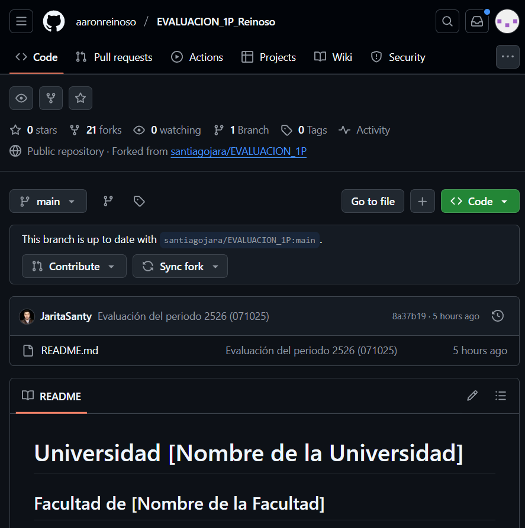
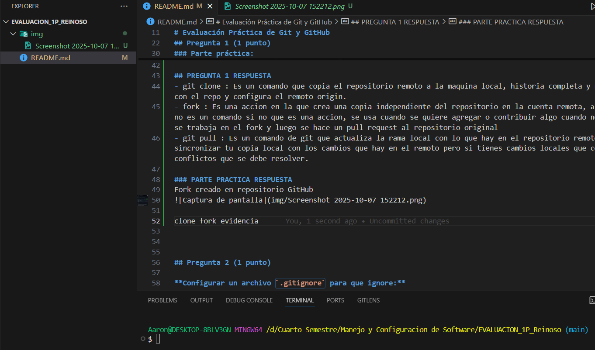
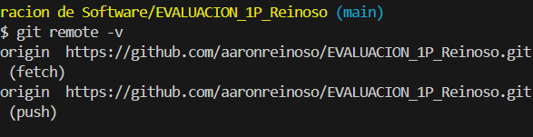
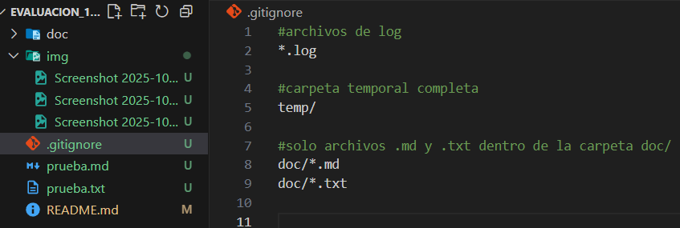
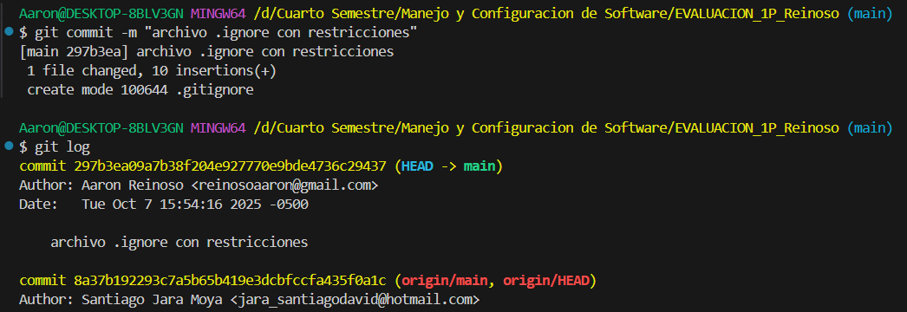
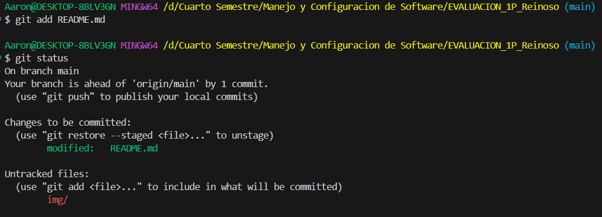
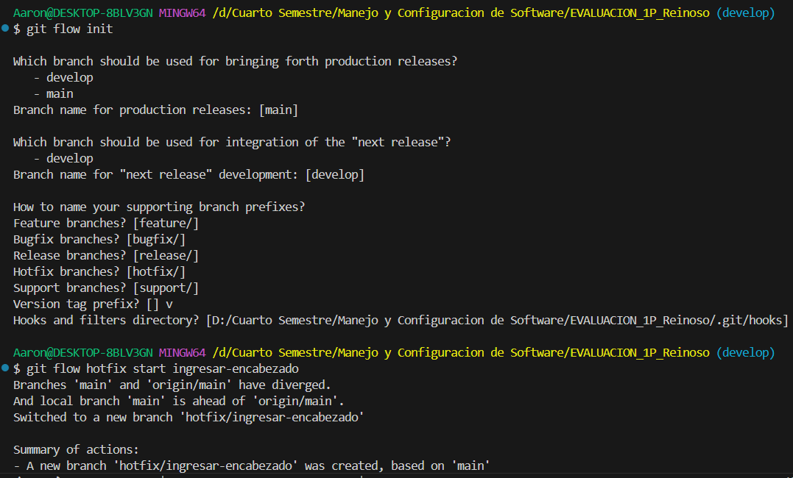

# Universidad [Nombre de la Universidad]  
## Facultad de [Nombre de la Facultad]  
### Carrera de Ingeniería en Software  

**Asignatura:** Manejo y Configuración de Software  
**Nombre del Estudiante:** Reinoso Salazar Aarón Adrián 
**Fecha:** 07/10/2025

# Evaluación Práctica de Git y GitHub

## Instrucciones Generales

- Cada pregunta debe ser respondida directamente en este archivo **(README.md)** debajo del enunciado correspondiente.
- Cada respuesta debe ir acompañada de uno o más **commits**, según se indique en cada pregunta.
- Cuando se indique, deberán realizarse acciones prácticas dentro del repositorio (como creación de archivos, ramas, resolución de conflictos, etc.).
- Cada pregunta debe estar **etiquetada con un tag**, únicamente en el commit final correspondiente, con el formato: `"Pregunta 1"`, `"Pregunta 2"`, etc.

---

## Pregunta 1 (1 punto)

**Explicar la diferencia entre los siguientes conceptos/comandos en Git y GitHub:**

- `git clone`  
- `fork`  
- `git pull`

### Parte práctica:

- Realizar un **fork** de este repositorio en la cuenta personal de GitHub del estudiante.
- Luego, realizar un **clone** del fork en el equipo local.
- En este README, describir el proceso seguido:
  - ¿Cómo se realizó el fork?
  - ¿Cómo se realizó el clone del fork?
  - ¿Cómo se verificó que se estaba trabajando sobre el fork y no sobre el repositorio original?

**📝 Respuesta:**

<!-- Escribe aquí tu respuesta a la Pregunta 1 -->

## PREGUNTA 1 RESPUESTA
- git clone : Es un comando que copia el repositorio remoto a la maquina local, historia completa y ramas, y crea una carpeta con el repo y configura el remoto origin.
- fork : Es una accion en la que crea una copia independiente del repositorio en la cuenta remota, a diferencia de git clone no es un comando si no que es una accion, se usa cuando se quiere agregar o contribuir algo cuando no se controla el proyecto, se trabaja en el fork y luego se hace un pull request al repositorio original 
- git pull : Es un comando de git que actualiza la rama local con lo que hay en el repositorio remoto, y se usa para sincronizar tu copia local con los cambios que hay en el remoto pero si tienes cambios locales que conflijan, puede generar conflictos que se debe resolver.

### PARTE PRACTICA RESPUESTA
Fork creado en repositorio GitHub

clone fork evidencia

  - ¿Cómo se realizó el fork?
    - Respuesta: Hice clic en "Fork" en GitHub y el repo se copió a mi cuenta.
  - ¿Cómo se realizó el clone del fork?
    - Respuesta: Copié la URL del fork y ejecuté `git clone https://github.com/aaronreinoso/EVALUACION_1P_Reinoso.git` en mi PC.
  - ¿Cómo se verificó que se estaba trabajando sobre el fork y no sobre el repositorio original?
    - Respuesta: Ejecuté `git remote -v` y confirmé que `origin` apuntaba a mi usuario.
    

---

## Pregunta 2 (1 punto)

**Configurar un archivo `.gitignore` para que ignore:**

- Todos los archivos con extensión `.log`.
- Una carpeta llamada `temp/`.
- Todos los archivos `.md` y `.txt`de la carpeta `doc/`. (Probar agregando un archivo `prueba.md` y un archivo `prueba.txt` dentro de la carpeta y fuera de la carpeta.)

### Requisitos:

1. Realizar un **primer commit** que incluya únicamente el archivo `.gitignore` con las reglas de exclusión definidas.
2. Realizar un **segundo commit** donde se explique en este README la función del archivo `.gitignore` y se muestre evidencia de que los archivos y carpetas indicadas no están siendo rastreadas por Git.

**Importante:**  
- Solo el **segundo commit** debe llevar el **tag `"Pregunta 2"`**.

**📝 Respuesta:**

<!-- Escribe aquí tu explicación y evidencia para la Pregunta 2 -->

Configuracion del archivo .gitignore

Primer commit con solo .gitignore

- El archivo `.gitignore` le dice a Git qué archivos no debe seguir como logs y carpetas temporales.
- Usé `git status` y los archivos dentro de `doc/` no aparecen, por eso están ignorados.

---

## Pregunta 3 (2 puntos)

**Utilizar Git Flow para desarrollar una nueva funcionalidad llamada `ingresar-encabezado`.**

### Requisitos:

- Inicializar el repositorio con Git Flow, utilizando las ramas por defecto: `main` y `develop`.
- Crear una rama de tipo `hotfix` con el nombre `ingresar-encabezado`.
- En dicha rama, **completar con los datos personales del estudiante** el encabezado que ya se encuentra al inicio de este archivo `README.md`.
- Realizar al menos un commit durante el desarrollo.
- Finalizar el hotfix siguiendo el flujo de trabajo establecido por Git Flow.

### En este README, se debe incluir:

- Los **comandos exactos** utilizados desde la inicialización de Git Flow hasta el cierre del hotfix.
- Una descripción del **proceso seguido**, indicando el propósito de cada paso.
- Una reflexión sobre las **ventajas de aplicar Git Flow**, especialmente en contextos colaborativos o proyectos de larga duración.

**Importante:**

- Deben realizarse varios commits durante esta pregunta.
- **Solo el commit final** debe llevar el **tag `"Pregunta 3"`**.
- El flujo debe respetar la estructura de Git Flow con las ramas `develop` y `main`.

**📝 Respuesta:**

<!-- Escribe aquí tu respuesta completa a la Pregunta 3 -->

comandos utilizados y salida utilizada: 
<!-- Aaron@DESKTOP-8BLV3GN MINGW64 /d/Cuarto Semestre/Manejo y Configuracion de Software/EVALUACION_1P_Reinoso (develop)      
$ git flow init

Which branch should be used for bringing forth production releases?
   - develop
   - main
Branch name for production releases: [main] 

Which branch should be used for integration of the "next release"?
   - develop
Branch name for "next release" development: [develop] 

How to name your supporting branch prefixes?
Feature branches? [feature/] 
Bugfix branches? [bugfix/] 
Release branches? [release/] 
Hotfix branches? [hotfix/] 
Support branches? [support/] 
Version tag prefix? [] v
Hooks and filters directory? [D:/Cuarto Semestre/Manejo y Configuracion de Software/EVALUACION_1P_Reinoso/.git/hooks] 

Aaron@DESKTOP-8BLV3GN MINGW64 /d/Cuarto Semestre/Manejo y Configuracion de Software/EVALUACION_1P_Reinoso (develop)      
$ git flow hotfix start ingresar-encabezado
Branches 'main' and 'origin/main' have diverged.
And local branch 'main' is ahead of 'origin/main'.
Switched to a new branch 'hotfix/ingresar-encabezado'

Summary of actions:
- A new branch 'hotfix/ingresar-encabezado' was created, based on 'main'
- You are now on branch 'hotfix/ingresar-encabezado'

Follow-up actions:
- Start committing your hot fixes
- Bump the version number now!
- When done, run:

     git flow hotfix finish 'ingresar-encabezado'

Aaron@DESKTOP-8BLV3GN MINGW64 /d/Cuarto Semestre/Manejo y Configuracion de Software/EVALUACION_1P_Reinoso (hotfix/ingresar-encabezado)
$ git commit -m "Ingreso de nombre"
On branch hotfix/ingresar-encabezado
Changes not staged for commit:
  (use "git add <file>..." to update what will be committed)
  (use "git restore <file>..." to discard changes in working directory)
        modified:   README.md

Untracked files:
  (use "git add <file>..." to include in what will be committed)
        img/

no changes added to commit (use "git add" and/or "git commit -a")

Aaron@DESKTOP-8BLV3GN MINGW64 /d/Cuarto Semestre/Manejo y Configuracion de Software/EVALUACION_1P_Reinoso (hotfix/ingresar-encabezado)
$ git add README.md

Aaron@DESKTOP-8BLV3GN MINGW64 /d/Cuarto Semestre/Manejo y Configuracion de Software/EVALUACION_1P_Reinoso (hotfix/ingresar-encabezado)
$ git commit -m "Ingreso de nombre"
[hotfix/ingresar-encabezado adb19cf] Ingreso de nombre
 1 file changed, 1 insertion(+), 1 deletion(-)

Aaron@DESKTOP-8BLV3GN MINGW64 /d/Cuarto Semestre/Manejo y Configuracion de Software/EVALUACION_1P_Reinoso (hotfix/ingresar-encabezado)
$ git add README.md

Aaron@DESKTOP-8BLV3GN MINGW64 /d/Cuarto Semestre/Manejo y Configuracion de Software/EVALUACION_1P_Reinoso (hotfix/ingresa

Aaron@DESKTOP-8BLV3GN MINGW64 /d/Cuarto Semestre/Manejo y Configuracion de Software/EVALUACION_1P_Reinoso (hotfix/ingresar-encabezado)
$ git commit -m "Ingreso de fecha"
[hotfix/ingresar-encabezado 65064b8] Ingreso de fecha
 1 file changed, 1 insertion(+), 1 deletion(-)

Aaron@DESKTOP-8BLV3GN MINGW64 /d/Cuarto Semestre/Manejo y Configuracion de Software/EVALUACION_1P_Reinoso (hotfix/ingresar-encabezado)
$ git add .
[hotfix/ingresar-encabezado 65064b8] Ingreso de fecha
 1 file changed, 1 insertion(+), 1 deletion(-)

Aaron@DESKTOP-8BLV3GN MINGW64 /d/Cuarto Semestre/Manejo y Configuracion de Software/EVALUACION_1P_Reinoso (hotfix/ingresar-encabezado)
$ git add .
 1 file changed, 1 insertion(+), 1 deletion(-)

Aaron@DESKTOP-8BLV3GN MINGW64 /d/Cuarto Semestre/Manejo y Configuracion de Software/EVALUACION_1P_Reinoso (hotfix/ingresar-encabezado)
$ git add .

Aaron@DESKTOP-8BLV3GN MINGW64 /d/Cuarto Semestre/Manejo y Configuracion de Software/EVALUACION_1P_Reinoso (hotfix/ingresar-encabezado)
$ git add .

Aaron@DESKTOP-8BLV3GN MINGW64 /d/Cuarto Semestre/Manejo y Configuracion de Software/EVALUACION_1P_Reinoso (hotfix/ingresar-encabezado)
Aaron@DESKTOP-8BLV3GN MINGW64 /d/Cuarto Semestre/Manejo y Configuracion de Software/EVALUACION_1P_Reinoso (hotfix/ingresar-encabezado)
$ git add .

Aaron@DESKTOP-8BLV3GN MINGW64 /d/Cuarto Semestre/Manejo y Configuracion de Software/EVALUACION_1P_Reinoso (hotfix/ingresar-encabezado)
r-encabezado)
$ git add .

Aaron@DESKTOP-8BLV3GN MINGW64 /d/Cuarto Semestre/Manejo y Configuracion de Software/EVALUACION_1P_Reinoso (hotfix/ingresar-encabezado)

Aaron@DESKTOP-8BLV3GN MINGW64 /d/Cuarto Semestre/Manejo y Configuracion de Software/EVALUACION_1P_Reinoso (hotfix/ingresar-encabezado)
$ git commit -m "imagenes de evidencias"
[hotfix/ingresar-encabezado 1eaa9bd] imagenes de evidencias
 6 files changed, 0 insertions(+), 0 deletions(-)
 create mode 100644 img/Screenshot 2025-01-01 225424.png
 create mode 100644 img/Screenshot 2025-10-07 152212.png
 create mode 100644 img/Screenshot 2025-10-07 153534.png
 create mode 100644 img/Screenshot 2025-10-07 154312.png
 create mode 100644 img/Screenshot 2025-10-07 154806.png
 6 files changed, 0 insertions(+), 0 deletions(-)
 create mode 100644 img/Screenshot 2025-01-01 225424.png
 create mode 100644 img/Screenshot 2025-10-07 152212.png
 create mode 100644 img/Screenshot 2025-10-07 153534.png
 6 files changed, 0 insertions(+), 0 deletions(-)
 create mode 100644 img/Screenshot 2025-01-01 225424.png
 6 files changed, 0 insertions(+), 0 deletions(-)
 6 files changed, 0 insertions(+), 0 deletions(-)
 6 files changed, 0 insertions(+), 0 deletions(-)
 6 files changed, 0 insertions(+), 0 deletions(-)
 create mode 100644 img/Screenshot 2025-01-01 225424.png
 create mode 100644 img/Screenshot 2025-10-07 152212.png
 create mode 100644 img/Screenshot 2025-10-07 153534.png
 create mode 100644 img/Screenshot 2025-10-07 154312.png
 create mode 100644 img/Screenshot 2025-10-07 154806.png
 create mode 100644 img/Screenshot 2025-10-07 155527.png

Aaron@DESKTOP-8BLV3GN MINGW64 /d/Cuarto Semestre/Manejo y Configuracion de Software/EVALUACION_1P_Reinoso (hotfix/ingresar-encabezado)
$

 6 files changed, 0 insertions(+), 0 deletions(-)
 create mode 100644 img/Screenshot 2025-01-01 225424.png
 create mode 100644 img/Screenshot 2025-10-07 152212.png
 create mode 100644 img/Screenshot 2025-10-07 153534.png
 create mode 100644 img/Screenshot 2025-10-07 154312.png
 create mode 100644 img/Screenshot 2025-10-07 154806.png
 create mode 100644 img/Screenshot 2025-10-07 155527.png

Aaron@DESKTOP-8BLV3GN MINGW64 /d/Cuarto Semestre/Manejo y Configuracion de Software/EVALUACION_1P_Reinoso (hotfix/ingresar-encabezado)
$

 6 files changed, 0 insertions(+), 0 deletions(-)
 create mode 100644 img/Screenshot 2025-01-01 225424.png
 create mode 100644 img/Screenshot 2025-10-07 152212.png
 create mode 100644 img/Screenshot 2025-10-07 153534.png
 create mode 100644 img/Screenshot 2025-10-07 154312.png
 create mode 100644 img/Screenshot 2025-10-07 154806.png
 create mode 100644 img/Screenshot 2025-10-07 155527.png

Aaron@DESKTOP-8BLV3GN MINGW64 /d/Cuarto Semestre/Manejo y Configuracion de Software/EVALUACION_1P_Reinoso hotfix/ingresa 6 files changed, 0 insertions(+), 0 deletions(-)
 create mode 100644 img/Screenshot 2025-01-01 225424.png
 create mode 100644 img/Screenshot 2025-10-07 152212.png
 create mode 100644 img/Screenshot 2025-10-07 153534.png
 create mode 100644 img/Screenshot 2025-10-07 154312.png
 create mode 100644 img/Screenshot 2025-10-07 154806.png
 6 files changed, 0 insertions(+), 0 deletions(-)
 create mode 100644 img/Screenshot 2025-01-01 225424.png
 6 files changed, 0 insertions(+), 0 deletions(-)
 create mode 100644 img/Screenshot 2025-01-01 225424.png
 create mode 100644 img/Screenshot 2025-10-07 152212.png
 6 files changed, 0 insertions(+), 0 deletions(-)
 create mode 100644 img/Screenshot 2025-01-01 225424.png
 create mode 100644 img/Screenshot 2025-10-07 152212.png
 create mode 100644 img/Screenshot 2025-01-01 225424.png
 create mode 100644 img/Screenshot 2025-10-07 152212.png
 create mode 100644 img/Screenshot 2025-10-07 153534.png
 create mode 100644 img/Screenshot 2025-10-07 154312.png
 create mode 100644 img/Screenshot 2025-10-07 154806.png
 create mode 100644 img/Screenshot 2025-10-07 152212.png
 create mode 100644 img/Screenshot 2025-10-07 153534.png
 create mode 100644 img/Screenshot 2025-10-07 152212.png
 create mode 100644 img/Screenshot 2025-10-07 152212.png
 create mode 100644 img/Screenshot 2025-10-07 153534.png
 create mode 100644 img/Screenshot 2025-10-07 154312.png
 create mode 100644 img/Screenshot 2025-10-07 152212.png
 create mode 100644 img/Screenshot 2025-10-07 153534.png
 create mode 100644 img/Screenshot 2025-10-07 152212.png
 create mode 100644 img/Screenshot 2025-10-07 153534.png
 create mode 100644 img/Screenshot 2025-10-07 154312.png
 create mode 100644 img/Screenshot 2025-10-07 154806.png
 create mode 100644 img/Screenshot 2025-10-07 155527.png

Aaron@DESKTOP-8BLV3GN MINGW64 /d/Cuarto Semestre/Manejo y Configuracion de Software/EVALUACION_1P_Reinoso (hotfix/ingresar-encabezado)
$ git add . 

Aaron@DESKTOP-8BLV3GN MINGW64 /d/Cuarto Semestre/Manejo y Configuracion de Software/EVALUACION_1P_Reinoso (hotfix/ingresar-encabezado)
$ git commit -m "evidencia de git flow con hotfix creado"
[hotfix/ingresar-encabezado ec8d869] evidencia de git flow con hotfix creado
 2 files changed, 5 insertions(+)
 create mode 100644 img/Screenshot 2025-10-07 161940.png

Aaron@DESKTOP-8BLV3GN MINGW64 /d/Cuarto Semestre/Manejo y Configuracion de Software/EVALUACION_1P_Reinoso (hotfix/ingresar-encabezado)
$ git tag "Pregunta3"

Aaron@DESKTOP-8BLV3GN MINGW64 /d/Cuarto Semestre/Manejo y Configuracion de Software/EVALUACION_1P_Reinoso (hotfix/ingresar-encabezado)
$ git log
commit ec8d8694ca0250b59076ffb94057c059c06ca290 (HEAD -> hotfix/ingresar-encabezado, tag: Pregunta3)
Author: Aaron Reinoso <reinosoaaron@gmail.com>
Date:   Tue Oct 7 16:22:40 2025 -0500

    evidencia de git flow con hotfix creado

commit 1eaa9bd774c18bdc51b5237292064a535f9deebc
Author: Aaron Reinoso <reinosoaaron@gmail.com>
Date:   Tue Oct 7 16:17:01 2025 -0500

    imagenes de evidencias

commit 65064b8d006d7cc76c8260be9902a2f0599b2d1f
Author: Aaron Reinoso <reinosoaaron@gmail.com>
Date:   Tue Oct 7 16:16:12 2025 -0500

    Ingreso de fecha

commit adb19cf85b9b42b089f9a9b2859a079607bb90da
Author: Aaron Reinoso <reinosoaaron@gmail.com>
Date:   Tue Oct 7 16:15:47 2025 -0500

    Ingreso de nombre

commit 6aad7d85729490cb6479a18301d78520b56f2164 (tag: Pregunta2, main, develop)
Author: Aaron Reinoso <reinosoaaron@gmail.com>
Date:   Tue Oct 7 16:04:50 2025 -0500

Aaron@DESKTOP-8BLV3GN MINGW64 /d/Cuarto Semestre/Manejo y Configuracion de Software/EVALUACION_1P_Reinoso (hotfix/ingresar-encabezado)
$ git flow hotfix finish ingresar-encabezado
Branches 'main' and 'origin/main' have diverged.
And local branch 'main' is ahead of 'origin/main'.
Switched to branch 'main'
Your branch is ahead of 'origin/main' by 2 commits.
  (use "git push" to publish your local commits)
hint: Waiting for your editor to close the file...  -->

- Descripción del proceso seguido: se creó la rama hotfix, se hicieron los cambios en el README y luego se finalizó el hotfix para fusionar esos commits en `main`.
- Reflexión sobre Git Flow: Git Flow ayuda a organizar ramas (feature/hotfix/release), facilita integraciones y mantiene el historial claro en proyectos colaborativos.

---

## Pregunta 4 (2 puntos)

**Trabajo con Issues y Pull Requests**

### Parte teórica:

- Explicar qué es un **issue** en GitHub.
- Explicar qué es un **pull request** y cuál es su finalidad.
- Indicar la diferencia entre ambos y cómo se relacionan en un entorno de trabajo colaborativo.

### Parte práctica:

- Trabajar en la rama `develop`, ya existente desde la configuración de Git Flow.
- Crear un **issue** titulado `"Respuesta a la Pregunta 4"`, en el que se indique que su objetivo es documentar esta pregunta.
- Realizar los cambios necesarios en este archivo `README.md` para responder esta pregunta.
- Realizar un **commit** con los cambios y subirlo a la rama `develop` del repositorio remoto.
- Crear un **pull request** desde `develop` hacia `main` en GitHub.
- **Vincular el pull request con el issue creado**, de manera que al ser aprobado y fusionado, el issue se cierre automáticamente.
- **Aprobar** el pull request para que se haga el merge respectivo hacia `main`.

### En este README, se debe incluir:

- Un resumen del procedimiento realizado.
- El número y enlace del issue creado.
- El número y enlace al pull request.

**📝 Respuesta:**

<!-- Escribe aquí tu respuesta completa a la Pregunta 4 -->

- ¿Qué es un issue?
  - Un issue es un ticket o tarea en GitHub donde se describe un problema, una idea o una solicitud (bug, mejora, pregunta). Permite discutir el tema, añadir etiquetas, asignar responsables y seguir el progreso.

- ¿Qué es un pull request y cuál es su finalidad?
  
  - Un pull request (PR) es una propuesta de cambios desde una rama a otra (por ejemplo, desde tu fork o rama feature hacia main). Su finalidad es revisar, comentar y aprobar los cambios antes de fusionarlos; sirve para hacer code review, ejecutar tests automáticos y documentar la integración.

- Diferencia y cómo se relacionan en trabajo colaborativo

  - Diferencia: el issue es la discusión/registro del problema o tarea; el pull request es la propuesta concreta de código para resolverla.

  - Relación: normalmente se crea un issue para documentar la necesidad y luego el PR referencia ese issue (por número) al enviar la solución; al fusionar el PR se puede cerrar automáticamente el issue. Esto organiza el trabajo y mantiene trazabilidad.

---

## Pregunta 5 (2 puntos)

**Resolver conflictos entre ramas y realizar un Pull Request**

### Requisitos:

- Crear dos ramas llamadas `ramaA` y `ramaB`, ambas a partir de la rama `develop`.
- En `ramaA`, crear un archivo llamado `archivoA.txt` con el contenido:  
  `Contenido A`
- En `ramaB`, crear un archivo con el mismo nombre (`archivoA.txt`), pero con el contenido:  
  `Contenido B`
- Intentar fusionar `ramaB` sobre `ramaA`, lo cual debe generar un conflicto.
- Resolver el conflicto combinando ambos contenidos.
- Realizar el merge de `ramaA` hacia `develop`.
- Crear un **pull request** desde `develop` hacia `main`.
- Una vez completado lo anterior, eliminar las ramas `ramaA` y `ramaB` tanto local como remotamente.

### En este README, se debe incluir:

- El procedimiento completo:
  - Cómo se crearon las ramas.
  - Cómo se generó y resolvió el conflicto.
  - Cómo se realizó el merge hacia `develop`.
  - Cómo se eliminaron las ramas al finalizar.
- El enlace al pull request.
- Una breve explicación de qué es un conflicto en Git y por qué ocurrió en este caso.

**📝 Respuesta:**

<!-- Escribe aquí tu respuesta completa a la Pregunta 5 -->

---

## Pregunta 6 (2 puntos)

**Realizar limpieza, explicar versionamiento semántico y enviar cambios al repositorio original**

### Requisitos:

- Trabajar en la rama `develop` del fork del repositorio.
- Eliminar los archivos `archivoA.txt` y `archivoB.txt` creados en preguntas anteriores.
- Realizar un merge desde `develop` hacia `main` en el repositorio local.
- Enviar los cambios de la rama `main` local a la rama `develop` del repositorio remoto (fork). Recuerde incluir todos los tags creados (6 tags).
- Finalmente, crear un **pull request** desde la rama `develop` del fork hacia la rama `main` del repositorio original (del cual se realizó el fork en la Pregunta 1). El titulo del pull request debe ser "NOMBRE APELLIDOS", en la descripción colocar el link de su repositorio de GitHub.

### En este README, se debe incluir:

- Una explicación del proceso realizado paso a paso.
- Una explicación del **versionamiento semántico**, indicando:
  - En qué consiste.
  - Sus tres componentes (MAJOR, MINOR, PATCH).
- El enlace al pull request creado hacia el repositorio original.
- Si hace falta agregar alguna evidencia adicional, agregue un tag adicional que sea `Version Final`.

**📝 Respuesta:**

<!-- Escribe aquí tu respuesta completa a la Pregunta 6 -->
