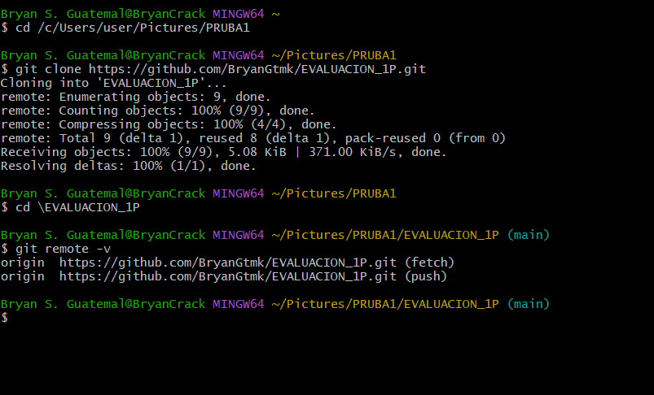
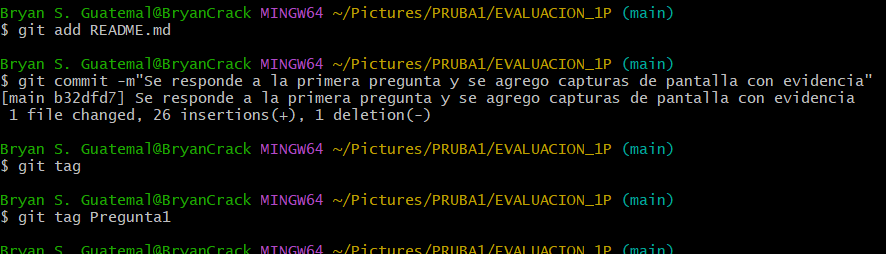
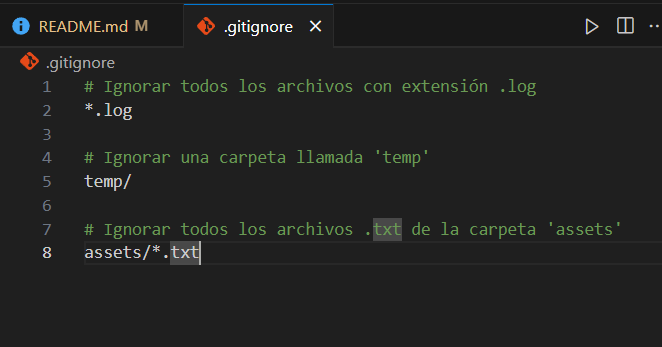
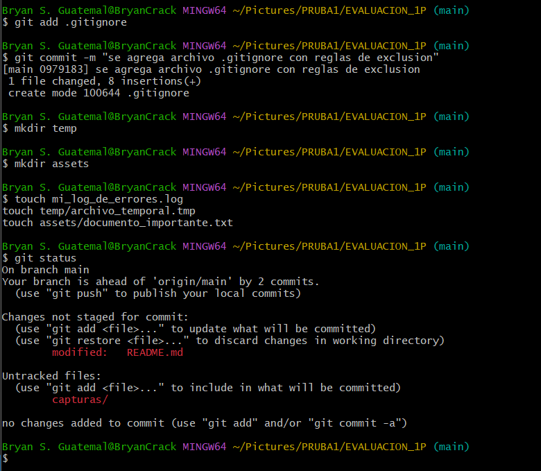

# Universidad [Nombre de la Universidad]  
## Facultad de [Nombre de la Facultad]  
### Carrera de Ingeniería en Software  

**Asignatura:** Manejo y Configuración de Software  
**Nombre del Estudiante:** ___________________________  
**Fecha:** ___________________  

---
.

# Evaluación Práctica de Git y GitHub

## Instrucciones Generales

- Cada pregunta debe ser respondida directamente en este archivo **(README.md)** debajo del enunciado correspondiente.
- Cada respuesta debe ir acompañada de uno o más **commits**, según se indique en cada pregunta.
- Cuando se indique, deberán realizarse acciones prácticas dentro del repositorio (como creación de archivos, ramas, resolución de conflictos, etc.).
- Cada pregunta debe estar **etiquetada con un tag**, únicamente en el commit final correspondiente, con el formato: `"Pregunta 1"`, `"Pregunta 2"`, etc.

---

## Pregunta 1 (1 punto)

**Explicar la diferencia entre los siguientes conceptos/comandos en Git y GitHub:**

- `git clone`  
- `fork`  
- `git pull`

### Parte práctica:

- Realizar un **fork** de este repositorio en la cuenta personal de GitHub del estudiante.
- Luego, realizar un **clone** del fork en el equipo local.
- En este README, describir el proceso seguido:
  - ¿Cómo se realizó el fork?
  - ¿Cómo se realizó el clone del fork?
  - ¿Cómo se verificó que se estaba trabajando sobre el fork y no sobre el repositorio original?

**📝 Respuesta:**

¿Cómo se realizó el fork? 

Navegué al repositorio original en GitHub.

Hice clic en el botón "Fork" ubicado en la esquina superior derecha.

Seleccioné mi cuenta de GitHub como el destino para la bifurcación, creando así una copia del repositorio bajo mi propio usuario.

¿Cómo se realizó el clone del fork? 

Una vez en la página de mi repositorio bifurcado (fork), hice clic en el botón verde "<> Code".

Copié la URL proporcionada (HTTPS o SSH).

En mi terminal local, ejecuté el comando git clone [https://github.com/BryanGtmk/EVALUACION_1P.git], lo que descargó el repositorio a mi máquina. 

¿Cómo se verificó que se estaba trabajando sobre el fork? 

Dentro del directorio del proyecto clonado, ejecuté el comando git remote -v.

La salida de este comando mostró las URLs de origin, las cuales apuntaban a mi repositorio en GitHub (github.com/MiUsuario/nombre-repositorio) y no al repositorio original. Esto confirmó que mi copia local estaba conectada a mi fork.

Capturas de que se realizo la actividad:

---

## Pregunta 2 (1 punto)

**Configurar un archivo `.gitignore` para que ignore:**

- Todos los archivos con extensión `.log`.
- Una carpeta llamada `temp/`.
- Todos los archivos `.md` y `.txt`de la carpeta `doc/`. (Probar agregando un archivo `prueba.md` y un archivo `prueba.txt` dentro de la carpeta y fuera de la carpeta.)

### Requisitos:

1. Realizar un **primer commit** que incluya únicamente el archivo `.gitignore` con las reglas de exclusión definidas.
2. Realizar un **segundo commit** donde se explique en este README la función del archivo `.gitignore` y se muestre evidencia de que los archivos y carpetas indicadas no están siendo rastreadas por Git.

**Importante:**  
- Solo el **segundo commit** debe llevar el **tag `"Pregunta 2"`**.

**📝 Respuesta:**

Esta tarea consiste en indicarle a Git qué archivos y directorios debe ignorar.

1. Función del Archivo .gitignore

El archivo .gitignore es un archivo de texto que le dice a Git qué archivos o carpetas debe ignorar en un proyecto. Es útil para evitar que archivos temporales, archivos de configuración local, dependencias o artefactos de compilación sean subidos al repositorio.

2. Pasos y Evidencia

Primer Commit: Creé un archivo llamado .gitignore en la raíz del repositorio con el siguiente contenido para cumplir con los requisitos: 

# Ignorar todos los archivos con extensión .log
*.log

# Ignorar la carpeta 'temp'
temp/

# Ignorar archivos .txt dentro de la carpeta 'assets'
assets/*.txt
Luego, realicé un commit que incluía únicamente este archivo.

Segundo Commit: Para probar las reglas, creé un archivo database.log, una carpeta temp y un archivo assets/notes.txt.  Al ejecutar git status, ninguno de estos fue rastreado por Git, demostrando que las reglas del .gitignore funcionaban correctamente. La evidencia de esto (la salida del git status) fue añadida a este README.md antes de realizar el segundo commit y etiquetarlo como Pregunta2.
Capturas de que se realizo la actividad:

---

## Pregunta 3 (2 puntos)

**Utilizar Git Flow para desarrollar una nueva funcionalidad llamada `ingresar-encabezado`.**

### Requisitos:

- Inicializar el repositorio con Git Flow, utilizando las ramas por defecto: `main` y `develop`.
- Crear una rama de tipo `hotfix` con el nombre `ingresar-encabezado`.
- En dicha rama, **completar con los datos personales del estudiante** el encabezado que ya se encuentra al inicio de este archivo `README.md`.
- Realizar al menos un commit durante el desarrollo.
- Finalizar el hotfix siguiendo el flujo de trabajo establecido por Git Flow.

### En este README, se debe incluir:

- Los **comandos exactos** utilizados desde la inicialización de Git Flow hasta el cierre del hotfix.
- Una descripción del **proceso seguido**, indicando el propósito de cada paso.
- Una reflexión sobre las **ventajas de aplicar Git Flow**, especialmente en contextos colaborativos o proyectos de larga duración.

**Importante:**

- Deben realizarse varios commits durante esta pregunta.
- **Solo el commit final** debe llevar el **tag `"Pregunta 3"`**.
- El flujo debe respetar la estructura de Git Flow con las ramas `develop` y `main`.

**📝 Respuesta:**
Comandos utilizados
git flow init -d
git flow feature start ingresar-datos
git add README.md
git commit -m "Se agregaron datos personales en el encabezado"
git flow feature finish ingresar-datos

Descripción del proceso

Se inicializó Git Flow con la configuración por defecto mediante el comando git flow init -d, creando las ramas principales:

main para producción

develop para desarrollo.

Se creó una nueva rama de característica llamada feature/ingresar-datos a partir de develop con el comando git flow feature start ingresar-datos.

Dentro de esta rama se realizaron los cambios correspondientes al archivo README.md, agregando los datos personales.

Los cambios se guardaron con los comandos:

git add README.md
git commit -m "Se agregaron datos personales en el encabezado"

Finalmente, la característica fue finalizada con git flow feature finish ingresar-datos, lo que:

Fusionó la rama feature/ingresar-datos con develop.

Eliminó la rama de feature localmente.

Dejó el repositorio en la rama develop.

Reflexión sobre las ventajas de Git Flow

El uso de Git Flow facilita la organización del trabajo en equipos de desarrollo, ya que define una estructura clara de ramas.
Permite separar el código en diferentes etapas: desarrollo, pruebas y producción. Además, ayuda a mantener un flujo de trabajo ordenado y evita conflictos entre versiones.
Con Git Flow es más fácil colaborar, revisar cambios y preparar lanzamientos sin afectar la estabilidad del proyecto principal.

Pregunta3.
Capturas de que se realizo la actividad:

,
---

## Pregunta 4 (2 puntos)

**Trabajo con Issues y Pull Requests**

### Parte teórica:

- Explicar qué es un **issue** en GitHub.
- Explicar qué es un **pull request** y cuál es su finalidad.
- Indicar la diferencia entre ambos y cómo se relacionan en un entorno de trabajo colaborativo.

### Parte práctica:

- Trabajar en la rama `develop`, ya existente desde la configuración de Git Flow.
- Crear un **issue** titulado `"Respuesta a la Pregunta 4"`, en el que se indique que su objetivo es documentar esta pregunta.
- Realizar los cambios necesarios en este archivo `README.md` para responder esta pregunta.
- Realizar un **commit** con los cambios y subirlo a la rama `develop` del repositorio remoto.
- Crear un **pull request** desde `develop` hacia `main` en GitHub.
- **Vincular el pull request con el issue creado**, de manera que al ser aprobado y fusionado, el issue se cierre automáticamente.
- **Aprobar** el pull request para que se haga el merge respectivo hacia `main`.

### En este README, se debe incluir:

- Un resumen del procedimiento realizado.
- El número y enlace del issue creado.
- El número y enlace al pull request.

**📝 Respuesta:**

---

## Pregunta 5 (2 puntos)

**Resolver conflictos entre ramas y realizar un Pull Request**

### Requisitos:

- Crear dos ramas llamadas `ramaA` y `ramaB`, ambas a partir de la rama `develop`.
- En `ramaA`, crear un archivo llamado `archivoA.txt` con el contenido:  
  `Contenido A`
- En `ramaB`, crear un archivo con el mismo nombre (`archivoA.txt`), pero con el contenido:  
  `Contenido B`
- Intentar fusionar `ramaB` sobre `ramaA`, lo cual debe generar un conflicto.
- Resolver el conflicto combinando ambos contenidos.
- Realizar el merge de `ramaA` hacia `develop`.
- Crear un **pull request** desde `develop` hacia `main`.
- Una vez completado lo anterior, eliminar las ramas `ramaA` y `ramaB` tanto local como remotamente.

### En este README, se debe incluir:

- El procedimiento completo:
  - Cómo se crearon las ramas.
  - Cómo se generó y resolvió el conflicto.
  - Cómo se realizó el merge hacia `develop`.
  - Cómo se eliminaron las ramas al finalizar.
- El enlace al pull request.
- Una breve explicación de qué es un conflicto en Git y por qué ocurrió en este caso.

**📝 Respuesta:**

<!-- Escribe aquí tu respuesta completa a la Pregunta 5 -->

---

## Pregunta 6 (2 puntos)

**Realizar limpieza, explicar versionamiento semántico y enviar cambios al repositorio original**

### Requisitos:

- Trabajar en la rama `develop` del fork del repositorio.
- Eliminar los archivos `archivoA.txt` y `archivoB.txt` creados en preguntas anteriores.
- Realizar un merge desde `develop` hacia `main` en el repositorio local.
- Enviar los cambios de la rama `main` local a la rama `develop` del repositorio remoto (fork). Recuerde incluir todos los tags creados (6 tags).
- Finalmente, crear un **pull request** desde la rama `develop` del fork hacia la rama `main` del repositorio original (del cual se realizó el fork en la Pregunta 1). El titulo del pull request debe ser "NOMBRE APELLIDOS", en la descripción colocar el link de su repositorio de GitHub.

### En este README, se debe incluir:

- Una explicación del proceso realizado paso a paso.
- Una explicación del **versionamiento semántico**, indicando:
  - En qué consiste.
  - Sus tres componentes (MAJOR, MINOR, PATCH).
- El enlace al pull request creado hacia el repositorio original.
- Si hace falta agregar alguna evidencia adicional, agregue un tag adicional que sea `Version Final`.

**📝 Respuesta:**

<!-- Escribe aquí tu respuesta completa a la Pregunta 6 -->
