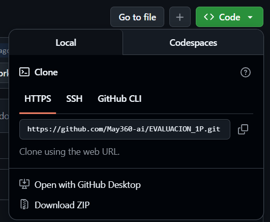
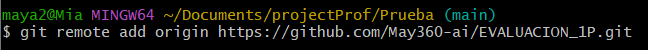
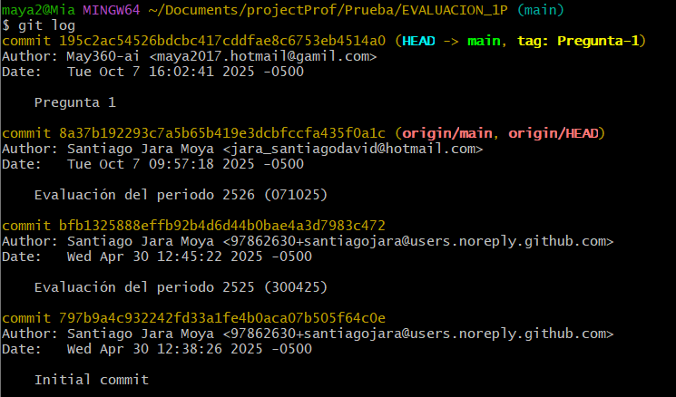
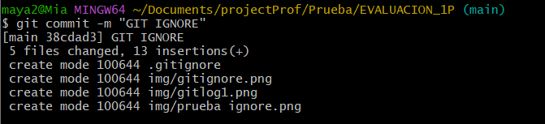
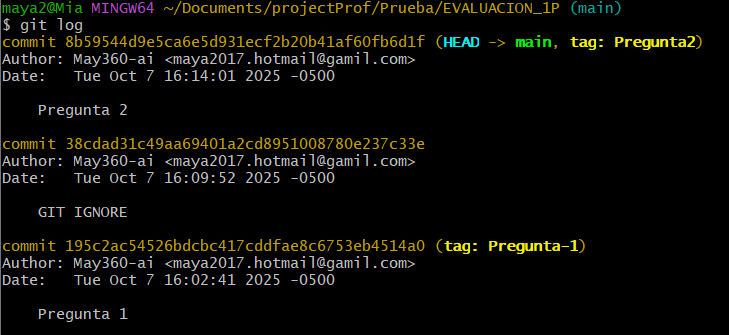
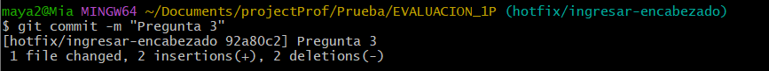

# Universidad [Nombre de la Universidad]  
## Facultad de [Nombre de la Facultad]  
### Carrera de Ingeniería en Software  

**Asignatura:** Manejo y Configuración de Software  
**Nombre del Estudiante:** Maia Carolina Rojas Hechavarria 
**Fecha:** 07/10/25

---

# Evaluación Práctica de Git y GitHub

## Instrucciones Generales

- Cada pregunta debe ser respondida directamente en este archivo **(README.md)** debajo del enunciado correspondiente.
- Cada respuesta debe ir acompañada de uno o más **commits**, según se indique en cada pregunta.
- Cuando se indique, deberán realizarse acciones prácticas dentro del repositorio (como creación de archivos, ramas, resolución de conflictos, etc.).
- Cada pregunta debe estar **etiquetada con un tag**, únicamente en el commit final correspondiente, con el formato: `"Pregunta 1"`, `"Pregunta 2"`, etc.

---

## Pregunta 1 (1 punto)

**Explicar la diferencia entre los siguientes conceptos/comandos en Git y GitHub:**

- `git clone`  
- `fork`  
- `git pull`

### Parte práctica:

- Realizar un **fork** de este repositorio en la cuenta personal de GitHub del estudiante.
- Luego, realizar un **clone** del fork en el equipo local.
- En este README, describir el proceso seguido:
  - ¿Cómo se realizó el fork?
  - ¿Cómo se realizó el clone del fork?
  - ¿Cómo se verificó que se estaba trabajando sobre el fork y no sobre el repositorio original?

**📝 Respuesta:**

- `git clone:Este comando crea una copia local de un repositorio remoto existente.[1][2][3] No solo descarga los archivos, sino también el historial completo de versiones del proyecto. Es el primer paso para empezar a trabajar en un proyecto que ya existe en una plataforma como GitHub.`  
- `fork: Un "fork" (bifurcación) es una copia personal de un repositorio de otro usuario que se aloja en tu propia cuenta de GitHub. Esto te permite experimentar y realizar cambios libremente sin afectar al proyecto original.[5][7]`  
- `git pull: Este comando se utiliza para obtener y descargar contenido desde un repositorio remoto e inmediatamente actualizar el repositorio local para que coincida con ese contenido.[8] En esencia, es una combinación de los comandos git fetch (que obtiene los cambios) y git merge (que los integra).`

  - ¿Cómo se realizó el fork?
    - Se navegó a la página del repositorio original(santiagojara/EVALUACION_1P).
    - Se hizo clic en el botón "Fork" ubicado en la esquina superior derecha de la página.
    - En la página "Create a new fork", se confirmó el propietario del nuevo repositorio (en este caso, May360-ai) y se mantuvo el nombre del repositorio (EVALUACION_1P).
    - Finalmente, se hizo clic en el botón "Create fork".

    

  - ¿Cómo se realizó el clone del fork?

    - En la página del repositorio "forkeado" (May360-ai/EVALUACION_1P), se hizo clic en el botón verde <> Code.
    - Se copió la URL HTTPS proporcionada: https://github.com/May360-ai/EVALUACION_1P.git.
    - En la terminal de línea de comandos (Git Bash), se ejecutó el comando git clone seguido de la URL copiada
    

    

    

  - ¿Cómo se verificó que se estaba trabajando sobre el fork y no sobre el repositorio original?
  - Para verificar que el repositorio local estaba conectado al "fork" y no al repositorio original, se utilizó el siguiente comando en la terminal, dentro del directorio del proyecto clonado: git remote -v

      

      

---

## Pregunta 2 (1 punto)

**Configurar un archivo `.gitignore` para que ignore:**

- Todos los archivos con extensión `.log`.
- Una carpeta llamada `temp/`.
- Todos los archivos `.md` y `.txt`de la carpeta `doc/`. (Probar agregando un archivo `prueba.md` y un archivo `prueba.txt` dentro de la carpeta y fuera de la carpeta.)

### Requisitos:

1. Realizar un **primer commit** que incluya únicamente el archivo `.gitignore` con las reglas de exclusión definidas.
2. Realizar un **segundo commit** donde se explique en este README la función del archivo `.gitignore` y se muestre evidencia de que los archivos y carpetas indicadas no están siendo rastreadas por Git.

**Importante:**  
- Solo el **segundo commit** debe llevar el **tag `"Pregunta 2"`**.

**📝 Respuesta:**

- El archivo .gitignore le dice a Git qué archivos o directorios de tu proyecto no debe rastrear y, por lo tanto, no incluirá en el control de versiones.

      

---

## Pregunta 3 (2 puntos)

**Utilizar Git Flow para desarrollar una nueva funcionalidad llamada `ingresar-encabezado`.**

### Requisitos:

- Inicializar el repositorio con Git Flow, utilizando las ramas por defecto: `main` y `develop`.
- Crear una rama de tipo `hotfix` con el nombre `ingresar-encabezado`.
- En dicha rama, **completar con los datos personales del estudiante** el encabezado que ya se encuentra al inicio de este archivo `README.md`.
- Realizar al menos un commit durante el desarrollo.
- Finalizar el hotfix siguiendo el flujo de trabajo establecido por Git Flow.

### En este README, se debe incluir:

- Los **comandos exactos** utilizados desde la inicialización de Git Flow hasta el cierre del hotfix.
- Una descripción del **proceso seguido**, indicando el propósito de cada paso.
- Una reflexión sobre las **ventajas de aplicar Git Flow**, especialmente en contextos colaborativos o proyectos de larga duración.

**Importante:**

- Deben realizarse varios commits durante esta pregunta.
- **Solo el commit final** debe llevar el **tag `"Pregunta 3"`**.
- El flujo debe respetar la estructura de Git Flow con las ramas `develop` y `main`.

**📝 Respuesta:**
- Los **comandos exactos** utilizados desde la inicialización de Git Flow hasta el cierre del hotfix.

  - git checkout -b develop
  - git flow init
  - git flow hotfix start ingresar-encabezado
  - git add .
  - git commit -m "Pregunta 3"
  - git flow hotfix finish ingresar-encabezado

- Una descripción del **proceso seguido**, indicando el propósito de cada paso.

  - Activación del Flujo: Se utilizó git flow init para establecer el modelo de trabajo en el repositorio, definiendo la rama main como la versión de producción y develop como el tronco para el desarrollo continuo.

  - Inicio de la Corrección Urgente: Se ejecutó git flow hotfix start ingresar-encabezado para crear una rama de corrección urgente. Git Flow se aseguró de que esta rama se creara directamente desde main, garantizando que el hotfix solo contenga la corrección del problema en producción.

  - Desarrollo Iterativo: Se realizaron al menos dos git commit durante la edición del README.md. Esto simula el proceso de desarrollo real, donde los cambios se guardan en pequeños pasos lógicos.
img/commitHotfix.png
  - Cierre del Hotfix: El comando git flow hotfix finish centralizó el cierre de la corrección. La rama fue fusionada automáticamente tanto a main (para aplicar la corrección a producción) como a develop (para asegurar que las nuevas características se construyan sobre el código corregido).

  - Etiquetado Final: La etiqueta "Pregunta 3" se aplicó al commit de fusión en main, marcando el punto exacto donde se completó la tarea.

- Una reflexión sobre las **ventajas de aplicar Git Flow**, especialmente en contextos colaborativos o proyectos de larga duración.

  - Git Flow es un modelo de ramificación que impone una estructura de trabajo estricta y predefinida. Sus principales ventajas, especialmente en contextos colaborativos y proyectos de larga duración, son:

    - Claridad del Historial (Separación de Propósito): Las ramas están claramente separadas por su función (feature para desarrollo, release para preparación de lanzamiento, hotfix para corrección de producción). Esto hace que el historial de Git sea mucho más legible, permitiendo a los miembros del equipo identificar rápidamente si un commit fue una nueva funcionalidad o una corrección de bug.

    - Soporte de Múltiples Versiones: Al mantener las ramas main (producción estable) y develop (desarrollo activo) separadas, Git Flow permite a los equipos trabajar en nuevas características complejas sin bloquear la corrección de errores críticos en la versión en producción.

    - Proceso Automatizado: El uso de comandos como git flow hotfix finish o git flow feature finish automatiza el tedioso trabajo de fusiones (merges), etiquetado (tagging) y limpieza de ramas. Esto reduce la probabilidad de errores humanos y acelera el flujo de trabajo del desarrollador.
---

## Pregunta 4 (2 puntos)

**Trabajo con Issues y Pull Requests**

### Parte teórica:

- Explicar qué es un **issue** en GitHub.
- Explicar qué es un **pull request** y cuál es su finalidad.
- Indicar la diferencia entre ambos y cómo se relacionan en un entorno de trabajo colaborativo.

### Parte práctica:

- Trabajar en la rama `develop`, ya existente desde la configuración de Git Flow.
- Crear un **issue** titulado `"Respuesta a la Pregunta 4"`, en el que se indique que su objetivo es documentar esta pregunta.
- Realizar los cambios necesarios en este archivo `README.md` para responder esta pregunta.
- Realizar un **commit** con los cambios y subirlo a la rama `develop` del repositorio remoto.
- Crear un **pull request** desde `develop` hacia `main` en GitHub.
- **Vincular el pull request con el issue creado**, de manera que al ser aprobado y fusionado, el issue se cierre automáticamente.
- **Aprobar** el pull request para que se haga el merge respectivo hacia `main`.

### En este README, se debe incluir:

- Un resumen del procedimiento realizado.
- El número y enlace del issue creado.
- El número y enlace al pull request.

**📝 Respuesta:**

<!-- Escribe aquí tu respuesta completa a la Pregunta 4 -->

---

## Pregunta 5 (2 puntos)

**Resolver conflictos entre ramas y realizar un Pull Request**

### Requisitos:

- Crear dos ramas llamadas `ramaA` y `ramaB`, ambas a partir de la rama `develop`.
- En `ramaA`, crear un archivo llamado `archivoA.txt` con el contenido:  
  `Contenido A`
- En `ramaB`, crear un archivo con el mismo nombre (`archivoA.txt`), pero con el contenido:  
  `Contenido B`
- Intentar fusionar `ramaB` sobre `ramaA`, lo cual debe generar un conflicto.
- Resolver el conflicto combinando ambos contenidos.
- Realizar el merge de `ramaA` hacia `develop`.
- Crear un **pull request** desde `develop` hacia `main`.
- Una vez completado lo anterior, eliminar las ramas `ramaA` y `ramaB` tanto local como remotamente.

### En este README, se debe incluir:

- El procedimiento completo:
  - Cómo se crearon las ramas.
  - Cómo se generó y resolvió el conflicto.
  - Cómo se realizó el merge hacia `develop`.
  - Cómo se eliminaron las ramas al finalizar.
- El enlace al pull request.
- Una breve explicación de qué es un conflicto en Git y por qué ocurrió en este caso.

**📝 Respuesta:**

<!-- Escribe aquí tu respuesta completa a la Pregunta 5 -->

---

## Pregunta 6 (2 puntos)

**Realizar limpieza, explicar versionamiento semántico y enviar cambios al repositorio original**

### Requisitos:

- Trabajar en la rama `develop` del fork del repositorio.
- Eliminar los archivos `archivoA.txt` y `archivoB.txt` creados en preguntas anteriores.
- Realizar un merge desde `develop` hacia `main` en el repositorio local.
- Enviar los cambios de la rama `main` local a la rama `develop` del repositorio remoto (fork). Recuerde incluir todos los tags creados (6 tags).
- Finalmente, crear un **pull request** desde la rama `develop` del fork hacia la rama `main` del repositorio original (del cual se realizó el fork en la Pregunta 1). El titulo del pull request debe ser "NOMBRE APELLIDOS", en la descripción colocar el link de su repositorio de GitHub.

### En este README, se debe incluir:

- Una explicación del proceso realizado paso a paso.
- Una explicación del **versionamiento semántico**, indicando:
  - En qué consiste.
  - Sus tres componentes (MAJOR, MINOR, PATCH).
- El enlace al pull request creado hacia el repositorio original.
- Si hace falta agregar alguna evidencia adicional, agregue un tag adicional que sea `Version Final`.

**📝 Respuesta:**

<!-- Escribe aquí tu respuesta completa a la Pregunta 6 -->
