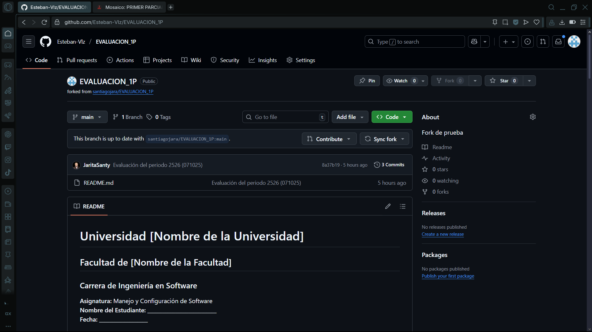
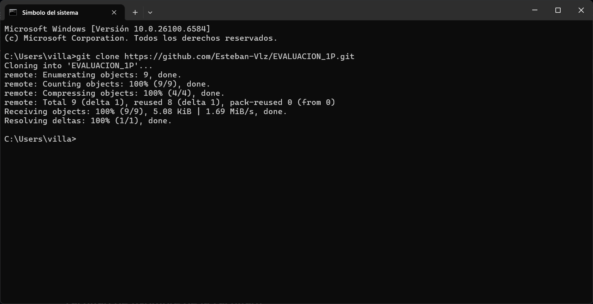
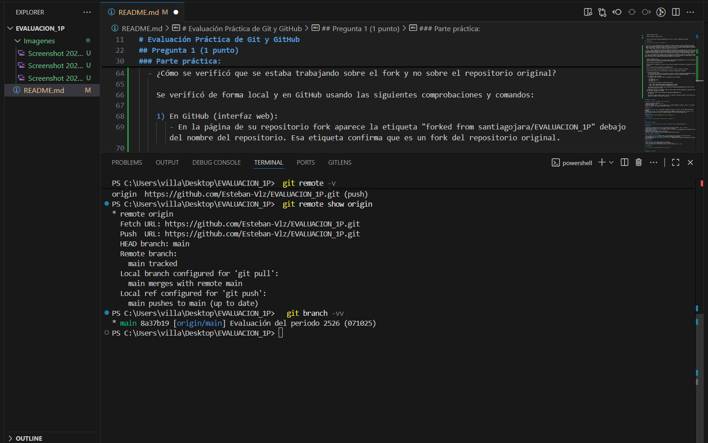
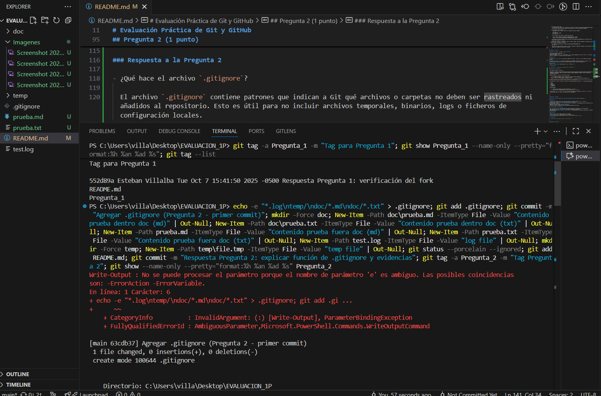
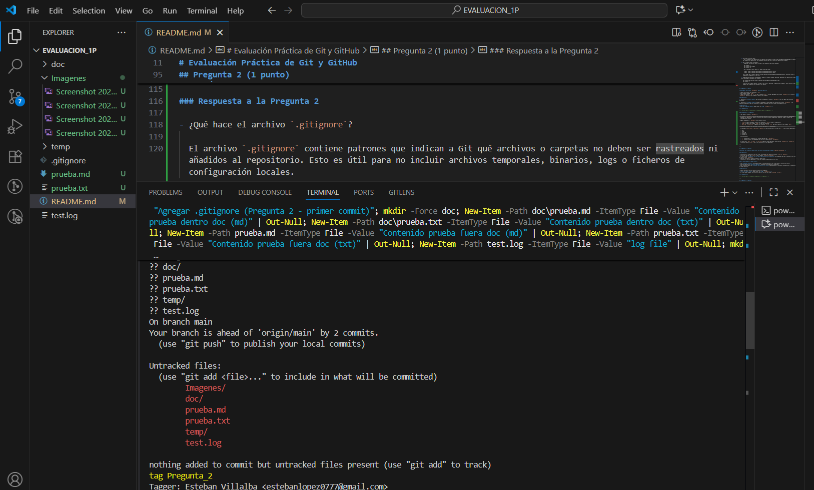

# Universidad [Universidad Tecnica de Ambato]  
## Facultad de [ INGENIERÍA EN SISTEMAS, ELECTRÓNICA E INDUSTRIAL]  
### Carrera de Ingeniería en Software  

**Asignatura:** Manejo y Configuración de Software  
**Nombre del Estudiante:** Washington Villalba  
**Correo electrónico:** estebanlopez0777@gmail.com  
**Fecha:** 07 / 10 / 2025 

---

# Evaluación Práctica de Git y GitHub

## Instrucciones Generales

- Cada pregunta debe ser respondida directamente en este archivo **(README.md)** debajo del enunciado correspondiente.
- Cada respuesta debe ir acompañada de uno o más **commits**, según se indique en cada pregunta.
- Cuando se indique, deberán realizarse acciones prácticas dentro del repositorio (como creación de archivos, ramas, resolución de conflictos, etc.).
- Cada pregunta debe estar **etiquetada con un tag**, únicamente en el commit final correspondiente, con el formato: `"Pregunta 1"`, `"Pregunta 2"`, etc.

---

## Pregunta 1 (1 punto)

**Explicar la diferencia entre los siguientes conceptos/comandos en Git y GitHub:**

- `git clone`  
- `fork`  
- `git pull`

### Parte práctica:

- Realizar un **fork** de este repositorio en la cuenta personal de GitHub del estudiante.
- Luego, realizar un **clone** del fork en el equipo local.
- En este README, describir el proceso seguido:

  - ¿Cómo se realizó el fork?
 
  - ¿Cómo se realizó el clone del fork?
   

  - ¿Cómo se verificó que se estaba trabajando sobre el fork y no sobre el repositorio original?

**📝 Respuesta:**

<!-- Escribe aquí tu respuesta a la Pregunta 1 -->

---
git clone: Este comando crea una copia o clon de un repositorio existente en un nuevo directorio. Este comando se utiliza para obtener una copia de trabajo local de un repositorio remoto, incluyendo todo el historial de commits y las ramas.

fork: Es una acción que se realiza en plataformas como GitHub. Consiste en crear una copia personal de un repositorio ajeno en tu propia cuenta. Esta copia, o "bifurcación", es un repositorio completamente independiente que te permite experimentar y realizar cambios libremente sin afectar al proyecto original. Es el método estándar para contribuir a proyectos de código abierto.

git pull: Es un comando de Git que se utiliza para actualizar el repositorio local con los cambios del repositorio remoto. Esencialmente, es una combinación de dos comandos: git fetch, que descarga los cambios del remoto, y git merge, que fusiona dichos cambios en tu rama de trabajo actual.

  - ¿Cómo se realizó el fork?

    Se realizó mediante el siguiente link https://github.com/santiagojara/EVALUACION_1P en el cual se presionó el botón "Fork" y se seleccionó la cuenta personal del estudiante.
    
  - ¿Cómo se realizó el clone del fork?

    En la página de su repositorio (su fork) se copió la URL de clonación y se ejecutó en la terminal local, por ejemplo:

    git clone https://github.com/Esteban-Vlz/EVALUACION_1P.git
    

  - ¿Cómo se verificó que se estaba trabajando sobre el fork y no sobre el repositorio original?

    Se verificó de forma local y en GitHub usando las siguientes comprobaciones y comandos:

    1) En GitHub (interfaz web):
       - En la página de su repositorio fork aparece la etiqueta "forked from santiagojara/EVALUACION_1P" debajo del nombre del repositorio. Esa etiqueta confirma que es un fork del repositorio original.

    2) En la máquina local (terminal):
       - Comprobar la URL del remoto "origin" con cualquiera de estos comandos:

         git remote -v
         git remote show origin
         git branch -vv

       - En la salida de "git remote -v" debe verse algo como:

         origin  https://github.com/Esteban-Vlz/EVALUACION_1P.git (fetch)
         origin  https://github.com/Esteban-Vlz/EVALUACION_1P.git (push)

       Si en lugar de su usuario aparece "https://github.com/santiagojara/EVALUACION_1P.git" entonces clonó el repositorio original y no su fork.

    3) Comprobación adicional (recomendado): añadir un remoto llamado "upstream" apuntando al repositorio original para distinguir claramente los remotos:

       git remote add upstream https://github.com/santiagojara/EVALUACION_1P.git
       git remote -v

       Tras esto verá ambos remotos: "origin" (su fork) y "upstream" (repositorio original). Esto facilita traer cambios del original sin confundir los remotos.
           

## Pregunta 2 (1 punto)

**Configurar un archivo `.gitignore` para que ignore:**

- Todos los archivos con extensión `.log`.
- Una carpeta llamada `temp/`.
- Todos los archivos `.md` y `.txt`de la carpeta `doc/`. (Probar agregando un archivo `prueba.md` y un archivo `prueba.txt` dentro de la carpeta y fuera de la carpeta.)

### Requisitos:

1. Realizar un **primer commit** que incluya únicamente el archivo `.gitignore` con las reglas de exclusión definidas.

2. Realizar un **segundo commit** donde se explique en este README la función del archivo `.gitignore` y se muestre evidencia de que los archivos y carpetas indicadas no están siendo rastreadas por Git.

**Importante:**  
- Solo el **segundo commit** debe llevar el **tag `"Pregunta 2"`**.

**📝 Respuesta:**

<!-- Escribe aquí tu explicación y evidencia para la Pregunta 2 -->

### Respuesta a la Pregunta 2

- ¿Qué hace el archivo `.gitignore`?

  El archivo `.gitignore` contiene patrones que indican a Git qué archivos o carpetas no deben ser rastreados ni añadidos al repositorio. Esto es útil para no incluir archivos temporales, binarios, logs o ficheros de configuración locales.

- Reglas añadidas en `.gitignore` para esta práctica:

  - `*.log` → Ignora cualquier archivo con extensión `.log` en todo el repositorio.
  - `temp/` → Ignora la carpeta `temp/` y todo su contenido.
  - `doc/*.md` y `doc/*.txt` → Ignoran los archivos `.md` y `.txt` que estén dentro de la carpeta `doc/`.

- Evidencia (estado de Git mostrando archivos ignorados y no rastreados):

  La salida de `git status --porcelain --ignored` en mi entorno mostró (líneas con `!!` son archivos ignorados):

  !! doc/
  !! temp/
  !! test.log
  ?? prueba.md
  ?? prueba.txt

  Interpretación:

  - `!!` indica que el elemento está siendo ignorado por `.gitignore`.
  - `??` indica archivos no rastreados que no están cubiertos por `.gitignore`.

  En este caso, `doc/` y `temp/` y `test.log` aparecen como ignorados, mientras que `prueba.md` y `prueba.txt` (archivos fuera de `doc/`) están sin rastrear y no son ignorados.

imagenes para demostrar las pruebas Screen
    
    

---

---

## Pregunta 3 (2 puntos)

**Utilizar Git Flow para desarrollar una nueva funcionalidad llamada `ingresar-encabezado`.**

### Requisitos:

- Inicializar el repositorio con Git Flow, utilizando las ramas por defecto: `main` y `develop`.
- Crear una rama de tipo `hotfix` con el nombre `ingresar-encabezado`.
- En dicha rama, **completar con los datos personales del estudiante** el encabezado que ya se encuentra al inicio de este archivo `README.md`.
- Realizar al menos un commit durante el desarrollo.
- Finalizar el hotfix siguiendo el flujo de trabajo establecido por Git Flow.

### En este README, se debe incluir:

- Los **comandos exactos** utilizados desde la inicialización de Git Flow hasta el cierre del hotfix.
- Una descripción del **proceso seguido**, indicando el propósito de cada paso.
- Una reflexión sobre las **ventajas de aplicar Git Flow**, especialmente en contextos colaborativos o proyectos de larga duración.

**Importante:**

- Deben realizarse varios commits durante esta pregunta.
- **Solo el commit final** debe llevar el **tag `"Pregunta 3"`**.
- El flujo debe respetar la estructura de Git Flow con las ramas `develop` y `main`.

**📝 Respuesta:**

<!-- Escribe aquí tu respuesta completa a la Pregunta 3 -->

- Crear la rama hotfix y trabajar en ella:

  git checkout -b hotfix/ingresar-encabezado

- Hacer el primer commit con el cambio (si hay cambios staged):

  git add README.md
  git commit -m "Hotfix: ingresar encabezado - datos personales (1)"

- Hacer un segundo commit con un cambio menor de formato:

  # editar README.md (por ejemplo añadir una línea)
  Add-Content README.md "`n# Cambio menor para segundo commit"   # PowerShell
  git add README.md
  git commit -m "Hotfix: ingresar encabezado - formato (2)"

- Finalizar el hotfix (si no se dispone de `git-flow`, usar merge manual):

  # crear develop si no existe
  git branch develop

  # fusionar hotfix en main
  git checkout main
  git merge --no-ff hotfix/ingresar-encabezado -m "Merge hotfix/ingresar-encabezado -> main"

  # fusionar hotfix en develop
  git checkout develop
  git merge --no-ff hotfix/ingresar-encabezado -m "Merge hotfix/ingresar-encabezado -> develop"

- Crear un tag anotado para el commit final (solo el commit final lleva el tag "Pregunta 3"):

  git checkout main
  git tag -a Pregunta_3 -m "Tag Pregunta 3"

Descripción del proceso y propósito de cada paso:

- git checkout -b hotfix/ingresar-encabezado
  - Crea una rama de tipo hotfix separada de la rama principal para corregir o completar rápidamente algo en producción (aquí el encabezado del README).

- Realizar commits incrementales
  - Se hicieron al menos dos commits en la rama hotfix: uno con la inserción de los datos personales y otro con un ajuste de formato. Tener varios commits permite documentar el trabajo y revertir/ajustar cambios si es necesario.

- git merge --no-ff hotfix/ingresar-encabezado -> main
  - Fusiona el hotfix a `main`. Se usa --no-ff para mantener el historial del hotfix como un punto de referencia (no hacer fast-forward) y dejar el merge explícito.

- git merge --no-ff hotfix/ingresar-encabezado -> develop
  - También se fusiona a `develop` para que la rama de desarrollo incorpore la corrección y no se pierda en futuros desarrollos.

- git tag -a Pregunta_3
  - Marca el commit final con el tag solicitado por la práctica (solo el commit final de la pregunta debe llevar el tag "Pregunta 3").

Reflexión: ventajas de aplicar Git Flow

- Organización clara de ramas: Git Flow define ramas con propósito (feature, develop, release, hotfix, main), lo que ayuda a mantener el trabajo aislado y fácil de integrar.
- Control de releases y hotfixes: permite aplicar correcciones urgentes en `main` sin interrumpir el trabajo en `develop` o en features en curso.
- Histórico limpio y rastreable: con merges --no-ff o tags, el historial muestra claramente cuándo se integraron hotfixes y qué cambios contenían.
- Facilita la colaboración: en equipos, los roles y flujos son explícitos; se reducen errores al integrar múltiples líneas de trabajo.

Notas prácticas y recomendaciones

- Si tienes la utilidad `git-flow` instalada, puedes usar los comandos:

  git flow init -d
  git flow hotfix start ingresar-encabezado
  # hacer commits
  git flow hotfix finish ingresar-encabezado

- Después de completar y testear localmente, recuerda empujar los cambios y tags al remoto:

  git push origin main
  git push origin develop
  git push origin --tags

---

---

## Pregunta 4 (2 puntos)

**Trabajo con Issues y Pull Requests**

### Parte teórica:

- Explicar qué es un **issue** en GitHub.
- Explicar qué es un **pull request** y cuál es su finalidad.
- Indicar la diferencia entre ambos y cómo se relacionan en un entorno de trabajo colaborativo.

### Parte práctica:

- Trabajar en la rama `develop`, ya existente desde la configuración de Git Flow.
- Crear un **issue** titulado `"Respuesta a la Pregunta 4"`, en el que se indique que su objetivo es documentar esta pregunta.
- Realizar los cambios necesarios en este archivo `README.md` para responder esta pregunta.
- Realizar un **commit** con los cambios y subirlo a la rama `develop` del repositorio remoto.
- Crear un **pull request** desde `develop` hacia `main` en GitHub.
- **Vincular el pull request con el issue creado**, de manera que al ser aprobado y fusionado, el issue se cierre automáticamente.
- **Aprobar** el pull request para que se haga el merge respectivo hacia `main`.

### En este README, se debe incluir:

- Un resumen del procedimiento realizado.
- El número y enlace del issue creado.
- El número y enlace al pull request.

**📝 Respuesta:**

<!-- Escribe aquí tu respuesta completa a la Pregunta 4 -->

### Respuesta a la Pregunta 4 — Issues y Pull Requests

Parte teórica

- ¿Qué es un issue en GitHub?

  Un issue en GitHUb es una entrada en el sistema de seguimiento de GitHub que se usa para reportar errores, proponer mejoras, pedir tareas, o documentar conversaciones relacionadas con el proyecto. Los issues permiten discutir, etiquetar, asignar y priorizar trabajo.

- ¿Qué es un pull request (PR) y cuál es su finalidad?

  Un pull request es una solicitud para fusionar cambios (commits) de una rama en otra (por ejemplo, `develop` → `main`). Sirve para revisar código, discutir cambios, ejecutar pruebas automatizadas (CI) y registrar la decisión de integración antes de aplicar los cambios al repositorio objetivo.

- Diferencia y relación entre ambos

  - Un issue describe *qué* hay que hacer o por qué hay un problema (tarea/bug/idea).
  - Un pull request propone *cómo* solucionarlo (cambios en el código). Un PR puede estar vinculado a uno o más issues; al fusionar un PR que cierra un issue (por ejemplo con la frase "Closes #123" en la descripción), el issue se cierra automáticamente.

Parte práctica (pasos sugeridos y comandos)

1) Asegurarse de trabajar en la rama `develop` local:

  git checkout develop
  git pull origin develop

2) Crear el issue en GitHub (interfaz web):

  - Ir a la página del repositorio en GitHub → Issues → New issue.
  - Título: "Respuesta a la Pregunta 4"
  - Contenido: indicar que el objetivo es documentar la respuesta en el README.

  (Copiar el número y enlace del issue para pegarlos más abajo.)

3) Hacer los cambios en `README.md` en la rama `develop`:

  # (ya debes estar en develop)
  git checkout develop
  # editar README.md y guardar
  git add README.md
  git commit -m "Respuesta Pregunta 4: issues y pull requests"

4) Subir la rama `develop` con los cambios al remoto:

  git push origin develop

5) Crear el Pull Request en GitHub (desde `develop` → `main`):

  - En GitHub ir a "Pull requests" → "New pull request".
  - Seleccionar base: `main`, compare: `develop`.
  - En la descripción del PR, referenciar el issue con "Closes #<issue_number>" o "Fixes #<issue_number>" para que al fusionar se cierre automáticamente.

6) Revisar, aprobar y fusionar el PR en GitHub.

7) Confirmar que el issue fue cerrado automáticamente y que los cambios aparecen en `main`.

Plantilla para pegar (cuando tengas los enlaces):

- Issue creado: #<NÚMERO> — <ENLACE_AL_ISSUE>
- Pull Request: #<NÚMERO_PR> — <ENLACE_AL_PR>

Resumen de ejemplo del procedimiento realizado (rellena con tus números/URLs):

- Creé el issue "Respuesta a la Pregunta 4" en GitHub: #123 — https://github.com/<usuario>/EVALUACION_1P/issues/123
- Trabajé en la rama `develop`, modifiqué `README.md` y realicé el commit: "Respuesta Pregunta 4: issues y pull requests".
- Subí la rama y creé el Pull Request desde `develop` hacia `main` y añadí en la descripción: "Closes #123".
- Aprobé y mergeé el PR; el issue #123 se cerró automáticamente.

Estado real (issue creado):

- Issue creado: #1 — https://github.com/Esteban-Vlz/EVALUACION_1P/issues/1#issue-3493065358
- Pull Request: pendiente — https://github.com/Esteban-Vlz/EVALUACION_1P/pull/new/develop

Nota: No puedo crear issues o PRs directamente en GitHub desde aquí sin autenticación y permiso en tu cuenta, por lo que los pasos arriba son la guía exacta que debes seguir. Cuando tengas el número del issue y del PR, pégalos en la plantilla anterior dentro de este README.

---

## Pregunta 5 (2 puntos)

**Resolver conflictos entre ramas y realizar un Pull Request**

### Requisitos:

- Crear dos ramas llamadas `ramaA` y `ramaB`, ambas a partir de la rama `develop`.
- En `ramaA`, crear un archivo llamado `archivoA.txt` con el contenido:  
  `Contenido A`
- En `ramaB`, crear un archivo con el mismo nombre (`archivoA.txt`), pero con el contenido:  
  `Contenido B`
- Intentar fusionar `ramaB` sobre `ramaA`, lo cual debe generar un conflicto.
- Resolver el conflicto combinando ambos contenidos.
- Realizar el merge de `ramaA` hacia `develop`.
- Crear un **pull request** desde `develop` hacia `main`.
- Una vez completado lo anterior, eliminar las ramas `ramaA` y `ramaB` tanto local como remotamente.

### En este README, se debe incluir:

- El procedimiento completo:
  - Cómo se crearon las ramas.
  - Cómo se generó y resolvió el conflicto.
  - Cómo se realizó el merge hacia `develop`.
  - Cómo se eliminaron las ramas al finalizar.
- El enlace al pull request.
- Una breve explicación de qué es un conflicto en Git y por qué ocurrió en este caso.

**📝 Respuesta:**

<!-- Escribe aquí tu respuesta completa a la Pregunta 5 -->

---

## Pregunta 6 (2 puntos)

**Realizar limpieza, explicar versionamiento semántico y enviar cambios al repositorio original**

### Requisitos:

- Trabajar en la rama `develop` del fork del repositorio.
- Eliminar los archivos `archivoA.txt` y `archivoB.txt` creados en preguntas anteriores.
- Realizar un merge desde `develop` hacia `main` en el repositorio local.
- Enviar los cambios de la rama `main` local a la rama `develop` del repositorio remoto (fork). Recuerde incluir todos los tags creados (6 tags).
- Finalmente, crear un **pull request** desde la rama `develop` del fork hacia la rama `main` del repositorio original (del cual se realizó el fork en la Pregunta 1). El titulo del pull request debe ser "NOMBRE APELLIDOS", en la descripción colocar el link de su repositorio de GitHub.

### En este README, se debe incluir:

- Una explicación del proceso realizado paso a paso.
- Una explicación del **versionamiento semántico**, indicando:
  - En qué consiste.
  - Sus tres componentes (MAJOR, MINOR, PATCH).
- El enlace al pull request creado hacia el repositorio original.
- Si hace falta agregar alguna evidencia adicional, agregue un tag adicional que sea `Version Final`.

**📝 Respuesta:**

<!-- Escribe aquí tu respuesta completa a la Pregunta 6 -->

# Cambio menor para segundo commit
