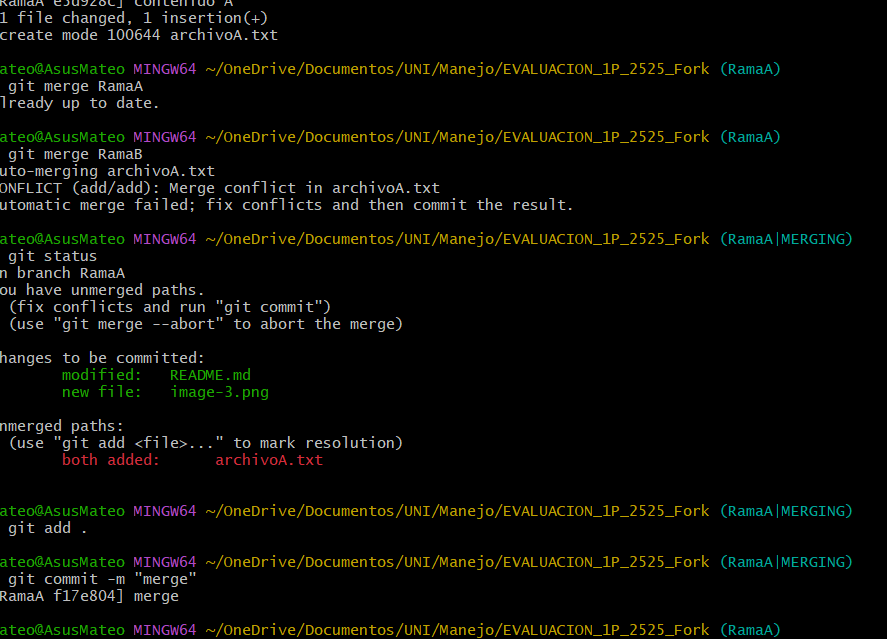
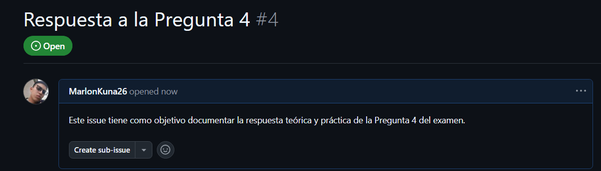
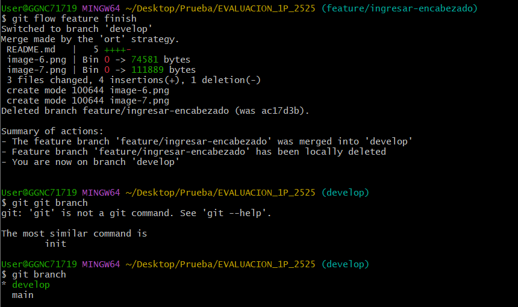

# Universidad [Nombre de la Universidad]  
## Facultad de [Nombre de la Facultad]  
### Carrera de Ingeniería en Software  

**Asignatura:** Manejo y Configuración de Software  
**Nombre del Estudiante:** Josue Guevara  
**Fecha:** 07/10/2025 

---

# Evaluación Práctica de Git y GitHub

## Instrucciones Generales

- Cada pregunta debe ser respondida directamente en este archivo **(README.md)** debajo del enunciado correspondiente.
- Cada respuesta debe ir acompañada de uno o más **commits**, según se indique en cada pregunta.
- Cuando se indique, deberán realizarse acciones prácticas dentro del repositorio (como creación de archivos, ramas, resolución de conflictos, etc.).
- Cada pregunta debe estar **etiquetada con un tag**, únicamente en el commit final correspondiente, con el formato: `"Pregunta 1"`, `"Pregunta 2"`, etc.

---

## Pregunta 1 (1 punto)

**Explicar la diferencia entre los siguientes conceptos/comandos en Git y GitHub:**

- `git clone`  
Git clone es un comando de github que permite traer todos los cambios y archivos de un repositorio remoto a un repositorio local 
- `fork`  
fork Permite llevar los cambios de u remositorio remotoa  otro repositorio remoto
- `git pull`
Git pull permite traer los cambios, archivos y ramas de un repositorio remoto al repositorio local, esto a diferencia de git clone actualiza los archvios y no sobreescribe lo que ya existe en el repositorio local

### Parte práctica:

- Realizar un **fork** de este repositorio en la cuenta personal de GitHub del estudiante.
- Luego, realizar un **clone** del fork en el equipo local.
- En este README, describir el proceso seguido:
  - ¿Cómo se realizó el fork? \
  El fork se realizó al dar click en github en la opcion de fork y crar un repositorio remoto en el remositorio remoto del estudiante
  \
  
  - ¿Cómo se realizó el clone del fork?\
  El clone del fork se realizó al clonar el repositorio remoto del estudiante mediante el comando `git clone https://github.com/ElJDragon/EVALUACION_1P.git`
  \
  
  - ¿Cómo se verificó que se estaba trabajando sobre el fork y no sobre el repositorio original?\
  Mediante el comando `git remote -v` se peude observar la rama remota y al ser la rama del estudiante se peude comprobar que se esta trabajando en el fork porque la ruta remota es del estudiante y no del docente \
  

**📝 Respuesta:**

<!-- Escribe aquí tu respuesta a la Pregunta 1 -->

---

## Pregunta 2 (1 punto)

**Configurar un archivo `.gitignore` para que ignore:**

- Todos los archivos con extensión `.log`.
- Una carpeta llamada `temp/`.
- Todos los archivos `.md` y `.txt`de la carpeta `doc/`. (Probar agregando un archivo `prueba.md` y un archivo `prueba.txt` dentro de la carpeta y fuera de la carpeta.)

### Requisitos:

1. Realizar un **primer commit** que incluya únicamente el archivo `.gitignore` con las reglas de exclusión definidas.\

2. Realizar un **segundo commit** donde se explique en este README la función del archivo `.gitignore` y se muestre evidencia de que los archivos y carpetas indicadas no están siendo rastreadas por Git.\

**Importante:**  
- Solo el **segundo commit** debe llevar el **tag `"Pregunta 2"`**.

**📝 Respuesta:**

<!-- Escribe aquí tu explicación y evidencia para la Pregunta 2 -->

---

## Pregunta 3 (2 puntos)

**Utilizar Git Flow para desarrollar una nueva funcionalidad llamada `ingresar-encabezado`.**

### Requisitos:

- Inicializar el repositorio con Git Flow, utilizando las ramas por defecto: `main` y `develop`.\

- Crear una rama de tipo `hotfix` con el nombre `ingresar-encabezado`.

- En dicha rama, **completar con los datos personales del estudiante** el encabezado que ya se encuentra al inicio de este archivo `README.md`.
- Realizar al menos un commit durante el desarrollo.
- Finalizar el hotfix siguiendo el flujo de trabajo establecido por Git Flow.

### En este README, se debe incluir:

- Los **comandos exactos** utilizados desde la inicialización de Git Flow hasta el cierre del hotfix.\
  - git flow init
  - git flow hotfix start ingresar-encabezado
  - git add .
  -  git commit -m "cambio del nommbre: Josue Guevara"
  - git add .
  - $ git commit -m "Cambio de la fecha 07/10/2025"
  - 
  - 
  - git flow hotfix finish
  -  git log --oneline --graph --all --decorate
  - 
- Una descripción del **proceso seguido**, indicando el propósito de cada paso. 
  - Prmero se debe hacer commit a cualquier cambio que se encuentr en staggin y se debe usar git flow init para usar el flujo de git flow dentro del proyecto, depsues de eso se debe realizar git flow start para que gitflow cree y nos transporte automaticamente a la rama hotfix, una ve en la rama hotfix se debe ralizar lo cambio y usar git flow hotfix finish para cerrar la rama y se debe asignar los mensaes d elos comits de merge y los tags para llevar los cambios a develop y main y cerrar finalmente la rama.
- Una reflexión sobre las **ventajas de aplicar Git Flow**, especialmente en contextos colaborativos o proyectos de larga duración.\
  - Aplicar Git Flow ofrece una estructura clara y ordenada para gestionar el desarrollo de software, especialmente en equipos colaborativos o proyectos de larga duración. Su división por ramas específicas permite trabajar en nuevas funciones, correcciones y versiones de forma paralela sin afectar la estabilidad del código principal. Esto mejora la organización, la trazabilidad y la comunicación entre los desarrolladores, garantizando un flujo de trabajo más eficiente y controlado a lo largo del tiempo.

**Importante:**

- Deben realizarse varios commits durante esta pregunta.
- **Solo el commit final** debe llevar el **tag `"Pregunta 3"`**.
- El flujo debe respetar la estructura de Git Flow con las ramas `develop` y `main`.

**📝 Respuesta:**

<!-- Escribe aquí tu respuesta completa a la Pregunta 3 -->

---

## Pregunta 4 (2 puntos)

**Trabajo con Issues y Pull Requests**

### Parte teórica:

- Explicar qué es un **issue** en GitHub. \

Un issue (incidencia o tema) es una herramienta que permite registrar, discutir y dar seguimiento a tareas, errores, mejoras o preguntas dentro de un repositorio. Los issues sirven para organizar el trabajo, asignar responsables, establecer prioridades y mantener una comunicación clara entre los miembros del equipo. Son esenciales para la planificación y gestión del proyecto.
- Explicar qué es un **pull request** y cuál es su finalidad. \

Un pull request (PR) es una solicitud que un desarrollador realiza para integrar los cambios hechos en una rama (generalmente de un fork o una feature branch) hacia otra rama principal del proyecto, como develop o main. Su finalidad es revisar, discutir y aprobar los cambios antes de que se unan al código principal, asegurando la calidad y coherencia del proyecto.
- Indicar la diferencia entre ambos y cómo se relacionan en un entorno de trabajo colaborativo.
  - Un issue plantea un problema o una tarea que necesita resolverse (por ejemplo: “corregir error en el login”).

  - Un pull request representa la propuesta de solución a ese problema (por ejemplo: “se corrigió el error en el login y se actualizó la validación”).

### Parte práctica:

- Trabajar en la rama `develop`, ya existente desde la configuración de Git Flow.
- Crear un **issue** titulado `"Respuesta a la Pregunta 4"`, en el que se indique que su objetivo es documentar esta pregunta.
- Realizar los cambios necesarios en este archivo `README.md` para responder esta pregunta.
- Realizar un **commit** con los cambios y subirlo a la rama `develop` del repositorio remoto.
- Crear un **pull request** desde `develop` hacia `main` en GitHub.
- **Vincular el pull request con el issue creado**, de manera que al ser aprobado y fusionado, el issue se cierre automáticamente.
- **Aprobar** el pull request para que se haga el merge respectivo hacia `main`.

### En este README, se debe incluir:

- Un resumen del procedimiento realizado.

- El número y enlace del issue creado.
https://github.com/ElJDragon/EVALUACION_1P/issues/1
#1
- El número y enlace al pull request.

**📝 Respuesta:**

<!-- Escribe aquí tu respuesta completa a la Pregunta 4 -->

---

## Pregunta 5 (2 puntos)

**Resolver conflictos entre ramas y realizar un Pull Request**

### Requisitos:

- Crear dos ramas llamadas `ramaA` y `ramaB`, ambas a partir de la rama `develop`.
- En `ramaA`, crear un archivo llamado `archivoA.txt` con el contenido:  
  `Contenido A`
- En `ramaB`, crear un archivo con el mismo nombre (`archivoA.txt`), pero con el contenido:  
  `Contenido B`
- Intentar fusionar `ramaB` sobre `ramaA`, lo cual debe generar un conflicto.
- Resolver el conflicto combinando ambos contenidos.
- Realizar el merge de `ramaA` hacia `develop`.
- Crear un **pull request** desde `develop` hacia `main`.
- Una vez completado lo anterior, eliminar las ramas `ramaA` y `ramaB` tanto local como remotamente.

### En este README, se debe incluir:

- El procedimiento completo:
  - Cómo se crearon las ramas.
  - Cómo se generó y resolvió el conflicto.
  - Cómo se realizó el merge hacia `develop`.
  - Cómo se eliminaron las ramas al finalizar.
- El enlace al pull request.
- Una breve explicación de qué es un conflicto en Git y por qué ocurrió en este caso.

**📝 Respuesta:**

<!-- Escribe aquí tu respuesta completa a la Pregunta 5 -->

---

## Pregunta 6 (2 puntos)

**Realizar limpieza, explicar versionamiento semántico y enviar cambios al repositorio original**

### Requisitos:

- Trabajar en la rama `develop` del fork del repositorio.
- Eliminar los archivos `archivoA.txt` y `archivoB.txt` creados en preguntas anteriores.
- Realizar un merge desde `develop` hacia `main` en el repositorio local.
- Enviar los cambios de la rama `main` local a la rama `develop` del repositorio remoto (fork). Recuerde incluir todos los tags creados (6 tags).
- Finalmente, crear un **pull request** desde la rama `develop` del fork hacia la rama `main` del repositorio original (del cual se realizó el fork en la Pregunta 1). El titulo del pull request debe ser "NOMBRE APELLIDOS", en la descripción colocar el link de su repositorio de GitHub.

### En este README, se debe incluir:

- Una explicación del proceso realizado paso a paso.
- Una explicación del **versionamiento semántico**, indicando:
  - En qué consiste.
  - Sus tres componentes (MAJOR, MINOR, PATCH).
- El enlace al pull request creado hacia el repositorio original.
- Si hace falta agregar alguna evidencia adicional, agregue un tag adicional que sea `Version Final`.

**📝 Respuesta:**

<!-- Escribe aquí tu respuesta completa a la Pregunta 6 -->
