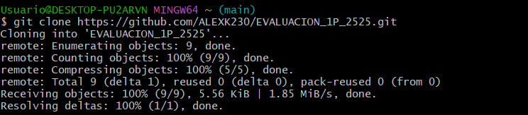
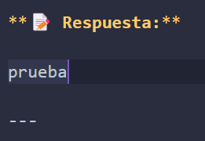
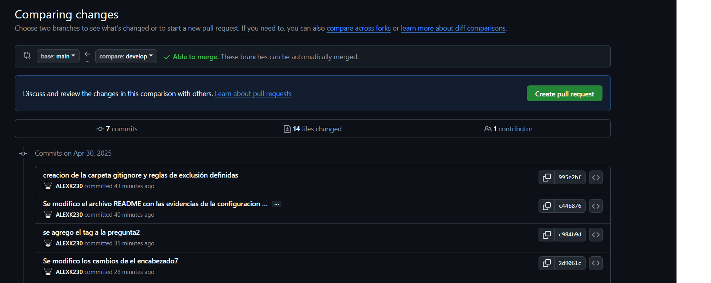
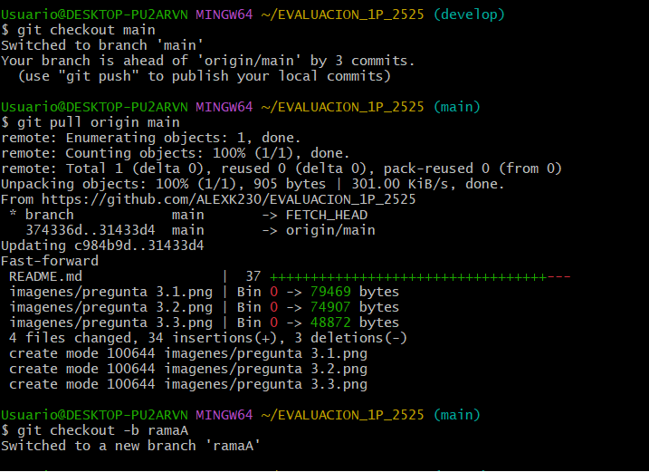
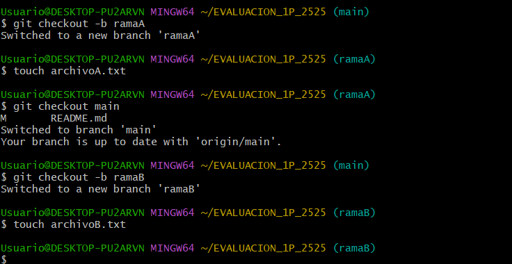

# Universidad [Nombre de la Universidad]  
## Facultad de [Nombre de la Facultad]  
### Carrera de Ingeniería en Software  

**Asignatura:** Manejo y Configuración de Software  
**Nombre del Estudiante:** ___________________________  
**Fecha:** ___________________  

---

# Evaluación Práctica de Git y GitHub

## Instrucciones Generales

- Cada pregunta debe ser respondida directamente en este archivo **(README.md)** debajo del enunciado correspondiente.
- Cada respuesta debe ir acompañada de uno o más **commits**, según se indique en cada pregunta.
- Cuando se indique, deberán realizarse acciones prácticas dentro del repositorio (como creación de archivos, ramas, resolución de conflictos, etc.).
- Cada pregunta debe estar **etiquetada con un tag**, únicamente en el commit final correspondiente, con el formato: `"Pregunta 1"`, `"Pregunta 2"`, etc.

---

## Pregunta 1 (1 punto)

**Explicar la diferencia entre los siguientes conceptos/comandos en Git y GitHub:**

- `git clone`  
- `fork`  
- `git pull`

### Parte práctica:

- Realizar un **fork** de este repositorio en la cuenta personal de GitHub del estudiante.
- Luego, realizar un **clone** del fork en el equipo local.
- En este README, describir el proceso seguido:
  - ¿Cómo se realizó el fork?
  - ¿Cómo se realizó el clone del fork?
  - ¿Cómo se verificó que se estaba trabajando sobre el fork y no sobre el repositorio original?

**📝 Respuesta:**

<!-- Escribe aquí tu respuesta a la Pregunta 1 -->
## Respuestas
### git clone
Es un comando que sirve para clonar un repositorio existen a nuestra area de trabajo
### fork
Es una herramienta que sirve para copiar un repositorio existente a nuestra cuenta en github
### git pull
Es un comando de Git utilizado para actualizar la versión local de un repositorio desde otro remoto. 

### ¿Cómo se realizó el fork?
Primero entramos al repositorio del Ing, en la parte superior derecha está un botón que dice fork, al aplastarlo y crearlo, se nos duplicará por asi decirlo en nuestra cuenta, la cual tendrá un link diferente al del repostorio del cual se hizo fork.
### ¿Cómo se realizó el clone del fork?
Copiamos el link del repositorio nuestro, y al iniciar bash se usa el comando git clone "link del repositorio"
### ¿Cómo se verificó que se estaba trabajando sobre el fork y no sobre el repositorio original?
Con el comando git remote -v podemos constatar eso, en la siguiente imagen se visualiza tanto esto, como todo el proceso seguido.

---

## Pregunta 2 (1 punto)

**Configurar un archivo `.gitignore` para que ignore:**

- Todos los archivos con extensión `.log`.
- Una carpeta llamada `temp/`.
- Todos los archivos `.md` y `.txt`de la carpeta `doc/`. (Probar agregando un archivo `prueba.md` y un archivo `prueba.txt` dentro de la carpeta y fuera de la carpeta.)

### Requisitos:

1. Realizar un **primer commit** que incluya únicamente el archivo `.gitignore` con las reglas de exclusión definidas.
2. Realizar un **segundo commit** donde se explique en este README la función del archivo `.gitignore` y se muestre evidencia de que los archivos y carpetas indicadas no están siendo rastreadas por Git.

**Importante:**  
- Solo el **segundo commit** debe llevar el **tag `"Pregunta 2"`**.

**📝 Respuesta:**
### Evidencia
Como evidencia la siguiente imagen.

En esta imagen se puede observar que el archivo readme si se muestra y agrega cuando se usa git add . y la carpeta y el archivo log se ignoran
---

## Pregunta 3 (2 puntos)

**Utilizar Git Flow para desarrollar una nueva funcionalidad llamada `ingresar-encabezado`.**

### Requisitos:

- Inicializar el repositorio con Git Flow, utilizando las ramas por defecto: `main` y `develop`.
- Crear una rama de tipo `hotfix` con el nombre `ingresar-encabezado`.
- En dicha rama, **completar con los datos personales del estudiante** el encabezado que ya se encuentra al inicio de este archivo `README.md`.
- Realizar al menos un commit durante el desarrollo.
- Finalizar el hotfix siguiendo el flujo de trabajo establecido por Git Flow.

### En este README, se debe incluir:

- Los **comandos exactos** utilizados desde la inicialización de Git Flow hasta el cierre del hotfix.
- Una descripción del **proceso seguido**, indicando el propósito de cada paso.
- Una reflexión sobre las **ventajas de aplicar Git Flow**, especialmente en contextos colaborativos o proyectos de larga duración.

**Importante:**

- Deben realizarse varios commits durante esta pregunta.
- **Solo el commit final** debe llevar el **tag `"Pregunta 3"`**.
- El flujo debe respetar la estructura de Git Flow con las ramas `develop` y `main`.

**📝 Respuesta:**
## Comandos exactos usados
- git flow init
- git flow hotfix start "ingresar-encabezado"
- git add .
- git commit -m "Se agregó los datos del encabezado"
- git flow hotfix finish "ingresar-encabezado"

## Proceso segido

1. Primero inicializamos git flow con el comando git flow init
2. Creamos la rama temporal hotfix para la realizacion de los cambios con el comando git flow hotfix start "ingresar-encabezado"
3. Editamos el encabezado y hacemos un git add . y un git commit
4. Terminamos la rama temporal con el comando git flow hotfix finish "ingresar-encabezado"
5. Listo

## Ventajas de aplicar el git flow

Sirve para tener un proyecto mas entendible, con menos contratiempos y que se puede configurar y manejar de una manera mas facil y entendible.

## Capturas

---

## Pregunta 4 (2 puntos)

**Trabajo con Issues y Pull Requests**

### Parte teórica:

- Explicar qué es un **issue** en GitHub.
- Explicar qué es un **pull request** y cuál es su finalidad.
- Indicar la diferencia entre ambos y cómo se relacionan en un entorno de trabajo colaborativo.

### Parte práctica:

- Trabajar en la rama `develop`, ya existente desde la configuración de Git Flow.
- Crear un **issue** titulado `"Respuesta a la Pregunta 4"`, en el que se indique que su objetivo es documentar esta pregunta.
- Realizar los cambios necesarios en este archivo `README.md` para responder esta pregunta.
- Realizar un **commit** con los cambios y subirlo a la rama `develop` del repositorio remoto.
- Crear un **pull request** desde `develop` hacia `main` en GitHub.
- **Vincular el pull request con el issue creado**, de manera que al ser aprobado y fusionado, el issue se cierre automáticamente.
- **Aprobar** el pull request para que se haga el merge respectivo hacia `main`.

### En este README, se debe incluir:

- Un resumen del procedimiento realizado.
- El número y enlace del issue creado.
- El número y enlace al pull request.

**📝 Respuesta:**

### Parte teorica

- Explicar qué es un **issue** en GitHub.
Es un reporte o tarea en GitHub para discutir errores, mejoras o preguntas sobre el proyecto.
- Explicar qué es un **pull request** y cuál es su finalidad.
Es una propuesta de cambio en el código para que otros lo revisen y lo integren al proyecto.
- Indicar la diferencia entre ambos y cómo se relacionan en un entorno de trabajo colaborativo.
El issue identifica qué hacer, el pull request muestra cómo hacerlo. En equipo, primero se crea un issue y luego se envía un pull request para solucionar ese issue y que el equipo lo revise antes de integrarlo.

### Parte práctica

- Un resumen del procedimiento realizado.
1. Primero desde github creamos el issue
2. Nos movimos a la rama develop
3. Editamos lo necesario e hicimos git add .
4. Hicimos el git commit -m "Pregunta4(#1)"
5. hicimos el pull request desde git y en descripcion se agregó Closes #1
6. Hicimos merge
- El número y enlace del issue creado.
El número del issue es #1 y el enlace es el siguiente: https://github.com/JumboJhon04/EVALUACION/issues/1#issue-3493003116
- El número y enlace al pull request.
El número del pull request es #2 y el enlace es el siguiente: https://github.com/JumboJhon04/EVALUACION/pull/2#issue-3493031061

### Capturas

## Pregunta 5 (2 puntos)

**Resolver conflictos entre ramas y realizar un Pull Request**

### Requisitos:

- Crear dos ramas llamadas `ramaA` y `ramaB`, ambas a partir de la rama `develop`.
- En `ramaA`, crear un archivo llamado `archivoA.txt` con el contenido:  
  `Contenido A`
- En `ramaB`, crear un archivo con el mismo nombre (`archivoA.txt`), pero con el contenido:  
  `Contenido B`
- Intentar fusionar `ramaB` sobre `ramaA`, lo cual debe generar un conflicto.
- Resolver el conflicto combinando ambos contenidos.
- Realizar el merge de `ramaA` hacia `develop`.
- Crear un **pull request** desde `develop` hacia `main`.
- Una vez completado lo anterior, eliminar las ramas `ramaA` y `ramaB` tanto local como remotamente.

### En este README, se debe incluir:

- El procedimiento completo:
  - Cómo se crearon las ramas.
  - Cómo se generó y resolvió el conflicto.
  - Cómo se realizó el merge hacia `develop`.
  - Cómo se eliminaron las ramas al finalizar.
- El enlace al pull request.
- Una breve explicación de qué es un conflicto en Git y por qué ocurrió en este caso.

**📝 Respuesta:**

### Cómo se crearon las ramas.

Usamos el comando git branch "nombre de la rama"

### Cómo se generó y resolvió el conflicto.

Hicimos una combinacion de ambas desde el editor de texto quedando asi
"Contenido A

Contenido B
"

### Cómo se realizó el merge hacia `develop`.

Pues hicimos el commit en la ramaA ya arreglado el problema y despues nos cambiamos a la rama develop e hicimos el comando git merge ramaA
### Cómo se eliminaron las ramas al finalizar.
En el github entramos en brach y pusimos eliminar rama.
con git branch -d "nombre de la rama"
### El enlace al pull request.

https://github.com/JumboJhon04/EVALUACION/pull/4#issue-3493079558
### Una breve explicación de qué es un conflicto en Git y por qué ocurrió en este caso.

El conflicto surge cuando al hacer merge de una rama a otra, esta tiene dos mismos archivos pero con diferente contenido en los mismos. 

## Capturas

<!-- Escribe aquí tu respuesta completa a la Pregunta 5 -->

---

## Pregunta 6 (2 puntos)

**Realizar limpieza, explicar versionamiento semántico y enviar cambios al repositorio original**

### Requisitos:

- Trabajar en la rama `develop` del fork del repositorio.
- Eliminar los archivos `archivoA.txt` y `archivoB.txt` creados en preguntas anteriores.
- Realizar un merge desde `develop` hacia `main` en el repositorio local.
- Enviar los cambios de la rama `main` local a la rama `develop` del repositorio remoto (fork). Recuerde incluir todos los tags creados (6 tags).
- Finalmente, crear un **pull request** desde la rama `develop` del fork hacia la rama `main` del repositorio original (del cual se realizó el fork en la Pregunta 1). El titulo del pull request debe ser "NOMBRE APELLIDOS", en la descripción colocar el link de su repositorio de GitHub.

### En este README, se debe incluir:

- Una explicación del proceso realizado paso a paso.
- Una explicación del **versionamiento semántico**, indicando:
  - En qué consiste.
  - Sus tres componentes (MAJOR, MINOR, PATCH).
- El enlace al pull request creado hacia el repositorio original.
- Si hace falta agregar alguna evidencia adicional, agregue un tag adicional que sea `Version Final`.

**📝 Respuesta:**

### Una explicación del proceso realizado paso a paso.
1. Primero realizamos un commit en caso de haber un cambio faltante
2. Nos cambiamos a la rama main
3. Usamos el comando git merge develop
4. hacemos el git push origin main --tags
5. Hacemos el pull request desde develop al main del repo original.

### Una explicación del **versionamiento semántico**, indicando:
  - En qué consiste.
  Consiste en asignar un número de versión en el formato MAJOR.MINOR.PATCH (por ejemplo, 2.3.1). Este número se incrementa de acuerdo con el tipo de cambios introducidos en el software.
  - Sus tres componentes (MAJOR, MINOR, PATCH).
  MAJOR: Cambios incompatibles con versiones anteriores. Se incrementa cuando haces cambios que rompen la compatibilidad con versiones previas. Ejemplo: 2.0.0 a 3.0.0.

  MINOR: Nuevas funcionalidades compatibles con versiones anteriores. Se incrementa cuando añades nuevas características de manera que no rompen el código anterior. Ejemplo: 1.2.0 a 1.3.0.

  PATCH: Correcciones de errores. Se incrementa cuando haces arreglos menores que no afectan la funcionalidad, solo corrigen fallos. Ejemplo: 1.0.1 a 1.0.2.

### El enlace al pull request creado hacia el repositorio original.

https://github.com/santiagojara/EVALUACION_1P/pull/108#issue-3493136409
### Capturas

<!-- Escribe aquí tu respuesta completa a la Pregunta 6 -->
