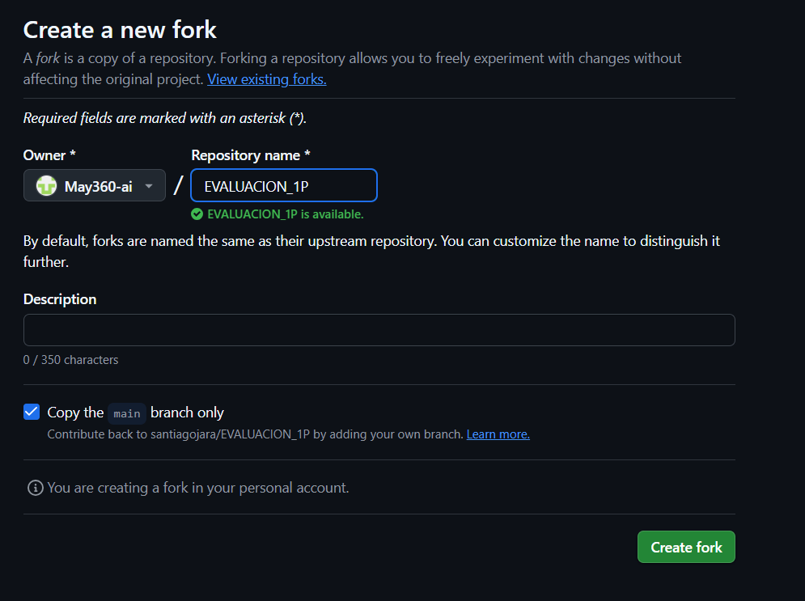

# Universidad Tecnica de Ambato
## Facultad de Ingeniería en Sistemas, Electrónica e Industrial
### Carrera de Ingeniería en Software  

**Asignatura:** Manejo y Configuración de Software  
**Nombre del Estudiante:** Patricio Tisalema
**Fecha:** 7/10/2025

---

# Evaluación Práctica de Git y GitHub

## Instrucciones Generales

- Cada pregunta debe ser respondida directamente en este archivo **(README.md)** debajo del enunciado correspondiente.
- Cada respuesta debe ir acompañada de uno o más **commits**, según se indique en cada pregunta.
- Cuando se indique, deberán realizarse acciones prácticas dentro del repositorio (como creación de archivos, ramas, resolución de conflictos, etc.).
- Cada pregunta debe estar **etiquetada con un tag**, únicamente en el commit final correspondiente, con el formato: `"Pregunta 1"`, `"Pregunta 2"`, etc.

---

## Pregunta 1 (1 punto)

**Explicar la diferencia entre los siguientes conceptos/comandos en Git y GitHub:**

- `git clone`  
- `fork`  
- `git pull`

### Parte práctica:

- Realizar un **fork** de este repositorio en la cuenta personal de GitHub del estudiante.
- Luego, realizar un **clone** del fork en el equipo local.
- En este README, describir el proceso seguido:
  - ¿Cómo se realizó el fork?
  - ¿Cómo se realizó el clone del fork?
  - ¿Cómo se verificó que se estaba trabajando sobre el fork y no sobre el repositorio original?

**📝 Respuesta:**

**Explicar la diferencia entre los siguientes conceptos/comandos en Git y GitHub:**

- `git clone`: Es un comando de Git que crea una copia local completa de un repositorio remoto.
- `fork`: Permite crear una copia personal de un repositorio ajeno en tu cuenta de GitHub para contribuir sin afectar el original.
- `git pull`: Es un comando de Git que descarga los cambios de un repositorio remoto y los fusiona en tu rama local actual.git

**Parte Practica**
- ¿Cómo se realizó el fork? : Se utilizo la funcion de fork de GitHub, simplemente se elije un nombre (en mi caso decidi conservar el mismo), escribismos una descripcion si queremos y le damos a "Crear Fork"

- ¿Cómo se realizó el clone del fork? : Se utilizo git clone y el link del repositorio que acabamos de forkear (asi se le dice??)

- ¿Cómo se verificó que se estaba trabajando sobre el fork y no sobre el repositorio original? :Simplemente me fije en el usuario el cual aparece en el link al momento de clonar el repositorio, por automatico los cambios que hagasmos se iran al fork en este caso

<!-- Escribe aquí tu respuesta a la Pregunta 1 -->

---

## Pregunta 2 (1 punto)

**Configurar un archivo `.gitignore` para que ignore:**

- Todos los archivos con extensión `.log`.
- Una carpeta llamada `temp/`.
- Todos los archivos `.md` y `.txt`de la carpeta `doc/`. (Probar agregando un archivo `prueba.md` y un archivo `prueba.txt` dentro de la carpeta y fuera de la carpeta.)

### Requisitos:

1. Realizar un **primer commit** que incluya únicamente el archivo `.gitignore` con las reglas de exclusión definidas.
2. Realizar un **segundo commit** donde se explique en este README la función del archivo `.gitignore` y se muestre evidencia de que los archivos y carpetas indicadas no están siendo rastreadas por Git.

**Importante:**  
- Solo el **segundo commit** debe llevar el **tag `"Pregunta 2"`**.

**📝 Respuesta:**

El archivo `.gitignore` es un archivo de texto que le indica a Git qué archivos, carpetas o patrones de archivos debe ignorar y no incluir en el control de versiones. Esto evita que archivos innecesarios o sensibles (como logs, archivos temporales o configuraciones locales) sean rastreados por Git, manteniendo el repositorio limpio y eficiente.

### Reglas configuradas en .gitignore:
- `*.log`: Ignora todos los archivos con extensión `.log`.
- `temp/`: Ignora la carpeta `temp/` y todo su contenido.
- `doc/*.md` y `doc/*.txt`: Ignora todos los archivos `.md` y `.txt` dentro de la carpeta `doc/`.

### Evidencia de funcionamiento:
Se crearon archivos de prueba para verificar las reglas:
- `doc/prueba.md` y `doc/prueba.txt`: Estos archivos están dentro de `doc/`, por lo que son ignorados por Git (no aparecen en `git status` como archivos a agregar).
- `prueba.md` y `prueba.txt`: Estos archivos están fuera de `doc/`, por lo que no son ignorados y aparecen como "untracked" en `git status`, listos para ser agregados si se desea.

Esto confirma que `.gitignore` funciona correctamente, excluyendo solo los archivos especificados en las reglas.

<!-- Escribe aquí tu explicación y evidencia para la Pregunta 2 -->

---

## Pregunta 3 (2 puntos)

**Utilizar Git Flow para desarrollar una nueva funcionalidad llamada `ingresar-encabezado`.**

### Requisitos:

- Inicializar el repositorio con Git Flow, utilizando las ramas por defecto: `main` y `develop`.
- Crear una rama de tipo `hotfix` con el nombre `ingresar-encabezado`.
- En dicha rama, **completar con los datos personales del estudiante** el encabezado que ya se encuentra al inicio de este archivo `README.md`.
- Realizar al menos un commit durante el desarrollo.
- Finalizar el hotfix siguiendo el flujo de trabajo establecido por Git Flow.

### En este README, se debe incluir:

- Los **comandos exactos** utilizados desde la inicialización de Git Flow hasta el cierre del hotfix.
- Una descripción del **proceso seguido**, indicando el propósito de cada paso.
- Una reflexión sobre las **ventajas de aplicar Git Flow**, especialmente en contextos colaborativos o proyectos de larga duración.

**Importante:**

- Deben realizarse varios commits durante esta pregunta.
- **Solo el commit final** debe llevar el **tag `"Pregunta 3"`**.
- El flujo debe respetar la estructura de Git Flow con las ramas `develop` y `main`.

**📝 Respuesta:**

<!-- Escribe aquí tu respuesta completa a la Pregunta 3 -->

---

## Pregunta 4 (2 puntos)

**Trabajo con Issues y Pull Requests**

### Parte teórica:

- Explicar qué es un **issue** en GitHub.
- Explicar qué es un **pull request** y cuál es su finalidad.
- Indicar la diferencia entre ambos y cómo se relacionan en un entorno de trabajo colaborativo.

### Parte práctica:

- Trabajar en la rama `develop`, ya existente desde la configuración de Git Flow.
- Crear un **issue** titulado `"Respuesta a la Pregunta 4"`, en el que se indique que su objetivo es documentar esta pregunta.
- Realizar los cambios necesarios en este archivo `README.md` para responder esta pregunta.
- Realizar un **commit** con los cambios y subirlo a la rama `develop` del repositorio remoto.
- Crear un **pull request** desde `develop` hacia `main` en GitHub.
- **Vincular el pull request con el issue creado**, de manera que al ser aprobado y fusionado, el issue se cierre automáticamente.
- **Aprobar** el pull request para que se haga el merge respectivo hacia `main`.

### En este README, se debe incluir:

- Un resumen del procedimiento realizado.
- El número y enlace del issue creado.
- El número y enlace al pull request.

**📝 Respuesta:**

### Parte teórica:

- **Explicar qué es un issue en GitHub:**  
  Un issue en GitHub es una herramienta de seguimiento que permite a los colaboradores del proyecto reportar bugs, sugerir mejoras, discutir ideas o documentar tareas pendientes. Funciona como un foro integrado en el repositorio, donde se pueden asignar responsables, etiquetas y milestones para organizar el trabajo.

- **Explicar qué es un pull request y cuál es su finalidad:**  
  Un pull request (PR) es una solicitud formal para fusionar cambios de una rama (generalmente una rama de feature o desarrollo) a otra rama principal (como `main` o `develop`). Su finalidad es facilitar la revisión de código por parte de otros colaboradores, permitiendo discusiones, pruebas y aprobaciones antes de integrar los cambios, asegurando calidad y evitando conflictos.

- **Indicar la diferencia entre ambos y cómo se relacionan en un entorno de trabajo colaborativo:**  
  La diferencia principal es que un issue se centra en la discusión y planificación de ideas o problemas sin involucrar código directamente, mientras que un pull request implica cambios concretos de código que se proponen para revisión y fusión. En un entorno colaborativo, se relacionan estrechamente: un issue puede iniciar una discusión sobre una mejora, y luego un PR resuelve ese issue al implementar la solución, permitiendo cerrar automáticamente el issue al fusionar el PR. Esto crea un flujo de trabajo estructurado donde issues guían el desarrollo y PRs lo ejecutan con control de calidad.

### Parte práctica:

- Un resumen del procedimiento realizado.
1. Se habilitaron las Issues en el repositorio
2. Nos cambiamos a la rama develop para responder las preguntas planteadas (Solamente teoria)
3. Pusheamos la rama develop a github
4. Al issue que creamos con anterioridad le asignamos esa rama
5. Creamos un pull request en nuestro repositorio en en cual indicamos que se cerraria la issue #1
6. Combinamos y aceptamos
- El número y enlace del issue creado: `https://github.com/NoMerlyn/EVALUACION_1P/issues/1#issue-3493075147` siendo la issue #1
- El número y enlace al pull request: `https://github.com/NoMerlyn/EVALUACION_1P/pull/2#issue-3493103638` siendo el pull request #2git fetch origin pull/ID/head:

---

## Pregunta 5 (2 puntos)

**Resolver conflictos entre ramas y realizar un Pull Request**

### Requisitos:

- Crear dos ramas llamadas `ramaA` y `ramaB`, ambas a partir de la rama `develop`.
- En `ramaA`, crear un archivo llamado `archivoA.txt` con el contenido:  
  `Contenido A`
- En `ramaB`, crear un archivo con el mismo nombre (`archivoA.txt`), pero con el contenido:  
  `Contenido B`
- Intentar fusionar `ramaB` sobre `ramaA`, lo cual debe generar un conflicto.
- Resolver el conflicto combinando ambos contenidos.
- Realizar el merge de `ramaA` hacia `develop`.
- Crear un **pull request** desde `develop` hacia `main`.
- Una vez completado lo anterior, eliminar las ramas `ramaA` y `ramaB` tanto local como remotamente.

### En este README, se debe incluir:

- El procedimiento completo:
  - Cómo se crearon las ramas.
  - Cómo se generó y resolvió el conflicto.
  - Cómo se realizó el merge hacia `develop`.
  - Cómo se eliminaron las ramas al finalizar.
- El enlace al pull request.
- Una breve explicación de qué es un conflicto en Git y por qué ocurrió en este caso.

**📝 Respuesta:**

<!-- Escribe aquí tu respuesta completa a la Pregunta 5 -->

---

## Pregunta 6 (2 puntos)

**Realizar limpieza, explicar versionamiento semántico y enviar cambios al repositorio original**

### Requisitos:

- Trabajar en la rama `develop` del fork del repositorio.
- Eliminar los archivos `archivoA.txt` y `archivoB.txt` creados en preguntas anteriores.
- Realizar un merge desde `develop` hacia `main` en el repositorio local.
- Enviar los cambios de la rama `main` local a la rama `develop` del repositorio remoto (fork). Recuerde incluir todos los tags creados (6 tags).
- Finalmente, crear un **pull request** desde la rama `develop` del fork hacia la rama `main` del repositorio original (del cual se realizó el fork en la Pregunta 1). El titulo del pull request debe ser "NOMBRE APELLIDOS", en la descripción colocar el link de su repositorio de GitHub.

### En este README, se debe incluir:

- Una explicación del proceso realizado paso a paso.
- Una explicación del **versionamiento semántico**, indicando:
  - En qué consiste.
  - Sus tres componentes (MAJOR, MINOR, PATCH).
- El enlace al pull request creado hacia el repositorio original.
- Si hace falta agregar alguna evidencia adicional, agregue un tag adicional que sea `Version Final`.

**📝 Respuesta:**

<!-- Escribe aquí tu respuesta completa a la Pregunta 6 -->
