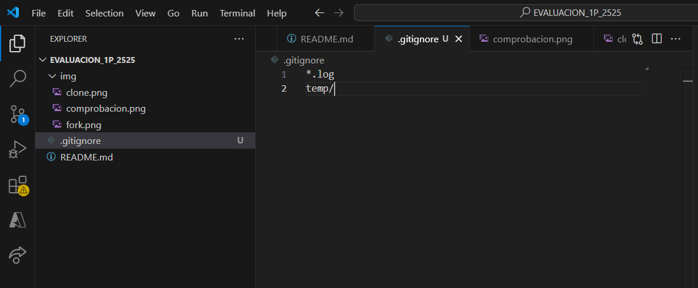

# Universidad Técnica de Ambato 
## Facultad de Ingeniería en Sistemas, Electrónica e Industrial 
### Carrera de Ingeniería en Software  

**Asignatura:** Manejo y Configuración de Software  
**Nombre del Estudiante:** Joseph Chachalo 
**Fecha:** 07/10/2025

---

# Evaluación Práctica de Git y GitHub

## Instrucciones Generales

- Cada pregunta debe ser respondida directamente en este archivo **(README.md)** debajo del enunciado correspondiente.
- Cada respuesta debe ir acompañada de uno o más **commits**, según se indique en cada pregunta.
- Cuando se indique, deberán realizarse acciones prácticas dentro del repositorio (como creación de archivos, ramas, resolución de conflictos, etc.).
- Cada pregunta debe estar **etiquetada con un tag**, únicamente en el commit final correspondiente, con el formato: `"Pregunta 1"`, `"Pregunta 2"`, etc.

---

## Pregunta 1 (1 punto)

**Explicar la diferencia entre los siguientes conceptos/comandos en Git y GitHub:**

- `git clone`  
- `fork`  
- `git pull`

### Parte práctica:

- Realizar un **fork** de este repositorio en la cuenta personal de GitHub del estudiante.
- Luego, realizar un **clone** del fork en el equipo local.
- En este README, describir el proceso seguido:
  - ¿Cómo se realizó el fork?
  - ¿Cómo se realizó el clone del fork?
  - ¿Cómo se verificó que se estaba trabajando sobre el fork y no sobre el repositorio original?

**📝 Respuesta:**

**git clone:** Comando que copia un repositorio remoto completo a tu máquina local, incluyendo todo el historial de commits y ramas.

**fork:** Acción en GitHub que crea una copia personal de un repositorio en tu cuenta, permitiéndote trabajar independientemente del original.

**git pull:** Comando que descarga los cambios más recientes desde el repositorio remoto y los fusiona con tu rama local actual.

**PROCESO SEGUIDO**

*¿Cómo se realizó el fork?*

- Navegué al repositorio original en GitHub

- Hice clic en el botón "Fork" en la esquina superior derecha

- Seleccioné mi cuenta personal como destino

*¿Cómo se realizó el clone del fork* 

- Dentro del fork en mi cuenta hice click en el botón Code y copie la URL

- Dento de la carpeta que usaré para la evaluación utilicé el comando `git clone https://github.com/josephch28/EVALUACION_1P.git`

- Luego cambié de directorio al repositorio clonado con `cd EVALUACION_1P`

*¿Cómo se verificó que se estaba trabajando sobre el fork y no sobre el repositorio original?*

Con el comando `git remote -v` verifiqué que la URL apunte a mi fork y no al repositorio original

---

## Pregunta 2 (1 punto)

**Configurar un archivo `.gitignore` para que ignore:**

- Todos los archivos con extensión `.log`.
- Una carpeta llamada `temp/`.
- Todos los archivos `.md` y `.txt`de la carpeta `doc/`. (Probar agregando un archivo `prueba.md` y un archivo `prueba.txt` dentro de la carpeta y fuera de la carpeta.)

### Requisitos:

1. Realizar un **primer commit** que incluya únicamente el archivo `.gitignore` con las reglas de exclusión definidas.
2. Realizar un **segundo commit** donde se explique en este README la función del archivo `.gitignore` y se muestre evidencia de que los archivos y carpetas indicadas no están siendo rastreadas por Git.

**Importante:**  
- Solo el **segundo commit** debe llevar el **tag `"Pregunta 2"`**.

**📝 Respuesta:**

*Función del archivo .gitignore*
El archivo .gitignore especifica archivos y carpetas que Git debe ignorar y no rastrear. Esto es útil para excluir archivos temporales, logs, dependencias y archivos sensibles.

*Evidencia de los archivos que no son rastreados por git* 
Para esto se usó el comando `git status`, el cual solo muestra el directorio creado y los archivos creados fuera del directorio.

---

## Pregunta 3 (2 puntos)

**Utilizar Git Flow para desarrollar una nueva funcionalidad llamada `ingresar-encabezado`.**

### Requisitos:

- Inicializar el repositorio con Git Flow, utilizando las ramas por defecto: `main` y `develop`.
- Crear una rama de tipo `hotfix` con el nombre `ingresar-encabezado`.
- En dicha rama, **completar con los datos personales del estudiante** el encabezado que ya se encuentra al inicio de este archivo `README.md`.
- Realizar al menos un commit durante el desarrollo.
- Finalizar el hotfix siguiendo el flujo de trabajo establecido por Git Flow.

### En este README, se debe incluir:

- Los **comandos exactos** utilizados desde la inicialización de Git Flow hasta el cierre del hotfix.
- Una descripción del **proceso seguido**, indicando el propósito de cada paso.
- Una reflexión sobre las **ventajas de aplicar Git Flow**, especialmente en contextos colaborativos o proyectos de larga duración.

**Importante:**

- Deben realizarse varios commits durante esta pregunta.
- **Solo el commit final** debe llevar el **tag `"Pregunta 3"`**.
- El flujo debe respetar la estructura de Git Flow con las ramas `develop` y `main`.

**📝 Respuesta:**

*Comandos Utilizado*
`git flow init`
`git flow hotfix start ingresar-encabezado`
`git add .`
`git commit -m "Completado de encabezado con datos personales"`
`git flow hotfix finish ingresar-encabezado`

*Descripción del proceso* 
**Inicialización:** Configura la estructura de ramas para Git Flow

**Hotfix start:** Crea rama hotfix desde main para corrección urgente

**Desarrollo:** Realizar cambios necesarios en la rama hotfix

**Hotfix finish:** Fusiona automáticamente en main y develop, crea tag de versión

*Reflexión* 
Git Flow proporciona una estructura estandarizada que facilita:

Trabajo en equipo: Roles y responsabilidades claras

Control de versiones: Liberaciones organizadas y etiquetadas

Estabilidad: main siempre contiene código estable

Desarrollo paralelo: Múltiples features pueden desarrollarse simultáneamente

Mantenimiento: Hotfixes para correcciones urgentes sin interrumpir desarrollo

---

## Pregunta 4 (2 puntos)

**Trabajo con Issues y Pull Requests**

### Parte teórica:

- Explicar qué es un **issue** en GitHub.
- Explicar qué es un **pull request** y cuál es su finalidad.
- Indicar la diferencia entre ambos y cómo se relacionan en un entorno de trabajo colaborativo.

### Parte práctica:

- Trabajar en la rama `develop`, ya existente desde la configuración de Git Flow.
- Crear un **issue** titulado `"Respuesta a la Pregunta 4"`, en el que se indique que su objetivo es documentar esta pregunta.
- Realizar los cambios necesarios en este archivo `README.md` para responder esta pregunta.
- Realizar un **commit** con los cambios y subirlo a la rama `develop` del repositorio remoto.
- Crear un **pull request** desde `develop` hacia `main` en GitHub.
- **Vincular el pull request con el issue creado**, de manera que al ser aprobado y fusionado, el issue se cierre automáticamente.
- **Aprobar** el pull request para que se haga el merge respectivo hacia `main`.

### En este README, se debe incluir:

- Un resumen del procedimiento realizado.
- El número y enlace del issue creado.
- El número y enlace al pull request.

**📝 Respuesta:**

**Issue en GitHub:** Es un elemento de seguimiento para tareas, mejoras, bugs o discusiones. Sirve como punto central para conversaciones sobre trabajo específico.

**Pull Request:** Propuesta para fusionar cambios de una rama a otra. Permite revisión de código, discusión e integración controlada.

**Diferencia y relación:**

Los issues identifican problemas o tareas

Los pull requests contienen soluciones a esos issues

Se relacionan cuando un PR referencia un issue, cerrando automáticamente el issue al fusionar

**Procedimiento realizado:**
1. Creación del Issue

2. Desarrollo en develop

3. Pull Request y vinculación

**Enlaces:**

Issue: #1 - https://github.com/josephch28/EVALUACION_1P/issues/1

Pull Request: #2 - https://github.com/josephch28/EVALUACION_1P/pull/2

---

## Pregunta 5 (2 puntos)

**Resolver conflictos entre ramas y realizar un Pull Request**

### Requisitos:

- Crear dos ramas llamadas `ramaA` y `ramaB`, ambas a partir de la rama `develop`.
- En `ramaA`, crear un archivo llamado `archivoA.txt` con el contenido:  
  `Contenido A`
- En `ramaB`, crear un archivo con el mismo nombre (`archivoA.txt`), pero con el contenido:  
  `Contenido B`
- Intentar fusionar `ramaB` sobre `ramaA`, lo cual debe generar un conflicto.
- Resolver el conflicto combinando ambos contenidos.
- Realizar el merge de `ramaA` hacia `develop`.
- Crear un **pull request** desde `develop` hacia `main`.
- Una vez completado lo anterior, eliminar las ramas `ramaA` y `ramaB` tanto local como remotamente.

### En este README, se debe incluir:

**📝 Respuesta:**

**Procedimiento Completo:**
git checkout develop
git checkout -b ramaA
echo "Contenido A" > archivoA.txt
git add . 
git commit -m "archivoA en ramaA"

git checkout develop
git checkout -b ramaB
echo "Contenido B" > archivoA.txt
git add . 
git commit -m "archivoA en ramaB"

git checkout ramaA
git merge ramaB

*Solucionar el conflicto en VSCode* 

git add .
git commit -m "RSolución de conflicto"

git checkout develop
git merge ramaA

git branch -d ramaA
git branch -d ramaB
git push origin --delete ramaA ramaB

**Explicación del conflicto:**
Un conflicto en Git ocurre cuando dos ramas modifican la misma línea de código de manera diferente y Git no puede determinar automáticamente cuál cambio conservar. En este caso, ambas ramas crearon archivoA.txt con contenido diferente en la misma ubicación, generando el conflicto que requirió intervención manual.

Enlace al pull request: https://github.com/josephch28/EVALUACION_1P/pull/3

---

## Pregunta 6 (2 puntos)

**Realizar limpieza, explicar versionamiento semántico y enviar cambios al repositorio original**

### Requisitos:

- Trabajar en la rama `develop` del fork del repositorio.
- Eliminar los archivos `archivoA.txt` y `archivoB.txt` creados en preguntas anteriores.
- Realizar un merge desde `develop` hacia `main` en el repositorio local.
- Enviar los cambios de la rama `main` local a la rama `develop` del repositorio remoto (fork). Recuerde incluir todos los tags creados (6 tags).
- Finalmente, crear un **pull request** desde la rama `develop` del fork hacia la rama `main` del repositorio original (del cual se realizó el fork en la Pregunta 1). El titulo del pull request debe ser "NOMBRE APELLIDOS", en la descripción colocar el link de su repositorio de GitHub.

### En este README, se debe incluir:

- Una explicación del proceso realizado paso a paso.
- Una explicación del **versionamiento semántico**, indicando:
  - En qué consiste.
  - Sus tres componentes (MAJOR, MINOR, PATCH).
- El enlace al pull request creado hacia el repositorio original.
- Si hace falta agregar alguna evidencia adicional, agregue un tag adicional que sea `Version Final`.

**📝 Respuesta:**
**Limpieza en develop:**

git checkout develop
git rm archivoA.txt archivoB.txt
git commit -m "Eliminar archivos temporales de preguntas anteriores"

Merge a main local:

git checkout main
git merge develop
Envío de cambios al fork:

git push origin main main:develop --tags

Pull request al repositorio original:

Navegar al repositorio original en GitHub

Crear Pull Request desde mi fork/develop → original/main

Título: "JOSEPH CHACHALO REDROBAN"

**Versionamiento Semántico:**
¿En qué consiste?
Es un esquema de numeración de versiones que comunica el impacto de los cambios mediante tres componentes: MAJOR.MINOR.PATCH

Tres componentes:

MAJOR: Cambios incompatibles con versiones anteriores

MINOR: Nuevas funcionalidades compatibles

PATCH: Correcciones de bugs compatibles

Ejemplo: v2.1.3 significa:

2: Versión mayor (cambios incompatibles)

1: Versión menor (nuevas características)

3: Parche (corrección de bugs)
