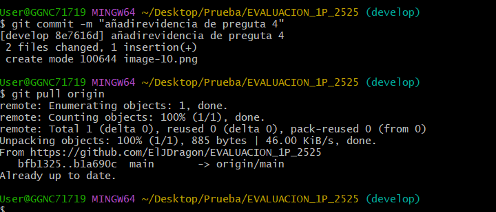

# Universidad Tecnica de Ambato 
## Facultad de Ingenieria en Sistemas Electronica e Industrial
### Carrera de Ingeniería en Software  

**Asignatura:** Manejo y Configuración de Software  
**Nombre del Estudiante:** Ismael Cuadrado  
**Fecha:** 30/04/2025

---

# Evaluación Práctica de Git y GitHub

## Instrucciones Generales

- Cada pregunta debe ser respondida directamente en este archivo **(README.md)** debajo del enunciado correspondiente.
- Cada respuesta debe ir acompañada de uno o más **commits**, según se indique en cada pregunta.
- Cuando se indique, deberán realizarse acciones prácticas dentro del repositorio (como creación de archivos, ramas, resolución de conflictos, etc.).
- Cada pregunta debe estar **etiquetada con un tag**, únicamente en el commit final correspondiente, con el formato: `"Pregunta 1"`, `"Pregunta 2"`, etc.

---

## Pregunta 1 (1 punto)

**Explicar la diferencia entre los siguientes conceptos/comandos en Git y GitHub:**

- `git clone`  
- `fork`  
- `git pull`

### Parte práctica:

- Realizar un **fork** de este repositorio en la cuenta personal de GitHub del estudiante.
- Luego, realizar un **clone** del fork en el equipo local.
- En este README, describir el proceso seguido:
  - ¿Cómo se realizó el fork?
  - ¿Cómo se realizó el clone del fork?
  - ¿Cómo se verificó que se estaba trabajando sobre el fork y no sobre el repositorio original?

**📝 Respuesta:**

<!-- Escribe aquí tu respuesta a la Pregunta 1 -->

git clone: Este copia el repositorio remoto a un repositorio local.
fork: Este duplica un repositorio de otra persona a nuestra cuenta .
git pull: Este trae los cambios de nuestro repositorio remoto a nuestro repositorio local.

¿Como se realizo el fork?
El fork se realizo entrando a la cuenta especificiada y accediendo al repositorio donde se encuentra la prueba, existe un boton denominado fork y se clickeo y se realizo el duplicado a nuestra cuenta.

¿Como se realizo el clone del fork?
Este se realizo entrando a al repositorio duplicado y seleccionamos el apartado que dice code y copiamos el link y abrimos una carpeta creada de manera local y abrimos la herramienta git y colocamos el siguiente comando git clone.

¿Cómo se verificó que se estaba trabajando sobre el fork y no sobre el repositorio original?
Este se verifico mediante los links que este nuestro usuario y el repositorio que vamos a clonar.

Como se observa la imagen se encuentra mi usuario.
---

## Pregunta 2 (1 punto)

**Configurar un archivo `.gitignore` para que ignore:**

- Todos los archivos con extensión `.log`.
- Una carpeta llamada `temp/`.

### Requisitos:

1. Realizar un **primer commit** que incluya únicamente el archivo `.gitignore` con las reglas de exclusión definidas.
2. Realizar un **segundo commit** donde se explique en este README la función del archivo `.gitignore` y se muestre evidencia de que los archivos y carpetas indicadas no están siendo rastreadas por Git.

**Importante:**  
- Solo el **segundo commit** debe llevar el **tag `"Pregunta 2"`**.

**📝 Respuesta:**

<!-- Escribe aquí tu explicación y evidencia para la Pregunta 2 -->
La funcion del .gitignore es para ignorar archivos que pueden resultar innecesarios en un commit, y para verificar que funciona procedemos a crear dichos archivos.

se realizo un git status para ver la funcionalidad del .gitignore lo cual no nos esta tomando los archivos 

---

## Pregunta 3 (2 puntos)

**Utilizar Git Flow para desarrollar una nueva funcionalidad llamada `ingresar-encabezado`.**

### Requisitos:

- Inicializar el repositorio con Git Flow, utilizando las ramas por defecto: `main` y `develop`.
- Crear una rama de tipo `feature` con el nombre `ingresar-encabezado`.
- En dicha rama, **completar con los datos personales del estudiante** el encabezado que ya se encuentra al inicio de este archivo `README.md`.
- Realizar al menos un commit durante el desarrollo.
- Finalizar la feature siguiendo el flujo de trabajo establecido por Git Flow.

### En este README, se debe incluir:

- Los **comandos exactos** utilizados desde la inicialización de Git Flow hasta el cierre de la feature.
- Una descripción del **proceso seguido**, indicando el propósito de cada paso.
- Una reflexión sobre las **ventajas de aplicar Git Flow**, especialmente en contextos colaborativos o proyectos de larga duración.

**Importante:**

- Deben realizarse varios commits durante esta pregunta.
- **Solo el commit final** debe llevar el **tag `"Pregunta 3"`**.
- El flujo debe respetar la estructura de Git Flow con las ramas `develop` y `main`.

**📝 Respuesta:**

<!-- Escribe aquí tu respuesta completa a la Pregunta 3 -->
Para inicializar git flow y utilizamos el siguiente comando : git flow init

Para crear la rama en git flow utilizamos, primero utilizamos el comando de git checkout develop para verificar si estabamso situados en develop, segundo utilizamso el segundo comando para crear la nueva rama git flow feature start feature/ingresar-encabezado.

Una vez modificamos el encabezado añadiendo nuestros datos procedemos hacer un commit con los comandos git add . , git commit -m ""

cerramos la rama con el sigueinte comando git flow feature finish feature/ingresar-encabezado.

al momento de cerrar la rama automaticamente realiza un merge hacia develop.
VENTAJAS DE APLICAR GIT FLOW  
-Organizacion de mejor manera en el grupo
-Optimizacion al momento de hacer los merge
-Se puede trabajar sin interferencias
---

## Pregunta 4 (2 puntos)

**Trabajo con Issues y Pull Requests**

### Parte teórica:

- Explicar qué es un **issue** en GitHub.
- Explicar qué es un **pull request** y cuál es su finalidad.
- Indicar la diferencia entre ambos y cómo se relacionan en un entorno de trabajo colaborativo.

### Parte práctica:

- Trabajar en la rama `develop`, ya existente desde la configuración de Git Flow.
- Crear un **issue** titulado `"Respuesta a la Pregunta 4"`, en el que se indique que su objetivo es documentar esta pregunta.
- Realizar los cambios necesarios en este archivo `README.md` para responder esta pregunta.
- Realizar un **commit** con los cambios y subirlo a la rama `develop` del repositorio remoto.
- Crear un **pull request** desde `develop` hacia `develop` en GitHub.
- **Vincular el pull request con el issue creado**, de manera que al ser aprobado y fusionado, el issue se cierre automáticamente.
- El repositorio debe estar **configurado para requerir una revisión previa al merge**, la cual **debe ser aprobada por el docente**.

### En este README, se debe incluir:

- Un resumen del procedimiento realizado.
- El número del issue creado.
- El enlace al pull request.
- Una explicación de cómo se comprobó que el repositorio requería revisión antes de aceptar el pull request (por ejemplo, a través del mensaje mostrado por GitHub).

**📝 Respuesta:**

<!-- Escribe aquí tu respuesta completa a la Pregunta 4 -->
¿que es issue?
Este sirve para notificar acerca de un cambio realizado o un pull request
pull request: es una solitud para fucionar cambios desde hacia una rama a otra.
La issue sirve para reportar, planear o discutir tareas	y el pull request sirve para proponer la integración de cambios
Aqui se creo el issue 

despues se realiza un commit y se sube al repositorio remoto con el comando de push  
sale la solicitud de pull request y seleccionamos que requiere una revision 
y se realiza el envio del pull request y se espera la respuesta.

---

## Pregunta 5 (2 puntos)

**Resolver conflictos entre ramas y realizar un Pull Request controlado**

### Requisitos:

- Crear dos ramas llamadas `ramaA` y `ramaB`, ambas a partir de la rama `main`.
- En `ramaA`, crear un archivo llamado `archivoA.txt` con el contenido:  
  `Contenido A`
- En `ramaB`, crear un archivo con el mismo nombre (`archivoA.txt`), pero con el contenido:  
  `Contenido B`
- Intentar fusionar `ramaB` sobre `ramaA`, lo cual debe generar un conflicto.
- Resolver el conflicto combinando ambos contenidos (por ejemplo: `Contenido combinado A+B`).
- Realizar el merge de `ramaA` hacia `develop`.
- Crear un **pull request** desde `ramaA` hacia `develop`.
- El pull request debe estar **configurado para requerir revisión y ser aprobado por el docente**.
- Una vez completado el merge, eliminar las ramas `ramaA` y `ramaB` tanto local como remotamente.

### En este README, se debe incluir:

- El procedimiento completo:
  - Cómo se crearon las ramas.
  - Cómo se generó y resolvió el conflicto.
  - Cómo se realizó el merge hacia `develop`.
  - Cómo se creó y vinculó el pull request.
  - Cómo se verificó que la revisión fue requerida y aprobada.
  - Cómo se eliminaron las ramas al finalizar.
- El enlace al pull request.
- Una breve explicación de qué es un conflicto en Git y por qué ocurrió en este caso.

**📝 Respuesta:**

<!-- Escribe aquí tu respuesta completa a la Pregunta 5 -->

---

## Pregunta 6 (2 puntos)

**Realizar limpieza, explicar versionamiento semántico y enviar cambios al repositorio original**

### Requisitos:

- Trabajar en la rama `develop` del fork del repositorio.
- Eliminar los archivos `archivoA.txt` y `archivoB.txt` creados en preguntas anteriores.
- Realizar un merge desde `develop` hacia `main` en el repositorio local.
- Enviar los cambios de la rama `main` local a la rama `develop` del repositorio remoto (fork).
- Finalmente, crear un **pull request** desde la rama `develop` del fork hacia la rama `main` del repositorio original (del cual se realizó el fork en la Pregunta 1), en la descripción colocar el link de su repositorio de GitHub.

### En este README, se debe incluir:

- Una explicación del proceso realizado paso a paso.
- Una explicación del **versionamiento semántico**, indicando:
  - En qué consiste.
  - Sus tres componentes (MAJOR, MINOR, PATCH).
  - Ejemplos de aplicación en un proyecto real.
- El enlace al pull request creado hacia el repositorio original.
- Una reflexión sobre la importancia del versionamiento semántico y del uso de forks y pull requests en equipos de trabajo.

**📝 Respuesta:**

<!-- Escribe aquí tu respuesta completa a la Pregunta 6 -->
